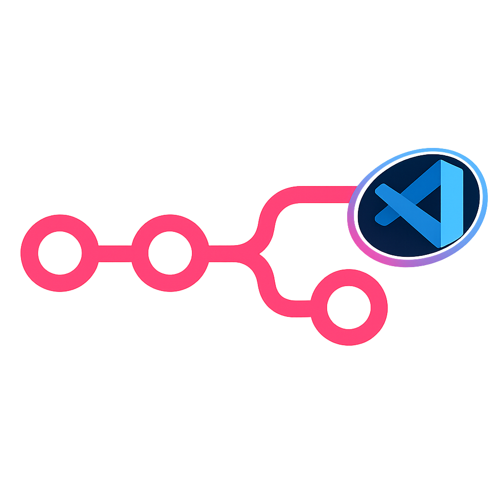

<div align="center">

<table>
<tr>
<td align="center" width="180">
	
</td>
<td align="left">

# Yagr

### (Y)our (A)gent (G)rounded in (R)eality

**Autonomous automation agent · orchestrator-ready by design · powered by n8n-as-code today**

</td>
</tr>
</table>

[](https://github.com/EtienneLescot/yagr/actions/workflows/ci.yml)
[](https://yagr.dev/docs/)
[](https://yagr.dev/)
[](https://n8n.io/)
[](https://opensource.org/licenses/MIT)

<br>

**Yagr is designed to sit above execution orchestrators.** Today it runs on top of n8n through the n8n-as-code stack. Tomorrow it can target a native Yagr runtime or other orchestrators without changing the product story.

[**Read Yagr docs**](https://yagr.dev/docs/) · [**Open n8n-as-code**](https://n8nascode.dev/n8n-as-code/) · [**Workflow GitOps docs**](https://n8nascode.dev/docs/)

</div>


## Quick Start

If you want to see Yagr working before reading the full product story, start here.

### 1. Install Yagr globally

```bash
npm install -g @yagr/agent@latest
```

### 2. Run onboarding once

```bash
yagr onboard
```

This connects three things:

- your execution orchestrator connection, which is n8n today
- your default model
- your optional messaging integrations, including Telegram

After onboarding, Yagr is ready. If you configured Telegram during onboarding, anyone who messages your bot will receive an automatic link to connect their chat — no extra step needed.

### Day-to-day commands

```bash
yagr start      # start gateways in the background (Telegram, etc.)
yagr tui        # open a terminal chat session
yagr webui      # open the local web interface
yagr stop       # stop the background gateway
```

`yagr start` launches messaging gateways as a background daemon and returns to your shell. Use `yagr tui` or `yagr webui` at any time to open an interactive session directly.

### Inspect Or Reset Local State

```bash
yagr paths
yagr reset --dry-run
yagr reset --scope full --yes
```

To remove the global CLI package itself:

```bash
npm uninstall -g @yagr/agent
```

> <table>
> <tr>
> <td width="108" align="center">
> 
> </td>
> <td>
> <strong>Yagr is built on top of n8n-as-code</strong><br>
> Yagr rely on the underlying n8n-as-code technology, workflow GitOps model, schema grounding, and editor tooling<br><br>
> <a href="https://github.com/EtienneLescot/n8n-as-code">Open the n8n-as-code repository</a>
> </td>
> </tr>
> </table>

Read next if you want more than the fast path:

- [Yagr getting started](https://yagr.dev/docs/getting-started/)
- [Yagr command reference](https://yagr.dev/docs/reference/commands/)

---

## 🧠 Why Another Autonomous Agent? (The Reality Check)

Most AI agents today execute tasks by writing ephemeral scripts or firing blind API calls.

It works once, but it creates a black box:

- hard to audit
- hard to secure
- hard to maintain
- easy to break

Yagr takes a radically different approach.

Yagr is a general-purpose autonomous agent, but its execution layer is grounded in deterministic workflows.

When you ask Yagr to sort your emails, draft replies, monitor Stripe churn, or automate an operations loop, it should not disappear into a temporary Python script that nobody can inspect tomorrow.

Instead, Yagr dynamically architects, validates, and deploys a real workflow underneath the conversation.

That means Yagr is an **automation agent** where:

- you express intent in natural language
- Yagr plans against a grounded node ecosystem
- Yagr generates and validates a workflow on a deterministic execution orchestrator
- the resulting workflow becomes durable, executable memory and muscle that Yagr can revisit later

For the user, it feels like magic chat.

For the engineer, it is auditable, inspectable, safer, and grounded in strict ontology rather than improvisation.

The workflow is the agent's durable memory and muscle.

---

## Why Yagr

<table>
<tr>
<td width="33%" valign="top">

### Intent First

Yagr starts from what you want to automate, not from manually wiring implementation primitives.

</td>
<td width="33%" valign="top">

### Workflows Remember

Generated workflows are not throwaway output. They are persisted intent that Yagr can inspect, explain, modify, and extend.

</td>
<td width="33%" valign="top">

### Engine Boundary

Yagr stays above the execution orchestrator. Today that means n8n through n8n-as-code. Tomorrow it can mean a native Yagr runtime or another orchestrator.

</td>
</tr>
</table>

---

## What Yagr Is And Is Not

<table>
<tr>
<td width="50%" valign="top">

### Yagr Is

- an autonomous automation agent
- a product layer above the engine
- a stable runtime with a dedicated home
- a way to reach the same agent through TUI, Telegram, CLI, and future gateways

</td>
<td width="50%" valign="top">

### Yagr Is Not

- a monolithic n8n workflow pretending to be an agent
- a generic memory/notes/reminders product
- a pile of shell variables glued together
- a replacement for n8n-as-code workflow engineering tooling

</td>
</tr>
</table>

---

## Architecture In One View

```text
User intent
	-> Yagr agent
		-> Orchestrator interface
			-> today: n8n via n8n-as-code
			-> tomorrow: native Yagr runtime or other orchestrators
				-> workflow is generated, validated, deployed
					-> workflow becomes durable executable memory
```

This separation is deliberate:

- gateways are thin surfaces
- the agent is the reasoning layer
- the engine executes automations
- workflows are the lasting artifact, memory, and muscle

---

## What Setup Actually Does

`yagr setup` configures three things:

1. your **current orchestrator connection**: today that means an n8n instance, API key, project, and local sync folder
2. your **default model**: provider, model, API key, optional base URL
3. your **optional messaging integrations**: for example Telegram

Yagr stores that state in its own home so the product does not depend on whatever repo or shell happens to be open.

---

## Product Philosophy

- **Yagr is the agent.** It should stay above the execution orchestrator.
- **Gateways are not the brain.** Telegram and TUI are surfaces into the same agent loop.
- **Workflows are memory and muscle.** They persist how the problem was solved and they execute it reliably over time.
- **The orchestrator must stay swappable.** Today that orchestrator is n8n via n8n-as-code. Tomorrow it may be a native Yagr runtime or something else.

---

### Troubleshooting

If gateways are not responding or something feels stuck:

```bash
yagr stop               # stop the background gateway daemon
yagr gateway status     # check whether a daemon is currently running
yagr start              # restart it
```

If you need to re-share the Telegram onboarding link (for example when linking a second chat):

```bash
yagr telegram onboarding
```

To reset everything and start over:

```bash
yagr reset --dry-run
yagr reset --scope full --yes
```

---

## Contributing And Development

If you are contributing from this repository instead of installing the published package globally, use the repo-scoped development flow:

```bash
npm install
npm run build
npm run yagr:onboard
npm run yagr:start
```

These development scripts intentionally target `.yagr-test-workspace` so local work does not pollute your real `~/.yagr` home.

---

## Read Next

- [Yagr overview](https://yagr.dev/)
- [Yagr getting started](https://yagr.dev/docs/getting-started/)
- [n8n-as-code repo](https://n8nascode.dev/n8n-as-code/)
- [n8n-as-code documentation](https://n8nascode.dev/docs/)
