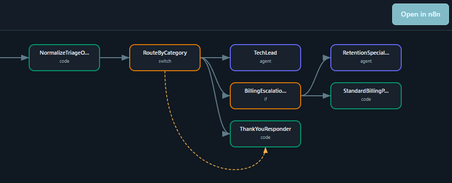
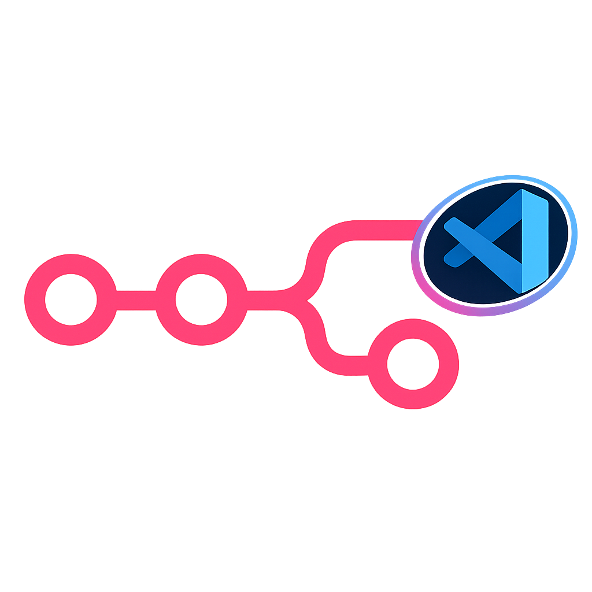

<table width="100%">
  <tr>
    <td width="320" align="center" valign="middle">
      
    </td>
    <td width="680" valign="middle">
      <div><strong><font size="6">Yagr</font></strong></div>
      <div><sub>(Y)our (A)gent (G)rounded in (R)eality</sub></div>
      <br>
      <div><strong>An autonomous agent that turns intent into real, running automations.</strong></div>
      <br>
      <div>
        <a href="https://github.com/EtienneLescot/yagr/actions/workflows/ci.yml"></a>
        <a href="https://yagr.dev/docs/"></a>
        <a href="https://yagr.dev/"></a>
        <a href="https://opensource.org/licenses/MIT"></a>
      </div>
      <br>
      <div>
        <a href="https://yagr.dev/"><strong>Docs</strong></a> ·
        <a href="https://yagr.dev/docs/getting-started/"><strong>Getting Started</strong></a> ·
        <a href="https://yagr.dev/docs/reference/commands/"><strong>Commands</strong></a>
      </div>
    </td>
  </tr>
</table>

<p align="center">
  
</p>

<p align="center"><em>Workflow generated by Yagr from a single prompt</em></p>

---

## What Yagr Is

Yagr is an autonomous agent for building and operating **durable n8n workflows** — not one-off scripts.

You describe what you want. Yagr turns it into a workflow you can **inspect, edit, publish, and run**.

* **agent** → plans and decides
* **n8n** → executes
* **workflow** → persists as the system you can review and evolve

Yagr can create new workflows, modify existing n8n workflows, publish them, and execute them in **local or cloud** environments.

---

## Why Yagr Exists

Setting up automation should not be harder than the automation itself.

Two things usually get in the way.

### The setup tax

* installing and configuring n8n before a first result
* wiring Docker just to get started
* pasting API keys across multiple surfaces
* managing URLs, tokens, and environment state

### Agents that do not build systems

Most agents generate scripts that are:

* ephemeral
* hard to audit
* difficult to review
* loosely secured

They execute once and disappear. They do not leave behind a system you can inspect and improve.

### Yagr takes a different path

Yagr removes most of that setup friction and produces workflows instead of ad-hoc execution.

It:

1. prepares the environment
2. connects your model
3. builds or updates the workflow
4. publishes it to n8n
5. runs it
6. keeps it editable in the visual canvas

> The result is not just a suggestion. It is a workflow you can inspect, edit, and run.

---

| Problem           | With Yagr            |
| ----------------- | -------------------- |
| Setup friction    | Automated onboarding |
| Ephemeral scripts | Durable workflows    |
| Hidden execution  | Inspectable systems  |

---

## Quick Start

### Install

```bash
npm install -g @yagr/agent@latest
```

### Onboard

```bash
yagr onboard
```

The onboarding flow handles:

* environment detection
* n8n setup via Docker when needed
* model configuration
* local runtime initialization
* optional integrations
* access to the visual editor

---

## Example (30 seconds)

Create an AI agent that triages inbound support emails, drafts a reply, and escalates urgent cases to Slack.

```bash
yagr tui
```

Then type:

> "Build an AI support triage agent: when a new email arrives, classify it, draft a reply, and send urgent billing issues to Slack"

Yagr will:

* connect Gmail
* create the email trigger
* add the AI agent and its tools
* reuse your configured model credentials across agentic nodes
* add Slack for escalation
* deploy the workflow to n8n
* run it

Open the visual editor to inspect or refine it.

---

## Supported Today

### Model providers

* **OpenAI API**
* **OpenAI** via **ChatGPT subscription** — no API key required
* **Claude**
* **Gemini**
* **GitHub** via **Copilot subscription** — no API key required
* **Mistral**
* **OpenRouter**

### Interfaces
* **TUI**
* **WEB UI**
* **Telegram**

### Environments and platform support

* **Local or cloud**
* **Docker is optional**
* Docker is required for **Yagr-managed instances**
* **Linux**
* **macOS**
* **Windows via WSL**
* **Native Windows support is coming**

### Workflow support

* create new n8n workflows
* modify existing n8n workflows
* push workflows to n8n
* publish and execute them
* keep them editable in the visual canvas

---

## Daily Usage

```bash
yagr start     # start services
yagr tui       # open terminal chat
yagr webui     # open web interface
yagr stop      # stop services
```

---

## Prerequisites

* **Node.js** `v22.16.0` or higher
* **Docker** (optional, required for Yagr-managed instances)

---

## Yagr and n8n-as-code

> <table>
> <tr>
> <td width="108" align="center">
> 
> </td>
> <td>
> <strong>Built on n8n-as-code</strong><br>
> Provides schema grounding, GitOps workflows, and editor tooling.<br><br>
> <a href="https://github.com/EtienneLescot/n8n-as-code">Explore the repo</a>
> </td>
> </tr>
> </table>

---

## Troubleshooting

```bash
yagr stop
yagr gateway status
yagr start
```

```bash
yagr n8n tunnel setup
yagr n8n tunnel url
```

```bash
yagr reset --scope full --yes
```

---

## Contributing

```bash
npm install
npm run build
npm run yagr:onboard
npm run yagr:start
```

---

## Read Next

* [Documentation](https://yagr.dev/docs/)
* [n8n-as-code](https://github.com/EtienneLescot/n8n-as-code)
* [n8n](https://github.com/n8n-io/n8n)