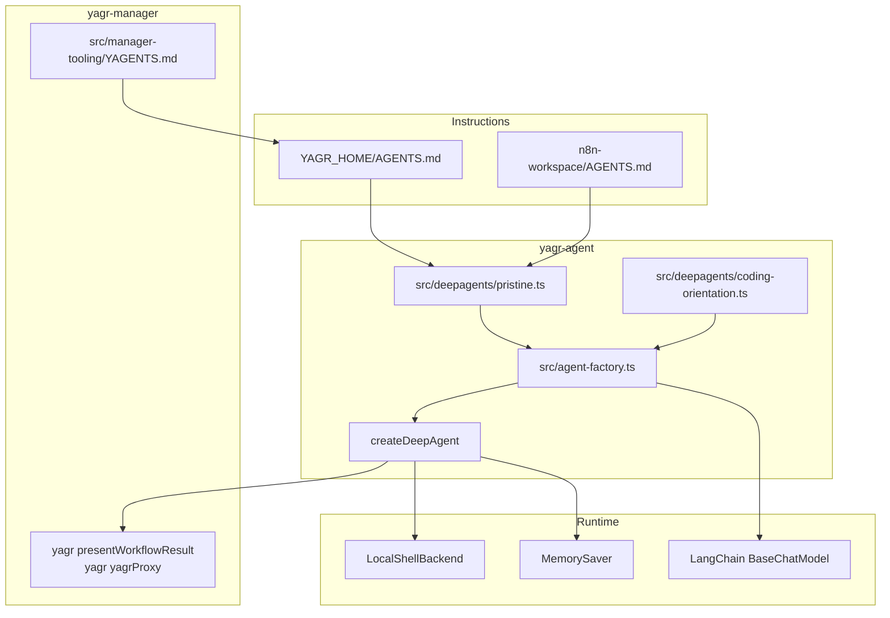

# Agent Architecture — deepagentsjs

This document describes the current agent architecture after cleaning the Yagr wrapper and reintroducing an explicit, minimal, and separated overlay.

## Overview

The Yagr agent is built on `createDeepAgent(...)` from deepagentsjs.

The current target model is:

1. a deepagentsjs `pristine` core, minimal and readable
2. a `coding-oriented` overlay, agnostic, added only via middleware
3. manager and workspace instructions loaded by `memory` via `AGENTS.md`
4. specific manager behaviors carried by shell commands `yagr ...`, not by tools injected into the agent

## High-Level Separation

The reference architecture model is as follows:

1. `src/deepagents/pristine.ts` carries the cleanest possible deepagentsjs base.
2. `src/deepagents/coding-orientation.ts` carries the coding-oriented overlay, agnostic and explicit.
3. `src/agent-factory.ts` composes these two layers without mixing them.
4. `src/manager-tooling/YAGENTS.md` remains a template of manager instructions seeded into `YAGR_HOME/AGENTS.md`.
5. `n8n-workspace/AGENTS.md` remains the business layer specific to the n8n workspace.
6. The main deepagents backend remains `LocalShellBackend` in host-native mode: real cwd `YAGR_HOME`, relative paths from home, absolute paths on the host.



## Entry Point: `createYagrDeepAgent`

```typescript
export async function createYagrDeepAgent(
  engine: EngineRuntimePort,
  configStore?: YagrConfigStoreLike,
  modelConfig?: { provider?: string; model?: string; apiKey?: string; baseUrl?: string },
): Promise<YagrDeepAgentHandle>
```

Responsibilities:

1. instantiate a LangChain `BaseChatModel` via `createLangChainModel(...)`
2. build the `MemorySaver` checkpointer
3. retrieve the pristine configuration via `buildPristineDeepAgentConfig(...)`
4. add the middleware overlay: `middleware: getCodingOrientedDeepAgentMiddleware()`
5. call `createDeepAgent(...)`

## Pristine Layer

The pristine layer only carries:

- the host-native backend
- AGENTS memory sources
- the minimal assembly configuration of the deep-agent

This layer must not contain:

- manager logic
- n8n-specific rules
- injected Yagr tools
- monolithic Yagr runtime prompt

## Coding-oriented Overlay

The coding-oriented overlay remains:

- agnostic
- minimal
- documented
- implemented only via middleware

Its function is to orient Deepagents toward good coding agent behavior without reintroducing a specific business layer.

## Backend Contract

The current main backend is `LocalShellBackend` from deepagents in local host-native mode.

Implications:

- the shell cwd and the base of relative paths both point to `YAGR_HOME`
- file tools and `execute` share the same path semantics
- `virtualMode` is not used in this model
- if Yagr someday needs a real virtual root common to file tools and `execute`, it will need to use a real deepagents sandbox backend, not `LocalShellBackend`

## Architecture Invariants

- `yagr-agent` carries no n8n-specific rules hardcoded in its pristine core or in its coding-oriented overlay
- the home `AGENTS.md` is the first instruction layer loaded by the deep-agent
- `src/manager-tooling/YAGENTS.md` remains the source template maintained by `yagr-manager`
- the top-level n8n business behavior is carried by the `AGENTS.md` generated in `n8n-workspace`
- the Yagr home remains the operational root; `n8n-workspace` is a sub-workspace
- the coding-oriented overlay must remain agnostic, documented, and physically isolated from the pristine layer
