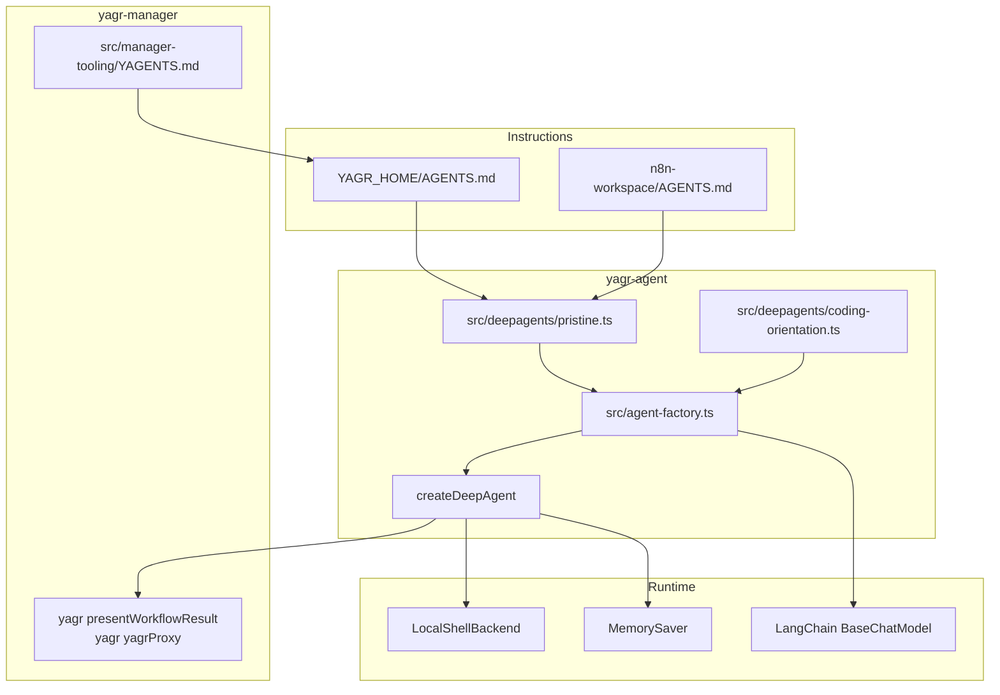

# Agent Architecture — deepagentsjs

Ce document decrit l'architecture agent actuelle apres nettoyage du wrapper Yagr et reintroduction d'une surcouche explicite, minimale et separee.

## Vue d'ensemble

L'agent Yagr est construit sur `createDeepAgent(...)` de deepagentsjs.

Le modele cible actuel est:

1. un coeur deepagentsjs `pristine`, minimal et lisible
2. une surcouche `coding-oriented`, agnostique, ajoutee uniquement via middleware
3. des instructions manager et workspace chargees par `memory` via `AGENTS.md`
4. des comportements manager specifiques portes par des commandes shell `yagr ...`, pas par des tools injectes dans l'agent

## Separation Haute Niveau

Le modele d'architecture de reference est le suivant:

1. `src/deepagents/pristine.ts` porte le socle deepagentsjs le plus propre possible.
2. `src/deepagents/coding-orientation.ts` porte la surcouche coding-oriented, agnostique et explicite.
3. `src/agent-factory.ts` compose ces deux couches sans les melanger.
4. `src/manager-tooling/YAGENTS.md` reste un template d'instructions manager seedes dans `YAGR_HOME/AGENTS.md`.
5. `n8n-workspace/AGENTS.md` reste la couche metier propre au workspace n8n.
6. Le backend deepagents principal reste `LocalShellBackend` en mode host-native: cwd reel `YAGR_HOME`, chemins relatifs depuis la home, chemins absolus sur le host.



## Point d'entree : `createYagrDeepAgent`

```typescript
export async function createYagrDeepAgent(
  engine: EngineRuntimePort,
  configStore?: YagrConfigStoreLike,
  modelConfig?: { provider?: string; model?: string; apiKey?: string; baseUrl?: string },
): Promise<YagrDeepAgentHandle>
```

Responsabilites:

1. instancier un `BaseChatModel` LangChain via `createLangChainModel(...)`
2. construire le checkpointer `MemorySaver`
3. recuperer la configuration pristine via `buildPristineDeepAgentConfig(...)`
4. ajouter la surcouche `middleware: getCodingOrientedDeepAgentMiddleware()`
5. appeler `createDeepAgent(...)`

## Couche pristine

La couche pristine porte uniquement:

- le backend host-native
- les sources memory AGENTS
- la configuration minimale d'assemblage du deep-agent

Cette couche ne doit contenir:

- ni logique manager
- ni regle n8n specifique
- ni tools Yagr injectes
- ni prompt runtime Yagr monolithique

## Surcouche coding-oriented

La surcouche coding-oriented reste:

- agnostique
- minimale
- documentee
- implementee uniquement via middleware

Sa fonction est d'orienter Deepagents vers un comportement de bon agent de codage sans reintroduire une couche metier specifique.

## Contrat backend

Le backend principal actuel est `LocalShellBackend` de deepagents en mode local host-native.

Implications:

- le cwd shell et la base des chemins relatifs pointent tous deux vers `YAGR_HOME`
- les outils fichier et `execute` partagent la meme semantique de chemins
- `virtualMode` n'est pas utilise dans ce modele
- si un jour Yagr a besoin d'un vrai root virtuel commun aux file tools et a `execute`, il faudra utiliser un vrai backend sandbox de deepagents, pas `LocalShellBackend`

## Invariants d'architecture

- `yagr-agent` ne porte aucune regle n8n specifique en dur dans son coeur pristine ou dans sa surcouche coding-oriented
- le `AGENTS.md` de home est la premiere couche d'instructions chargee par le deep-agent
- `src/manager-tooling/YAGENTS.md` reste le template source maintenu par `yagr-manager`
- le comportement metier n8n de premier niveau est porte par le `AGENTS.md` genere dans `n8n-workspace`
- la home Yagr reste la racine operationnelle; `n8n-workspace` est un sous-workspace
- la surcouche coding-oriented doit rester agnostique, documentee et physiquement isolee de la couche pristine
