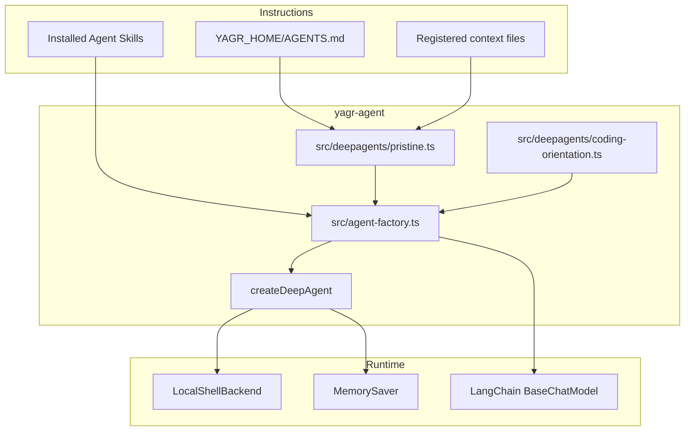

# Agent Architecture — deepagentsjs

This document describes the current coding-agent architecture.

## Overview

The Yagr agent is built on `createDeepAgent(...)` from deepagentsjs.

The current model is:

1. a pristine deepagentsjs core
2. a coding-oriented overlay, agnostic, added only via middleware
3. optional workspace instructions loaded by memory sources
4. optional installed Agent Skills passed to DeepAgents.js via native `skills` sources
5. no built-in domain-specific backend tools or instructions

## High-Level Separation

## Entry Point

`createYagrDeepAgent(...)` instantiates the LangChain model, checkpointer, pristine deepagents config, coding middleware, and compiled deep-agent graph.

## Invariants

- The pristine layer only carries backend, memory sources, and minimal deep-agent assembly.
- The coding-oriented overlay stays agnostic and only contains generic coding-agent guidance.
- Domain-specific behavior must come from project files, user prompts, or explicitly installed external tools, not from built-in Yagr code.
- The Yagr home remains the operational root for the local coding agent.
- Yagr only resolves and passes skill source paths; DeepAgents.js owns skill metadata discovery, `SkillsMiddleware`, and progressive disclosure.
