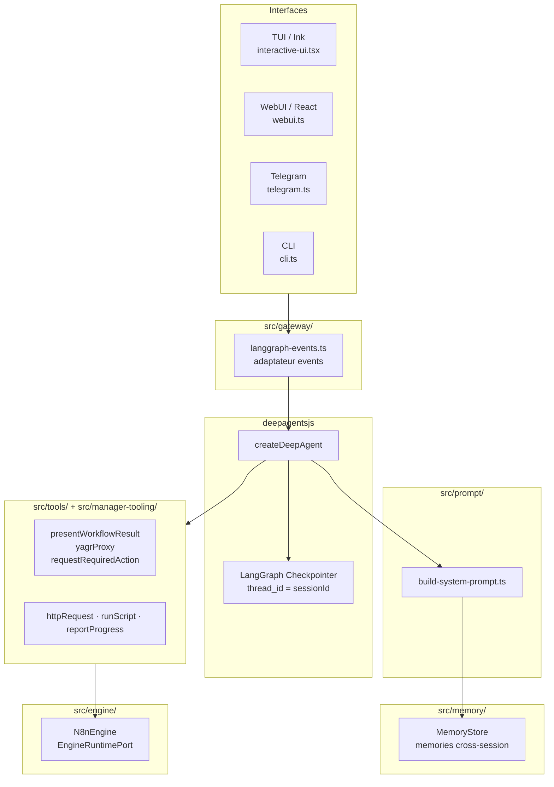

# Agent Architecture — deepagentsjs (LangGraph)

Ce document décrit l'architecture de l'agent Yagr après la migration complète vers deepagentsjs.

## Vue d'ensemble

L'agent Yagr est construit sur **deepagentsjs** (`createDeepAgent`), qui utilise LangGraph comme
moteur d'orchestration. Toutes les gateways consomment un `YagrDeepAgentHandle`.



## Point d'entrée : `createYagrDeepAgent`

```typescript
// src/agent-factory.ts
export async function createYagrDeepAgent(
  engine: EngineRuntimePort,
  configService: YagrConfigStoreLike,
): Promise<YagrDeepAgentHandle>
```

Responsabilités :
1. Instancie un `BaseChatModel` LangChain via `createLangChainModel(configService)`
2. Construit le `systemPrompt` via `buildSystemPrompt(engine, configService, ...)`
3. Assemble les tools LangChain (tools/ + manager-tooling/)
4. Configure un `MemorySaver` (checkpointer en mémoire, par thread)
5. Appelle `createDeepAgent({ model, tools, systemPrompt, checkpointer })`

## Persistance de session

- **Historique de conversation** : `MemorySaver` (LangGraph, in-memory, par thread). Le `thread_id` est le `sessionId` de la gateway.
- **Métadonnées UI** (titre, timestamps, display messages) : `WebUiSessionRegistry` dans `src/session/webui-sessions.ts` — fichiers JSON dans `YAGR_HOME/sessions/`.

`session-store.ts` (`SessionStore`) a été supprimé. Le checkpointer LangGraph est le SSOT pour l'historique de conversation.

## Adaptateur events : `langgraph-events.ts`

Traduit les events LangGraph en `YagrUserVisibleUpdate` (interface stable côté gateways) :

| Event LangGraph | Event Yagr équivalent |
|---|---|
| `on_chain_start` (node `agent`) | `YagrPhaseEvent { phase: 'inspect', status: 'started' }` |
| `on_tool_start` | `YagrToolEvent { status: 'started', toolName }` |
| `on_tool_end` | `YagrToolEvent { status: 'completed', toolName }` |
| `on_chat_model_stream` | streaming texte assistant |
| interrupt (HITL) | `YagrStateEvent { state: 'waiting_for_permission' }` |

## Couche LLM

### Couche A — Agent deepagentsjs (LangChain)

`src/llm/create-langchain-model.ts` : factory `BaseChatModel` LangChain.

Providers supportés :
| Provider | Classe LangChain | Auth |
|---|---|---|
| `anthropic` | `ChatAnthropic` | API key / env |
| `openai` | `ChatOpenAI` | API key / env |
| `google` | `ChatGoogleGenerativeAI` | API key / env |
| `mistral` | `ChatMistralAI` | API key / env |
| `openrouter` | `ChatOpenAI` (baseURL custom) | API key |
| `anthropic-proxy` | `ChatAnthropic` | `getAnthropicAccountSession()` |
| `openai-proxy` | `ChatOpenAI` | `getOpenAiAccountSession()` |
| `copilot-proxy` | `ChatOpenAI` (baseURL Copilot) | `resolveCopilotApiToken()` |

Les fonctions de résolution (`resolveLanguageModelConfig`, `resolveModelProvider`, `resolveModelName`) vivent dans ce même fichier.

### Couche B — Relay LLM pour n8n (Vercel AI SDK)

`proxy-runtime.ts` + `llm-relay-server.ts` exposent un endpoint OpenAI-compatible local que les noeuds `lmChatOpenAi` n8n peuvent cibler. Cette couche est **orthogonale** à deepagentsjs et conservée identique.

## Modules supprimés

| Module | Remplacé par |
|---|---|
| `src/agent.ts` (`YagrSessionAgent`) | `src/agent-factory.ts` + deepagentsjs |
| `src/runtime/run-engine.ts` | LangGraph (deepagentsjs) |
| `src/runtime/tool-runtime-strategy.ts` | Supprimé — deepagentsjs ne segmente pas par capacité |
| `src/runtime/context-compaction.ts` | deepagentsjs (auto-compaction native) |
| `src/runtime/policy-hooks.ts` | Supprimé |
| `src/runtime/completion-gate.ts` | Supprimé |
| `src/runtime/required-actions.ts` | Supprimé |
| `src/runtime/outcome.ts` | Supprimé |
| `src/llm/create-language-model.ts` | `create-langchain-model.ts` |
| `src/session/session-store.ts` | `src/session/webui-sessions.ts` + LangGraph checkpointer |

## Points de vigilance

### `requestRequiredAction` — outil Yagr spécifique

Conservé comme tool injecté dans deepagentsjs. La sémantique `blocking` vs `follow-up` est une convention produit Yagr. Ne pas mapper sur `interruptOn` de LangGraph (sémantique différente).

### `src/runtime/user-visible-updates.ts`

Conservé (utilisé par `langgraph-events.ts` et `telegram.ts`). Ce fichier est l'interface stable des events visibles par les gateways.

### Mémoire cross-session (`src/memory/`)

`MemoryStore` est conservé. Il répond à un besoin distinct du checkpointer : construire un contexte long-terme *synthétique* entre sessions (résumés injectés dans le system prompt via `loadRecentMemory()`). Pas de duplication avec `MemorySaver`.
