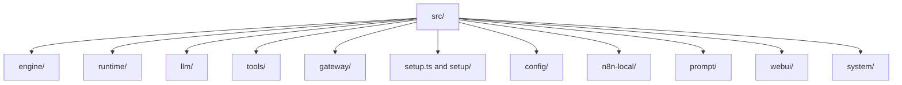
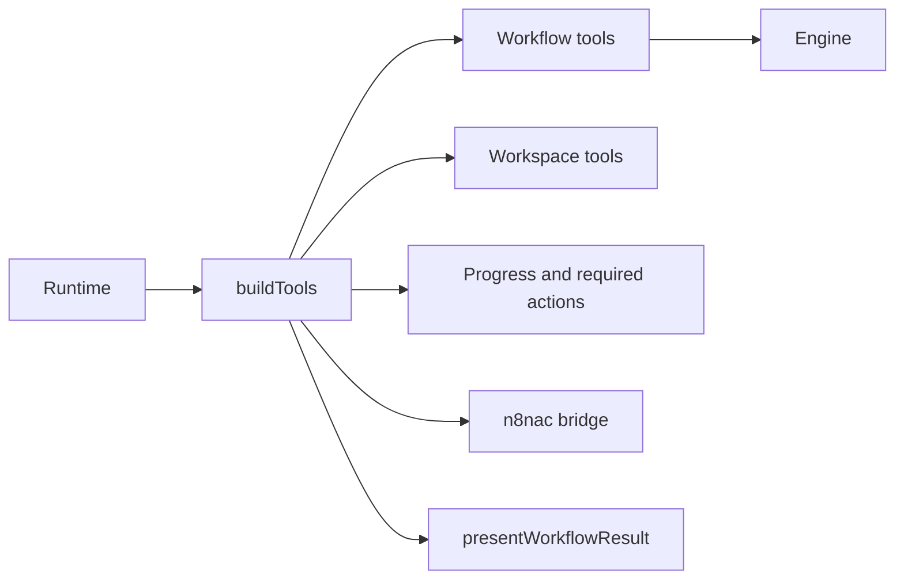

# Module Map

Cette page cartographie les modules principaux du repo et leurs responsabilites actuelles.

## Carte par dossiers

## Details par bloc

### `src/engine/`

Fichiers clefs:

- `engine.ts`
- `n8n-engine.ts`
- `yagr-engine.ts`

Responsabilites actuelles:

- contrat abstrait de backend automation
- ports specialises pour catalogue, compilation, validation et lifecycle workflow
- implementation n8n
- stub du futur moteur natif

Dette structurelle:

- le contrat `Engine` complet reste encore present pour compatibilite
- la migration vers les ports fins est entamee cote tools, mais pas encore terminee dans tout le repo

### `src/runtime/`

Fichiers clefs:

- `run-engine.ts`
- `tool-runtime-strategy.ts`
- `context-compaction.ts`
- `policy-hooks.ts`
- `completion-gate.ts`
- `required-actions.ts`
- `outcome.ts`

Responsabilites actuelles:

- orchestration du run
- etat et journal
- enforcement runtime
- compaction de contexte
- selection d'une strategie runtime selon le niveau de capacite (`native`, `compatible`, `weak`, `none`)

### `src/llm/`

Fichiers clefs:

- `provider-registry.ts`
- `create-language-model.ts`
- `provider-discovery.ts`
- `provider-metadata.ts`
- `capability-resolver.ts`
- `proxy-runtime.ts`
- `openai-account.ts`
- `anthropic-account.ts`
- `google-account.ts`
- `copilot-account.ts`

Responsabilites actuelles:

- metadonnees providers
- resolution de configuration
- auth
- creation modele
- discovery
- cache de metadonnees provider/model
- normalisation des capacites provider/model
- compat provider-specific

Dette structurelle:

- trop de concerns au meme endroit
- logique de capacites et logique d'integration melees

### `src/tools/`

Familles actuelles:

- outils workflow/orchestrateur
- outils workspace
- outils de statut et interaction
- pont `n8nac`

Observation actuelle:

- les tools ne dependent plus du contrat `Engine` monolithique partout: ils consomment maintenant des ports cibles selon leur responsabilite

### `src/gateway/`

Sous-blocs actuels:

- transports et facades
- supervision des surfaces
- formatting de messages
- liens vers les workflows

Dette structurelle:

- certaines facades portent aussi des commandes applicatives et de configuration

### `src/setup.ts` et `src/setup/`

Role actuel:

- `src/setup/application-services.ts`: service applicatif partage pour operations n8n, LLM et surfaces
- `src/setup/status.ts`: calcul partage du statut setup
- point de coordination du wizard et de l'onboarding
- point de coordination entre config, providers, surfaces et n8n local

Dette structurelle:

- une premiere extraction existe via `application-services.ts`
- la WebUI s'appuie desormais sur le service applicatif pour construire son snapshot de configuration
- il reste encore de la logique d'orchestration a affiner dans `src/setup.ts` et certaines facades

### `src/config/`

Role actuel:

- SSOT local partiel pour config Yagr et n8n
- persistance credentials
- resolution chemins et home dir

Note:

- cette zone est le meilleur candidat pour devenir le coeur du SSOT applicatif, a condition de remonter la logique de coordination dans des services d'application explicites

## References utiles

- Boucle agentique: `src/agent.ts`, `src/runtime/*`
- Providers: `src/llm/*`
- Tooling: `src/tools/*`
- Facades: `src/gateway/*`, `src/webui/*`
- Setup: `src/setup.ts`, `src/setup/*`, `src/n8n-local/*`
