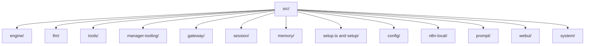

# Module Map

Cette page cartographie les modules principaux du repo et leurs responsabilites actuelles.

## Carte par dossiers


```mermaid
flowchart TD
    SRC[src/]
    SRC --> ENGINE[engine/]
    SRC --> LLM[llm/]
    SRC --> TOOLS[tools/]
    SRC --> MGR[manager-tooling/]
    SRC --> GATEWAY[gateway/]
    SRC --> SESSION[session/]
    SRC --> MEMORY[memory/]
    SRC --> SETUP[setup.ts and setup/]
    SRC --> CONFIG[config/]
    SRC --> N8NLOCAL[n8n-local/]
    SRC --> PROMPT[prompt/]
    SRC --> WEBUI[webui/]
    SRC --> SYSTEM[system/]
```

Notes:

- `src/runtime/` **supprimé** — remplacé par deepagentsjs (LangGraph)
- `src/agent.ts` (`YagrSessionAgent`) **supprimé** — remplacé par `agent-factory.ts` (`createYagrDeepAgent`)
- `llm/` porte les providers, la metadata, les comptes OAuth et le relay proxy n8n
- `tools/` porte les outils LangChain generalistes (FS, shell, HTTP)
- `manager-tooling/` porte les comportements manager internes exposes via CLI (`presentWorkflowResult`, `yagrProxy`)
- `gateway/` porte les facades + l'adaptateur events LangGraph
- `gateway/local-open-bridge.ts` porte le bridge HTTP d'auth n8n pour les ouvertures de workflow sur surfaces distantes
- `session/` porte le registre UI des sessions WebUI (metadata + display messages)
- `memory/` porte le `MemoryStore` cross-session (synthetique, injecte dans le system prompt)
- `setup/` porte la couche applicative de configuration
- `n8n-local/tunnel-reachability.ts` porte le SSOT de wake-up des tunnels par consommateur/facade
- `n8n-local/n8n-tunnel.ts` porte le SSOT du lifecycle `cloudflared` et de la politique `TUNNEL_DOMAIN`

## Details par bloc

### `src/engine/`

Fichiers clefs:

- `engine.ts`
- `n8n-engine.ts`
- `yagr-engine.ts`

Responsabilites actuelles:

- contrat abstrait de backend automation
- ports specialises pour catalogue, compilation, validation et lifecycle workflow
- implementation n8n (`N8nEngine`)
- stub du futur moteur natif (`YagrNativeEngine` avec `name = 'yagr-engine'`)

Note: orthogonal à deepagentsjs — les deux peuvent evoluer independamment.

### `src/agent-factory.ts`

Cree le deep agent Yagr :

```typescript
createYagrDeepAgent(engine, configService, modelConfig?) → YagrDeepAgentHandle
```

Responsabilites:
- instantiate `createLangChainModel()`
- injecter uniquement les tools LangChain agnostiques (`src/tools/langchain/*`)
- injecter le `systemPrompt` via `buildSystemPrompt()`
- configurer `MemorySaver` (checkpointer par thread)
- deleger à `createDeepAgent()` de deepagentsjs

Note:

- les tools manager n8n ne sont plus importes directement par `yagr-agent`
- les instructions de home apprennent a l'agent a passer par `execute` pour lancer `yagr presentWorkflowResult` et `yagr yagrProxy`

### `src/gateway/`

Fichiers clefs:

- `langgraph-events.ts` — adaptateur events LangGraph → `YagrUserVisibleUpdate`
- `webui.ts` — gateway HTTP/SSE pour l'interface React
- `webui-config.ts` — SSOT du host/port/url WebUI partage par les facades
- `telegram.ts` — gateway Telegram  
- `interactive-ui.tsx` — gateway TUI Ink
- `cli.ts` — gateway CLI non-interactif
- `manager.ts` — superviseur multi-gateway (`GatewaySupervisor`)
- `local-open-bridge.ts` — bridge HTTP tokenise pour materialiser `presentWorkflowResult.url` selon la surface

Toutes les gateways consomment `YagrDeepAgentHandle` (deepagentsjs).
Aucune ne depend du runtime supprimé (`YagrRunEngine`).

### `src/llm/`

Fichiers clefs:

- `create-langchain-model.ts` — factory LangChain `BaseChatModel` + utilitaires de resolution
- `provider-registry.ts` — catalogue des providers supportes
- `provider-metadata.ts` / `provider-discovery.ts` — metadata et discovery
- `proxy-runtime.ts` + `llm-relay-server.ts` — relay proxy OpenAI-compatible pour n8n
- `copilot-account.ts` — auth GitHub Copilot (Device Flow)
- `openai-account.ts` — auth OpenAI Codex (OAuth)
- `anthropic-account.ts` — auth Claude Pro/Max (setup token)
- `model-capabilities.ts` + `capability-resolver.ts` — classification capacite provider/modele (utilisee par le relay proxy)

Note: `create-language-model.ts` (factory Vercel AI SDK) **supprimé**. Les fonctions de resolution (`resolveLanguageModelConfig`, `resolveModelProvider`, `resolveModelName`) vivent maintenant dans `create-langchain-model.ts`.

### `src/session/`

Fichiers clefs:

- `deepagent-sessions.ts` — store bas niveau des sessions Deepagents (`thread_id`, scopes façade, rotation/reset)
- `webui-sessions.ts` — `WebUiSessionRegistry` : registre fichier des sessions WebUI (metadata + display messages)
- `session-types.ts` — types partages minimaux (`SessionMessage`, `SerializedChatMessage`, `SessionSummary`)

Note: `session-store.ts` (`SessionStore`) **supprimé**. La persistance de l'historique de conversation reste assurée par le checkpointer LangGraph (`MemorySaver`) dans deepagentsjs. `deepagent-sessions.ts` ajoute le registre de sessions bas niveau, agnostique des facades, autour des `thread_id`. `WebUiSessionRegistry` ne stocke que les metadonnees UI et les display messages.

### `src/tools/`

Familles actuelles:

- outils LangChain (FS, shell, HTTP) : `readFile`, `grep`, `listDir`, `writeFile`, `replaceInFile`, `moveFile`, `deleteFile`, `httpRequest`, `runScript`, `runShell`
- outils d'interaction : `reportProgress`, `requestRequiredAction`

Note: les tools sont maintenant des `DynamicStructuredTool` LangChain, injectes directement dans `createDeepAgent()`.

### `src/manager-tooling/`

Fichiers clefs:

- `present-workflow.ts` — logique manager et commande CLI interne `presentWorkflowResult`
- `yagr-proxy.ts` — logique manager et commande CLI interne `yagrProxy`
- `YAGENTS.md` — template source des instructions manager semees dans le `AGENTS.md` de la home Yagr

Clarification:

- l'agent lit automatiquement le `AGENTS.md` de la home Yagr comme premiere couche d'instructions
- ce fichier de home est seme depuis `src/manager-tooling/YAGENTS.md` lorsqu'il est absent
- les instructions shell `n8nac` de premier niveau appartiennent au fichier genere par `n8nac` dans `n8n-workspace`, que l'agent inspecte lorsqu'il entre dans ce sous-workspace
- ce template `YAGENTS.md` ne porte que les comportements specifiques a yagr-manager (presentation workflow, proxy LLM, etc.) et apprend a l'agent a invoquer les commandes CLI internes via le shell

### `src/setup.ts` et `src/setup/`

Role actuel:

- `src/setup/application-services.ts`: service applicatif partage pour operations n8n, LLM et surfaces
- `src/setup/status.ts`: calcul partage du statut setup
- point de coordination du wizard et de l'onboarding

### `src/config/`

Role actuel:

- SSOT local pour config Yagr et n8n
- persistance credentials
- resolution chemins et home dir

## References utiles

- Agent: `src/agent-factory.ts`, `deepagentsjs`
- Providers: `src/llm/*`
- Tooling generaliste: `src/tools/langchain/*`
- Tooling manager: `src/manager-tooling/*`
- Facades: `src/gateway/*`
- Setup: `src/setup.ts`, `src/setup/*`, `src/n8n-local/*`
- Sessions Deepagents + UI: `src/session/deepagent-sessions.ts`, `src/session/webui-sessions.ts`
- Memoire cross-session: `src/memory/*`
