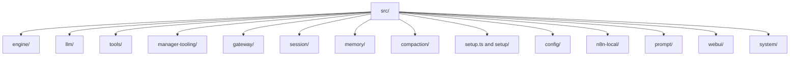

# Module Map

This page maps the main modules of the repo and their current responsibilities.

## Map by Folders


```mermaid
flowchart TD
    SRC[src/]
    SRC --> ENGINE[engine/]
    SRC --> LLM[llm/]
    SRC --> TOOLS[tools/]
    SRC --> MGR[manager-tooling/]
    SRC --> GATEWAY[gateway/]
    SRC --> SESSION[session/]
    SRC --> MEMORY[memory/]
    SRC --> COMPACTION[compaction/]
    SRC --> SETUP[setup.ts and setup/]
    SRC --> CONFIG[config/]
    SRC --> N8NLOCAL[n8n-local/]
    SRC --> PROMPT[prompt/]
    SRC --> WEBUI[webui/]
    SRC --> SYSTEM[system/]
```

Notes:

- `src/runtime/` **deleted** — replaced by deepagentsjs (LangGraph)
- `src/agent.ts` (`YagrSessionAgent`) **deleted** — replaced by `agent-factory.ts` (`createYagrDeepAgent`)
- `llm/` carries providers, metadata, OAuth accounts, and the n8n relay proxy
- `tools/` carries generalist LangChain tools (FS, shell, HTTP)
- `manager-tooling/` carries internal manager behaviors exposed via CLI (`presentWorkflowResult`, `yagrProxy`)
- `gateway/` carries facades + the LangGraph events adapter
- `gateway/local-open-bridge.ts` carries the n8n auth HTTP bridge for workflow opening on remote surfaces
- `session/` carries the WebUI session registry (metadata + display messages)
- `memory/` carries the cross-session `MemoryStore` (synthetic, injected into the system prompt)
- `compaction/` carries the `CompactionService` SSOT for context compaction events (history, context block, subscribers)
- `setup/` carries the application configuration layer
- `n8n-local/public-exposure-service.ts` carries the SSOT of product orchestration for public exposures (`n8n`, `n8n auth`, `llm`)
- `n8n-local/tunnel-reachability.ts` carries the SSOT of tunnel wake-up by consumer/facade
- `n8n-local/n8n-tunnel.ts` carries the SSOT of `cloudflared` lifecycle and `TUNNEL_DOMAIN` policy
- `system/process.ts` carries the SSOT for platform process behavior: executable resolution, native shell policy, detached spawning, PID checks, and process-tree termination

## Details by Block

### `src/engine/`

Key files:

- `engine.ts`
- `n8n-engine.ts`
- `yagr-engine.ts`

Current responsibilities:

- abstract automation backend contract
- specialized ports for catalog, compilation, validation, and workflow lifecycle
- n8n implementation (`N8nEngine`)
- stub of the future native engine (`YagrNativeEngine` with `name = 'yagr-engine'`)

Note: orthogonal to deepagentsjs — the two can evolve independently.

### `src/agent-factory.ts`

Creates the Yagr deep agent:

```typescript
createYagrDeepAgent(engine, configService, modelConfig?) → YagrDeepAgentHandle
```

Responsibilities:
- instantiate `createLangChainModel()`
- inject only agnostic LangChain tools (`src/tools/langchain/*`)
- inject the `systemPrompt` via `buildSystemPrompt()`
- configure `MemorySaver` (checkpointer per thread)
- delegate to `createDeepAgent()` from deepagentsjs

Note:

- n8n manager tools are no longer imported directly by `yagr-agent`
- home instructions teach the agent to use `execute` to launch `yagr presentWorkflowResult` and `yagr yagrProxy`

### `src/gateway/`

Key files:

- `langgraph-events.ts` — LangGraph events adapter → `YagrUserVisibleUpdate`
- `webui.ts` — HTTP/SSE gateway for the React interface
- `webui-config.ts` — SSOT of WebUI host/port/url shared by facades
- `telegram.ts` — Telegram gateway
- `interactive-ui.tsx` — TUI Ink gateway
- `cli.ts` — non-interactive CLI gateway
- `manager.ts` — multi-gateway supervisor (`GatewaySupervisor`)
- `local-open-bridge.ts` — internal tokenized HTTP bridge for URL resolution in `presentWorkflowResult`. Facades do not call it directly.

All gateways consume `YagrDeepAgentHandle` (deepagentsjs).
None depend on the deleted runtime (`YagrRunEngine`).

### `src/llm/`

Key files:

- `create-langchain-model.ts` — LangChain `BaseChatModel` factory + resolution utilities
- `provider-registry.ts` — catalog of supported providers
- `provider-metadata.ts` / `provider-discovery.ts` — metadata and discovery
- `proxy-runtime.ts` + `llm-relay-server.ts` — OpenAI-compatible relay proxy for n8n
- `copilot-account.ts` — GitHub Copilot auth (Device Flow)
- `openai-account.ts` — OpenAI Codex auth (OAuth)
- `anthropic-account.ts` — Claude Pro/Max auth (setup token)
- `model-capabilities.ts` + `capability-resolver.ts` — provider/model capability classification (used by the relay proxy)

Note: `create-language-model.ts` (Vercel AI SDK factory) **deleted**. Resolution functions (`resolveLanguageModelConfig`, `resolveModelProvider`, `resolveModelName`) now live in `create-langchain-model.ts`.

### `src/session/`

Key files:

- `session-service.ts` — **SSOT** `SessionService`: unified session management for all facades
- `deepagent-sessions.ts` — low-level Deepagents sessions store (`thread_id`, facade scopes, rotation/reset)
- `webui-sessions.ts` — `WebUiSessionRegistry`: WebUI sessions file registry (metadata + display messages) — internal facade usage
- `session-types.ts` — minimal shared types (`SessionMessage`, `SerializedChatMessage`, `SessionSummary`)
- `index.ts` — barrel export

`SessionService` is the single authority point for session lifecycle:

- `list()`, `get()`, `create()`, `ensure()`, `resume()`, `delete()`
- `getOrCreateForScope()`, `rotateForScope()`, `clearScope()`, `getActiveForScope()`, `listForScope()` — management by scope (webui, telegram, tui)
- `listCheckpointsSync()` — synchronized list of checkpoints (direct disk read)
- `setCheckpointer()` — checkpointer injection for thread cleanup
- `buildSessionConfig()` — LangGraph config construction with `thread_id`

### `src/conversation/`

**SSOT** of unified slash commands for all facades (TUI, WebUI, Telegram).

Key files:

- `slash-command-types.ts` — shared types (`SlashCommandName`, `SlashCommandResult`, `SlashSurface`)
- `slash-command-registry.ts` — canonical registry of commands, parsing, alias resolution
- `slash-command-service.ts` — `SlashCommandService`: parser + dispatcher + execute for each command

Responsibilities:

- unique catalog of commands `/help`, `/sessions`, `/resume`, `/delete`, `/new`, `/reset`, `/checkpoints`, `/save`, `/restore`, `/checkpoint_delete`, `/pending`, `/approve`, `/compact`, `/open`, `/toggle_thinking`, `/toggle_cli`, `/stop`, `/exit`
- unique semantics: `/resume` = session resume, `/restore` = checkpoint restoration
- facade-independent result structure
- availability per surface in the registry

Each facade instantiates its own `SessionService` and delegates session management to the service. The checkpointer is injected after agent creation.

### `src/tools/`

Current families:

- LangChain tools (FS, shell, HTTP): `readFile`, `grep`, `listDir`, `writeFile`, `replaceInFile`, `moveFile`, `deleteFile`, `httpRequest`, `runScript`, `runShell`
- interaction tools: `reportProgress`, `requestRequiredAction`

Note: tools are now LangChain `DynamicStructuredTool`, injected directly into `createDeepAgent()`.

### `src/manager-tooling/`

Key files:

- `present-workflow.ts` — manager logic and internal CLI command `presentWorkflowResult`
- `yagr-proxy.ts` — manager logic and internal CLI command `yagrProxy`
- `YAGENTS.md` — source template of manager instructions seeded into the `AGENTS.md` of the Yagr home

Clarification:

- the agent automatically reads the `AGENTS.md` of the home as the first layer of instructions
- this home file is seeded from `src/manager-tooling/YAGENTS.md` when absent
- top-level `n8nac` shell instructions belong to the file generated by `n8nac` in `n8n-workspace`, which the agent inspects when entering this sub-workspace
- this `YAGENTS.md` template only carries behaviors specific to yagr-manager (workflow presentation, LLM proxy, etc.) and teaches the agent to invoke internal CLI commands via shell

### `src/setup.ts` and `src/setup/`

Current role:

- `src/setup/application-services.ts`: shared application service for n8n, LLM, and surfaces operations
- `src/setup/status.ts`: shared calculation of setup status
- wizard and onboarding coordination point
- `YagrSetupApplicationService.completeManagedN8nConnection(...)`: SSOT of finalization of connection of an already-reachable Yagr-managed n8n instance (project selection + config/workspace persistence)

### `src/n8n-local/`

Current role:

- `managed-runtime.ts`: SSOT of startup preflight for `yagr-managed-docker` instances; restarts or recreates the managed runtime from the persisted `instanceProfile`, then triggers bootstrap/config reconciliation if necessary
- `bootstrap.ts`: SSOT of silent owner/API key bootstrap against a reachable n8n instance
- `docker-manager.ts`: SSOT of low-level runtime lifecycle for the only supported Yagr-managed Docker strategy
- `state.ts`: local persistence of managed runtime state and bootstrap stage resolution

### `src/system/`

Current role:

- `process.ts`: SSOT for cross-platform process concerns:
  executable names (`npm`/`npx` shims on Windows), native shell selection (PowerShell on Windows, POSIX shell elsewhere), detached process spawning, PID liveness, command availability, and process-tree termination
- `package-manager.ts`: compatibility wrapper over the executable resolver for package-manager command names
- `open-external.ts`: platform-specific browser opening through the shared detached process helper

### `src/config/`

Current role:

- local SSOT for Yagr and n8n config
- credentials persistence
- path and home dir resolution

### `src/compaction/`

Key files:

- `compaction-types.ts` — shared types (`CompactionState`, `CompactionConfig`, `buildCompactionContextBlock`)
- `compaction-service.ts` — `CompactionService` SSOT (compaction history, subscribers, context block builder)

Current responsibilities:

- centralizes compaction state (last event, history, counter)
- notifies subscribers (facades) during compaction
- builds a context block for injection into the system prompt
- consumed by all facades (WebUI, Telegram) via `langgraph-events.ts`

Note: orthogonal to `memory/` which carries cross-session memory. `compaction/` manages in-session context reduction via deepagents.

## Useful References

- Agent: `src/agent-factory.ts`, `deepagentsjs`
- Providers: `src/llm/*`
- Generalist tooling: `src/tools/langchain/*`
- Manager tooling: `src/manager-tooling/*`
- Facades: `src/gateway/*`
- Compaction: `src/compaction/*`, `src/deepagents/compaction-middleware.ts`
- Setup: `src/setup.ts`, `src/setup/*`, `src/n8n-local/*`
- Deepagents sessions + UI: `src/session/deepagent-sessions.ts`, `src/session/webui-sessions.ts`
- Slash commands: `src/conversation/slash-command-service.ts`, `src/conversation/slash-command-registry.ts`
- Cross-session memory: `src/memory/*`
