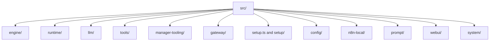
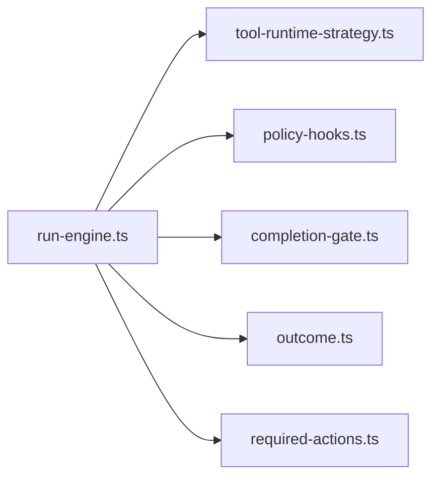
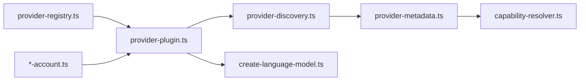

# Module Map

Cette page cartographie les modules principaux du repo et leurs responsabilites actuelles.

## Carte par dossiers

```mermaid
flowchart TD
    SRC[src/]
    SRC --> ENGINE[engine/]
    SRC --> RUNTIME[runtime/]
    SRC --> LLM[llm/]
    SRC --> TOOLS[tools/]
    SRC --> MGR[manager-tooling/]
    SRC --> GATEWAY[gateway/]
    SRC --> SETUP[setup.ts and setup/]
    SRC --> CONFIG[config/]
    SRC --> N8NLOCAL[n8n-local/]
    SRC --> PROMPT[prompt/]
    SRC --> WEBUI[webui/]
    SRC --> SYSTEM[system/]
```

Cette carte repond a la question "ou vit quoi ?" :

- `runtime/` porte la boucle et les politiques d'execution (agnostique)
- `llm/` porte les plugins providers, la metadata et la creation de modele
- `tools/` porte les outils generalistes (FS, shell, HTTP)
- `manager-tooling/` porte les outils yagr-manager (presentWorkflowResult, yagrProxy, YAGENTS.md)
- `gateway/` porte les facades
- `setup/` porte la couche applicative de configuration

## Details par bloc

### `src/engine/`

Fichiers clefs:

- `engine.ts`
- `n8n-engine.ts`
- `yagr-engine.ts`

Responsabilites actuelles:

- contrat abstrait de backend automation
- ports specialises pour catalogue, compilation, validation et lifecycle workflow
- implementation n8n (`N8nEngine`)
- stub du futur moteur natif (`YagrNativeEngine` avec `name = 'yagr-engine'`)

Dette structurelle:

- le contrat `Engine` complet reste encore present pour compatibilite
- la migration vers les ports fins est maintenant appliquee aux tools, au runtime, au prompt et aux gateways
- `YagrNativeEngine` est un stub non implemente — la direction cible est documentee dans `../target/yagr-engine-architecture.md`

### `src/runtime/`

Fichiers clefs:

- `run-engine.ts`
- `tool-runtime-strategy.ts`
- `context-compaction.ts`
- `policy-hooks.ts`
- `completion-gate.ts`
- `required-actions.ts`
- `outcome.ts`

Responsabilites actuelles:

- orchestration du run
- etat et journal
- enforcement runtime
- compaction de contexte
- selection d'une strategie runtime selon le niveau de capacite (`native`, `compatible`, `weak`, `none`)

Observation actuelle:

- le runtime consomme maintenant `EngineRuntimePort` plutot que le contrat `Engine` complet
- le runtime choisit maintenant seul la surface d'outils, le mode de tool calling et la politique post-sync via `tool-runtime-strategy.ts` puis `policy-hooks.ts`
- `completion-gate.ts` et `run-engine.ts` imposent maintenant une fin de run plus stricte: resultat concret, blocker structure, ou poursuite

```mermaid
flowchart LR
    RE[run-engine.ts]
    STRAT[tool-runtime-strategy.ts]
    HOOKS[policy-hooks.ts]
    GATE[completion-gate.ts]
    OUT[outcome.ts]
    ACT[required-actions.ts]

    RE --> STRAT
    RE --> HOOKS
    RE --> GATE
    RE --> OUT
    RE --> ACT
```

### `src/llm/`

Fichiers clefs:

- `provider-registry.ts`
- `create-language-model.ts`
- `provider-discovery.ts`
- `provider-metadata.ts`
- `capability-resolver.ts`
- `proxy-runtime.ts`
- `openai-account.ts`
- `anthropic-account.ts`
- `copilot-account.ts`

Responsabilites actuelles:

- metadonnees providers
- resolution de configuration
- auth
- creation modele via `ProviderPlugin`
- discovery via `ProviderPlugin`
- cache de metadonnees provider/model
- normalisation des capacites provider/model
- compat provider-specific

Dette structurelle:

- les adapters providers sont maintenant recentres autour de `ProviderPlugin`

```mermaid
flowchart LR
    REG[provider-registry.ts]
    PLUG[provider-plugin.ts]
    DISC[provider-discovery.ts]
    META[provider-metadata.ts]
    CAP[capability-resolver.ts]
    CLM[create-language-model.ts]
    ACC[*-account.ts]

    REG --> PLUG
    PLUG --> DISC
    PLUG --> CLM
    DISC --> META
    META --> CAP
    ACC --> PLUG
```

### `src/tools/`

Familles actuelles:

- outils generalistes (FS, shell, HTTP) : `readFile`, `grep`, `listDir`, `writeFile`, `replaceInFile`, `moveFile`, `deleteFile`, `httpRequest`, `runScript`, `runShell`
- outils de statut et interaction : `reportProgress`, `requestRequiredAction`
- groupes normalises de surface outillage dans `toolsets.ts`

Observation actuelle:

- les tools ne dependent plus du contrat `Engine` monolithique : ils consomment des ports cibles selon leur responsabilite
- `toolsets.ts` est le SSOT des groupes d'outils exposes au runtime
- `build-tools.ts` applique la surface d'outils decidee par la strategie runtime au lieu de porter sa propre politique implicite
- les noms d'outils sont generiques (`readFile`, `grep`, `listDir`…) et ne portent plus le prefixe workspace
- les outils n8n-specific (`presentWorkflowResult`, `yagrProxy`) ont ete deplaces vers `src/manager-tooling/`

### `src/manager-tooling/`

Fichiers clefs:

- `present-workflow.ts` — Tool `presentWorkflowResult` : presente un workflow n8n avec URL canonique resolue (host + workflowId, tunnel si actif)
- `yagr-proxy.ts` — Tool `yagrProxy` : demarre le relay LLM et cree la credential n8n
- `YAGENTS.md` — Instructions injectees dans le system prompt pour l'agent
- `index.ts` — Barrel export

Responsabilites:

- outillage specifique yagr-manager, enregistre dynamiquement quand l'engine n8n est actif
- resolution d'URL canonique depuis la config n8n persistee
- l'agent reste agnostique : il utilise ces tools comme n'importe quels autres outils CLI

### `src/gateway/`

Sous-blocs actuels:

- transports et facades
- supervision des surfaces
- formatting de messages
- liens vers les workflows

Observation actuelle:

- la WebUI et Telegram deleguent maintenant l'essentiel des mutations setup/config au service applicatif partage
- la CLI ne persiste plus directement la configuration metier du runtime et passe elle aussi par la couche applicative
- les facades gardent maintenant l'I/O, les sessions et le branchement des runtimes
- les facades conversationnelles passent maintenant par `YagrSessionAgent` plutot que par l'agent complet

### `src/setup.ts` et `src/setup/`

Role actuel:

- `src/setup/application-services.ts`: service applicatif partage pour operations n8n, LLM et surfaces
- `src/setup/status.ts`: calcul partage du statut setup
- point de coordination du wizard et de l'onboarding
- point de coordination entre config, providers, surfaces et n8n local

Dette structurelle:

- une premiere extraction existe via `application-services.ts`
- la WebUI s'appuie desormais sur le service applicatif pour construire son snapshot de configuration
- il reste encore de la logique d'orchestration a affiner dans `src/setup.ts` et certaines facades

### `src/config/`

Role actuel:

- SSOT local partiel pour config Yagr et n8n
- persistance credentials
- resolution chemins et home dir

Note:

- cette zone est le meilleur candidat pour devenir le coeur du SSOT applicatif, a condition de remonter la logique de coordination dans des services d'application explicites
- la resolution n8n partagee vit maintenant aussi ici: le runtime normal lit la config persistee, tandis que le fallback environnement n'est autorise que pour le harness automatise

## References utiles

- Boucle agentique: `src/agent.ts`, `src/runtime/*`
- Providers: `src/llm/*`
- Tooling generaliste: `src/tools/*`
- Tooling manager: `src/manager-tooling/*`
- Facades: `src/gateway/*`, `src/webui/*`
- Setup: `src/setup.ts`, `src/setup/*`, `src/n8n-local/*`
