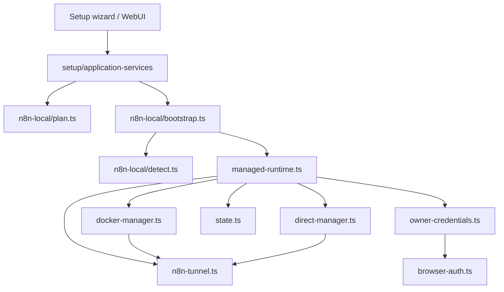
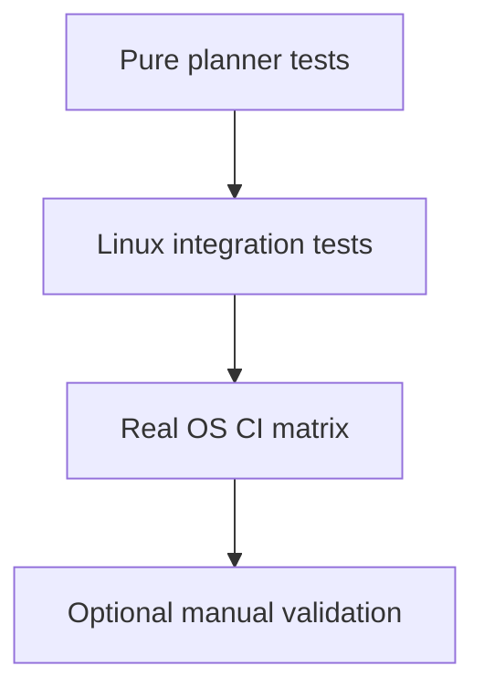

# n8n Local

Cette page decrit l'architecture actuelle du bootstrap n8n local, ainsi que la strategie de test retenue autour de ce bloc.

## Position produit actuelle

Le repo supporte deux grands chemins n8n:

1. connexion a une instance existante
2. instance n8n locale geree par Yagr

Le principe durable conserve des anciens plans est le suivant:

- Yagr doit privilegier un runtime n8n isole quand il le gere lui-meme
- Yagr ne doit pas faire d'install machine intrusive en silence
- la decision Docker vs runtime direct doit rester explicite, testable, et basee sur la detection d'environnement

## Matrice d'instances

Le wizard est la source canonique du type d'instance n8n. Il persiste un `instanceProfile` explicite au lieu de laisser cette decision a des heuristiques reseau.

| Choix wizard | Profil persiste | Tags | Redemarrage/sante geres par Yagr | Tunnel n8n | URL LLM proxy attendue |
|---|---|---|---|---|---|
| Instance Yagr-managed avec Docker | `yagr-managed-docker` | `YAGR_MANAGED`, `DOCKER` | oui | oui | `docker` |
| Instance Yagr-managed sans Docker | `yagr-managed-direct` | `YAGR_MANAGED` | oui | oui | `local` |
| Instance existante cloud | `custom-cloud` | `CLOUD` | non | non | `tunnel` |
| Instance existante locale dans Docker | `custom-local-docker` | `DOCKER` | non | non | `docker` |
| Instance existante locale hors Docker | `custom-local-direct` | aucun | non | non | `local` |

## Matrice LLM proxy

Le LLM proxy doit choisir son URL en fonction de la reachability de n8n vers l'hote Yagr, pas en fonction de la simple presence de Docker sur la machine.

| Profil n8n | Type d'URL LLM proxy | Exemple |
|---|---|---|
| `yagr-managed-direct` | `local` | `http://127.0.0.1:11437/v1` |
| `yagr-managed-docker` | `docker` | `http://host.docker.internal:11437/v1` |
| `custom-local-direct` | `local` | `http://127.0.0.1:11437/v1` |
| `custom-local-docker` | `docker` | `http://host.docker.internal:11437/v1` |
| `custom-cloud` | `tunnel` | `https://xxxxx.trycloudflare.com/v1` |

## Wizard didactique

Le flux n8n cible est volontairement pedagogique:

1. `Disposez-vous deja d'une instance n8n ?`
2. si non: `Souhaitez-vous installer une instance avec Docker ?`
3. si oui: `URL` puis `cle API`
4. puis: `S'agit-il d'une instance cloud ?`
5. si non: `Cette instance locale tourne-t-elle dans Docker ?`

Ce flux doit rester la seule source canonique pour distinguer `custom-local-docker` et `custom-local-direct`.

## Blocs actuels

- [bootstrap.ts](/home/etienne/repos/yagr/src/n8n-local/bootstrap.ts)
- [detect.ts](/home/etienne/repos/yagr/src/n8n-local/detect.ts)
- [plan.ts](/home/etienne/repos/yagr/src/n8n-local/plan.ts)
- [managed-runtime.ts](/home/etienne/repos/yagr/src/n8n-local/managed-runtime.ts)
- [docker-manager.ts](/home/etienne/repos/yagr/src/n8n-local/docker-manager.ts)
- [direct-manager.ts](/home/etienne/repos/yagr/src/n8n-local/direct-manager.ts)
- [owner-credentials.ts](/home/etienne/repos/yagr/src/n8n-local/owner-credentials.ts)
- [browser-auth.ts](/home/etienne/repos/yagr/src/n8n-local/browser-auth.ts)
- [state.ts](/home/etienne/repos/yagr/src/n8n-local/state.ts)
- [n8n-tunnel.ts](/home/etienne/repos/yagr/src/n8n-local/n8n-tunnel.ts) — Cloudflare Tunnel exposure

## Vue d'ensemble



## Regles de conception

- la detection d'environnement doit rester separee de l'execution
- la planification doit rester pure autant que possible
- les choix d'installation ne doivent pas etre disperses dans les facades
- l'etat d'instance geree doit rester sous `YAGR_HOME`
- un runtime gere par Yagr doit rester distinct d'une instance n8n utilisateur preexistante

## Strategie actuelle

Le signal encore valide des anciens plans est:

- Docker reste la voie privilegiee quand il est disponible
- le runtime direct existe comme fallback
- les preconditions machine sont detectees avant d'essayer un bootstrap
- l'ownership et les credentials sont traites comme un sous-probleme explicite, pas comme un detail implicite

Ce qui est important ici n'est pas de garder les anciennes phases de planification, mais de conserver ces invariants.

## Strategie de test actuelle



Tests et points d'entree actuels:

- [n8n-local-detect.test.mjs](/home/etienne/repos/yagr/tests/n8n-local-detect.test.mjs)
- [n8n-local-plan.test.mjs](/home/etienne/repos/yagr/tests/n8n-local-plan.test.mjs)
- [n8n-local-state.test.mjs](/home/etienne/repos/yagr/tests/n8n-local-state.test.mjs)
- [n8n-local-doctor.test.mjs](/home/etienne/repos/yagr/tests/integration/n8n-local-doctor.test.mjs)
- [n8n-local-install.test.mjs](/home/etienne/repos/yagr/tests/integration/n8n-local-install.test.mjs)
- [n8n-local-silent-bootstrap.test.mjs](/home/etienne/repos/yagr/tests/integration/n8n-local-silent-bootstrap.test.mjs)

Regle durable:

- la confiance principale doit venir des tests de planification et detection purs
- les tests d'integration doivent valider un environnement propre et reproductible
- les validations lourdes manuelles ne doivent pas devenir la source canonique de confiance

## Cloudflare Tunnel

Le module `n8n-tunnel.ts` permet d'exposer l'instance n8n locale via un tunnel Cloudflare, rendant les webhooks accessibles depuis l'exterieur.

### Composants

| Element | Role |
|---|---|
| `startN8nTunnel(targetUrl)` | Spawne `cloudflared tunnel --url <targetUrl>` en detaché, detecte l'URL publique dans le log |
| `stopN8nTunnel()` | Tue le process cloudflared et nettoie le state |
| `refreshN8nTunnel(targetUrl)` | Stop + start pour renouveler l'URL |
| `getActiveTunnelState()` | Retourne le state si le process est vivant, null sinon |
| `installCloudflaredIfNeeded()` | Telecharge cloudflared dans `YAGR_HOME/bin` si absent du PATH |
| `resolveN8nTunnelTargetUrl()` | Resout l'URL locale n8n cible (managed uniquement) |
| `startProxyTunnel(targetUrl)` | Tunnel dedie pour le LLM Proxy (deduplication par targetUrl) |

### Persistance

L'etat du tunnel est persiste dans `YAGR_HOME/n8n-tunnel-state.json`:

```typescript
interface N8nTunnelState {
  publicUrl: string;   // URL trycloudflare.com
  targetUrl: string;   // URL locale n8n
  pid: number;         // PID du process cloudflared
  startedAt: string;   // ISO timestamp
}
```

### Regles de conception

- Le tunnel n8n ne s'applique qu'aux instances **Yagr-managed**.
- Deux tunnels coexistent : Tunnel A (LLM Proxy) et Tunnel B (N8N Webhook Exposure).
- Le tunnel du LLM proxy ne s'applique qu'aux profils `custom-cloud`.
- Les URL `trycloudflare.com` changent a chaque restart — le systeme supporte `refresh` manuel.
- `N8N_WEBHOOK_URL` est positionne au demarrage n8n ; un refresh tunnel propose un redemarrage explicite.
- Le tunnel expose une surface **non authentifiee** par defaut pour les webhooks.
