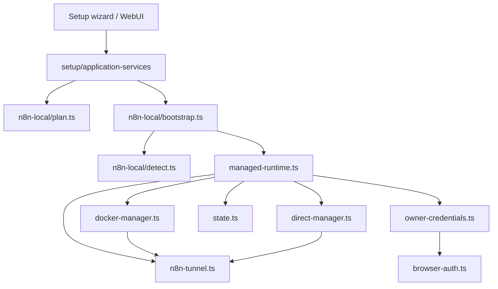
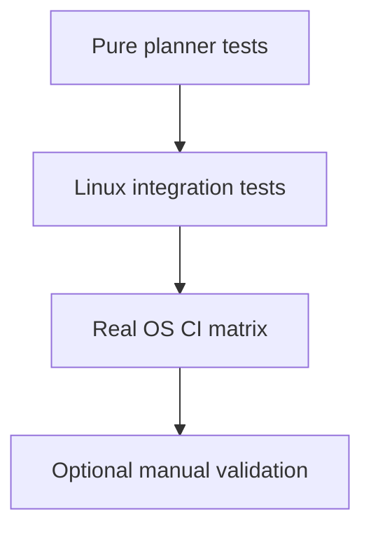

# n8n Local

This page describes the current architecture of the local n8n bootstrap, as well as the test strategy around this block.

## Current Product Position

The repo supports two major n8n paths:

1. connection to an existing instance
2. local n8n instance managed by Yagr

The durable principle kept from old plans is as follows:

- Yagr must favor an isolated n8n runtime when it manages it itself
- Yagr must not do silent intrusive machine installation
- the Docker vs direct runtime decision must remain explicit, testable, and based on environment detection

## Instance Matrix

The wizard is the canonical source of the n8n instance type. It persists an explicit `instanceProfile` instead of leaving this decision to network heuristics.

| Wizard choice | Persisted profile | Tags | Restart/health managed by Yagr | n8n tunnel | Expected LLM proxy URL |
|---|---|---|---|---|---|
| Yagr-managed instance with Docker | `yagr-managed-docker` | `YAGR_MANAGED`, `DOCKER` | yes | yes | `docker` |
| Yagr-managed instance without Docker | `yagr-managed-direct` | `YAGR_MANAGED` | yes | yes | `local` |
| Existing cloud instance | `custom-cloud` | `CLOUD` | no | no | `tunnel` |
| Existing local instance in Docker | `custom-local-docker` | `DOCKER` | no | no | `docker` |
| Existing local instance outside Docker | `custom-local-direct` | none | no | no | `local` |

## LLM Proxy Matrix

The LLM proxy must choose its URL based on n8n's reachability to the Yagr host, not based on the simple presence of Docker on the machine.

| n8n profile | LLM proxy URL type | Example |
|---|---|---|
| `yagr-managed-direct` | `local` | `http://127.0.0.1:11437/v1` |
| `yagr-managed-docker` | `docker` | `http://host.docker.internal:11437/v1` |
| `custom-local-direct` | `local` | `http://127.0.0.1:11437/v1` |
| `custom-local-docker` | `docker` | `http://host.docker.internal:11437/v1` |
| `custom-cloud` | `tunnel` | `https://xxxxx.trycloudflare.com/v1` |

## Didactic Wizard

The target n8n flow is intentionally pedagogical:

1. `Do you already have an n8n instance?`
2. if no: `Do you want to install an instance with Docker?`
3. if yes: `URL` then `API key`
4. then: `Is this a cloud instance?`
5. if no: `Does this local instance run in Docker?`

This flow must remain the only canonical source to distinguish `custom-local-docker` and `custom-local-direct`.

## Current Blocks

- [bootstrap.ts](/home/etienne/repos/yagr/src/n8n-local/bootstrap.ts)
- [detect.ts](/home/etienne/repos/yagr/src/n8n-local/detect.ts)
- [plan.ts](/home/etienne/repos/yagr/src/n8n-local/plan.ts)
- [managed-runtime.ts](/home/etienne/repos/yagr/src/n8n-local/managed-runtime.ts)
- [docker-manager.ts](/home/etienne/repos/yagr/src/n8n-local/docker-manager.ts)
- [direct-manager.ts](/home/etienne/repos/yagr/src/n8n-local/direct-manager.ts)
- [owner-credentials.ts](/home/etienne/repos/yagr/src/n8n-local/owner-credentials.ts)
- [browser-auth.ts](/home/etienne/repos/yagr/src/n8n-local/browser-auth.ts)
- [state.ts](/home/etienne/repos/yagr/src/n8n-local/state.ts)
- [n8n-tunnel.ts](/home/etienne/repos/yagr/src/n8n-local/n8n-tunnel.ts) — Cloudflare Tunnel exposure

## Overview



## Design Rules

- environment detection must remain separate from execution
- planning must remain as pure as possible
- installation choices must not be scattered in facades
- managed instance state must remain under `YAGR_HOME`
- a runtime managed by Yagr must remain distinct from a user's pre-existing n8n instance

## Current Strategy

The still-valid signal from old plans is:

- Docker remains the preferred path when available
- the direct runtime exists as a fallback
- machine preconditions are detected before attempting bootstrap
- ownership and credentials are treated as an explicit sub-problem, not an implicit detail
- at startup, `managed-runtime.ts` is the SSOT of preparation of a Yagr-managed instance: it restarts the runtime, or recreates it if the runtime state has disappeared but the `instanceProfile` persists as Yagr-managed, then reconciles if needed the silent bootstrap and final persistence via `setup/application-services.ts`
- a Yagr-managed instance restarted after container/runtime deletion must automatically return to a `connected` state, not just `ready`

What is important here is not to keep the old planning phases, but to preserve these invariants.

## Current Test Strategy



Current tests and entry points:

- [n8n-local-detect.test.mjs](/home/etienne/repos/yagr/tests/n8n-local-detect.test.mjs)
- [n8n-local-plan.test.mjs](/home/etienne/repos/yagr/tests/n8n-local-plan.test.mjs)
- [n8n-local-state.test.mjs](/home/etienne/repos/yagr/tests/n8n-local-state.test.mjs)
- [n8n-local-doctor.test.mjs](/home/etienne/repos/yagr/tests/integration/n8n-local-doctor.test.mjs)
- [n8n-local-install.test.mjs](/home/etienne/repos/yagr/tests/integration/n8n-local-install.test.mjs)
- [n8n-local-silent-bootstrap.test.mjs](/home/etienne/repos/yagr/tests/integration/n8n-local-silent-bootstrap.test.mjs)

Durable rule:

- the main confidence must come from pure planning and detection tests
- integration tests must validate a clean and reproducible environment
- heavy manual validations must not become the canonical source of confidence

## Cloudflare Tunnel

The `n8n-tunnel.ts` and `tunnel-reachability.ts` modules manage three distinct Cloudflare use cases:

- `n8n tunnel` to expose the Yagr-managed local n8n instance
- `n8n auth tunnel` to expose the auth bridge used for remote workflow opening
- `llm tunnel` to expose the local LLM relay to cloud n8n instances

### Components

| Element | Role |
|---|---|
| `startN8nTunnel(targetUrl)` | Spawns `cloudflared tunnel --url <targetUrl>` detached, detects public URL in log |
| `stopN8nTunnel()` | Kills the cloudflared process and cleans up state |
| `refreshN8nTunnel(targetUrl)` | Stop + start to renew the URL |
| `getActiveTunnelState()` | Returns state if process is alive, null otherwise |
| `installCloudflaredIfNeeded()` | Downloads cloudflared into `YAGR_HOME/bin` if absent from PATH |
| `resolveN8nTunnelTargetUrl()` | Resolves target local n8n URL (managed only) |
| `startLlmTunnel(targetUrl)` | Dedicated tunnel for LLM relay (deduplication by targetUrl) |
| `startN8nAuthTunnel(targetUrl)` | Dedicated tunnel for n8n auth bridge |
| `ensureFacadeTunnelReachability(consumer)` | Wake-up policy by facade/consumer |

### Persistence

Tunnel state is persisted under `YAGR_HOME`:

- `n8n-tunnel-state.json`
- `proxy-runtime/n8n-auth-tunnel.json`
- `proxy-runtime/llm-tunnel.json`

A tunnel's state follows the same canonical structure:

```typescript
interface TunnelState {
  publicUrl: string;   // trycloudflare.com URL
  targetUrl: string;   // target local URL
  pid: number;         // cloudflared process PID
  startedAt: string;   // ISO timestamp
}
```

### Design Rules

- the n8n tunnel only applies to **Yagr-managed** instances.
- three tunnels can coexist: `n8n`, `n8n auth`, `llm`.
- the `llm` tunnel only applies to `custom-cloud` profiles.
- `trycloudflare.com` URLs change on every restart; `TUNNEL_DOMAIN` switches to dedicated DNS-managed hostnames via `cloudflared`.
- `N8N_WEBHOOK_URL` is set at n8n startup; a tunnel refresh proposes an explicit restart.
- The tunnel exposes an **unauthenticated** surface by default for webhooks.
- Tunnel wake-up is driven by `tunnel-reachability.ts`, not directly by facades.
