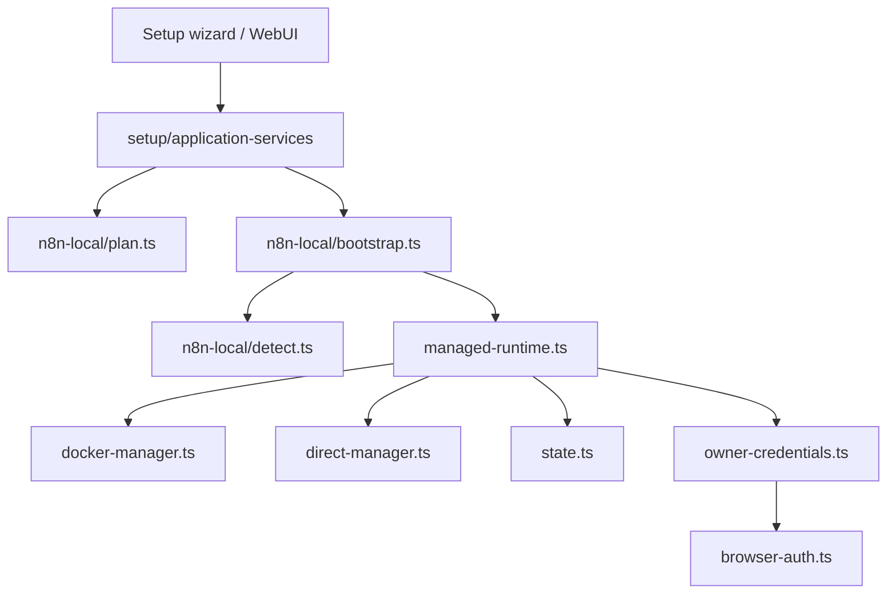
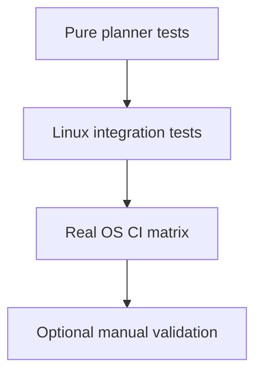

# n8n Local

Cette page decrit l'architecture actuelle du bootstrap n8n local, ainsi que la strategie de test retenue autour de ce bloc.

## Position produit actuelle

Le repo supporte deux grands chemins n8n:

1. connexion a une instance existante
2. instance n8n locale geree par Yagr

Le principe durable conserve des anciens plans est le suivant:

- Yagr doit privilegier un runtime n8n isole quand il le gere lui-meme
- Yagr ne doit pas faire d'install machine intrusive en silence
- la decision Docker vs runtime direct doit rester explicite, testable, et basee sur la detection d'environnement

## Blocs actuels

- [bootstrap.ts](/home/etienne/repos/yagr/src/n8n-local/bootstrap.ts)
- [detect.ts](/home/etienne/repos/yagr/src/n8n-local/detect.ts)
- [plan.ts](/home/etienne/repos/yagr/src/n8n-local/plan.ts)
- [managed-runtime.ts](/home/etienne/repos/yagr/src/n8n-local/managed-runtime.ts)
- [docker-manager.ts](/home/etienne/repos/yagr/src/n8n-local/docker-manager.ts)
- [direct-manager.ts](/home/etienne/repos/yagr/src/n8n-local/direct-manager.ts)
- [owner-credentials.ts](/home/etienne/repos/yagr/src/n8n-local/owner-credentials.ts)
- [browser-auth.ts](/home/etienne/repos/yagr/src/n8n-local/browser-auth.ts)
- [state.ts](/home/etienne/repos/yagr/src/n8n-local/state.ts)

## Vue d'ensemble

## Regles de conception

- la detection d'environnement doit rester separee de l'execution
- la planification doit rester pure autant que possible
- les choix d'installation ne doivent pas etre disperses dans les facades
- l'etat d'instance geree doit rester sous `YAGR_HOME`
- un runtime gere par Yagr doit rester distinct d'une instance n8n utilisateur preexistante

## Strategie actuelle

Le signal encore valide des anciens plans est:

- Docker reste la voie privilegiee quand il est disponible
- le runtime direct existe comme fallback
- les preconditions machine sont detectees avant d'essayer un bootstrap
- l'ownership et les credentials sont traites comme un sous-probleme explicite, pas comme un detail implicite

Ce qui est important ici n'est pas de garder les anciennes phases de planification, mais de conserver ces invariants.

## Strategie de test actuelle

Tests et points d'entree actuels:

- [n8n-local-detect.test.mjs](/home/etienne/repos/yagr/tests/n8n-local-detect.test.mjs)
- [n8n-local-plan.test.mjs](/home/etienne/repos/yagr/tests/n8n-local-plan.test.mjs)
- [n8n-local-state.test.mjs](/home/etienne/repos/yagr/tests/n8n-local-state.test.mjs)
- [n8n-local-doctor.test.mjs](/home/etienne/repos/yagr/tests/integration/n8n-local-doctor.test.mjs)
- [n8n-local-install.test.mjs](/home/etienne/repos/yagr/tests/integration/n8n-local-install.test.mjs)
- [n8n-local-silent-bootstrap.test.mjs](/home/etienne/repos/yagr/tests/integration/n8n-local-silent-bootstrap.test.mjs)

Regle durable:

- la confiance principale doit venir des tests de planification et detection purs
- les tests d'integration doivent valider un environnement propre et reproductible
- les validations lourdes manuelles ne doivent pas devenir la source canonique de confiance
