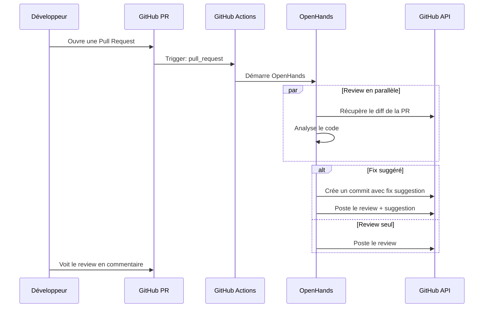

# OpenHands PR Review Agent — Architecture Target

> **Status**: Target (à implémenter)
> **Migration**: Sera déplacé vers `architecture/current/` une fois implémenté
> **Note importante**: OpenHands tourne de manière **autonome** dans GitHub Actions, **sans intégration avec Yagr**. Yagr est simplement le repository qui sera review.

## Contexte

L'utilisateur souhaite mettre en place OpenHands pour automatiser les reviews de Pull Requests avec :
- **Review automatique** : analyse et commentaires sur les PRs via GitHub Actions
- **Corrections semi-automatiques** : suggestions de fixes nécessitant validation utilisateur

OpenHands est un agent IA **indépendant** qui s'exécute dans GitHub Actions. Il n'est pas intégré à Yagr — Yagr est juste le repo à reviewer.

---

## 1. OpenHands — Vue d'ensemble

### 1.1 Qu'est-ce qu'OpenHands ?

[OpenHands](https://github.com/OpenHands/OpenHands) est un agent IA open-source conçu pour automatiser des tâches de développement logiciel :

- Lecture et compréhension du code
- Proposition de modifications
- Création/modification de fichiers
- Exécution de commandes shell
- Interaction avec des APIs (GitHub, etc.)

### 1.2 Mode GitHub Actions

OpenHands s'exécute **autonomement** dans GitHub Actions :

1. Déclenchement sur événements PR (`pull_request`, `issue_comment`)
2. Exécution de l'agent sur le contexte de la PR
3. Posting de commentaires via l'API GitHub
4. Création optionnelle de commits de fix (avec validation)

---

## 2. Architecture — OpenHands Standalone

```
┌─────────────────────────────────────────────────────────────┐
│                    GitHub Actions                           │
│                                                              │
│  ┌───────────────────────────────────────────────────────┐  │
│  │   .github/workflows/openhands-pr-review.yml           │  │
│  └───────────────────────┬───────────────────────────────┘  │
│                          │                                   │
│                          ▼                                   │
│  ┌───────────────────────────────────────────────────────┐  │
│  │   OpenHands Agent (sandboxed)                         │  │
│  │   • Exécution autonome                                │  │
│  │   • Accès au code via checkout                        │  │
│  │   • Posting via GitHub API                            │  │
│  └───────────────────────┬───────────────────────────────┘  │
│                          │                                   │
│                          ▼                                   │
│  ┌───────────────────────────────────────────────────────┐  │
│  │   GitHub PR Comment                                   │  │
│  │   • Review détaillé                                   │  │
│  │   • Suggestions de fix                                │  │
│  └───────────────────────────────────────────────────────┘  │
│                                                              │
└─────────────────────────────────────────────────────────────┘

Yagr n'est PAS impliqué dans ce flux. Yagr = le repository sous review.
```

### 2.1 Flux détaillé



---

## 3. Configuration Requise

### 3.1 Secrets GitHub à configurer

| Secret | Description | Required |
|--------|-------------|----------|
| `ANTHROPIC_API_KEY` | Clé API Anthropic (Claude) | Oui |
| `OPENAI_API_KEY` | Clé API OpenAI (backup) | Alternatif |
| `OPENAI_API_KEY` | Clé API si pas Anthropic | Dépend du provider |

### 3.2 Variables GitHub (non-secrets)

| Variable | Description | Default |
|----------|-------------|---------|
| `OPENHANDS_MODEL` | Modèle LLM | `claude-sonnet-4-20250514` |

### 3.3 Emplacement des clés

```
┌─────────────────────────────────────────────────────────────┐
│                    STOCKAGE DES CLÉS D'API                    │
├─────────────────────────────────────────────────────────────┤
│                                                              │
│  GitHub Actions Secrets (Settings → Secrets → Actions)       │
│  ┌─────────────────────────────────────────────────────┐    │
│  │  ANTHROPIC_API_KEY    → Clé API Anthropic           │    │
│  │  OPENAI_API_KEY      → Clé API OpenAI (backup)     │    │
│  └─────────────────────────────────────────────────────┘    │
│                                                              │
│  GitHub Actions Variables (Settings → Variables → Actions)   │
│  ┌─────────────────────────────────────────────────────┐    │
│  │  OPENHANDS_MODEL    → claude-sonnet-4-20250514     │    │
│  └─────────────────────────────────────────────────────┘    │
│                                                              │
└─────────────────────────────────────────────────────────────┘
```

---

## 4. Workflow GitHub Actions

### 4.1 Fichier principal

**Fichier**: [`.github/workflows/openhands-pr-review.yml`](.github/workflows/openhands-pr-review.yml)

```yaml
name: OpenHands PR Review

on:
  pull_request:
    types: [opened, synchronize]
  issue_comment:
    types: [created]

permissions:
  contents: read
  pull-requests: write

jobs:
  pr-review:
    name: OpenHands AI Review
    runs-on: ubuntu-latest
    if: github.event.pull_request.draft == false
    
    steps:
      - uses: actions/checkout@v4
        with:
          fetch-depth: 0
          
      # Option 1: Action officielle OpenHands (quand disponible)
      # - uses: openhands/openhands-action@latest
      #   with:
      #     api_key: ${{ secrets.ANTHROPIC_API_KEY }}
      #     model: ${{ vars.OPENHANDS_MODEL }}
      #     task: pr_review
      
      # Option 2: Installation pip manuelle
      - uses: actions/setup-python@v5
        with:
          python-version: '3.11'
          
      - name: Install OpenHands
        run: pip install openhands
        
      - name: Run PR Review
        env:
          ANTHROPIC_API_KEY: ${{ secrets.ANTHROPIC_API_KEY }}
          GITHUB_TOKEN: ${{ secrets.GITHUB_TOKEN }}
        run: |
          openhands run --task pr_review
```

---

## 5. Considérations de Sécurité

### 5.1 Principes

1. **Clés API dans GitHub Secrets** — Jamais dans le code
2. **Sandbox** — OpenHands s'exécute dans un environnement isolé
3. **Validation humaine** — Les fixes sont proposés, jamais auto-merged
4. **Permissions minimales** — `contents: read`, `pull-requests: write`

### 5.2 Permissions GitHub

```yaml
permissions:
  contents: read      # Lecture du code pour review
  pull-requests: write # Posting des reviews
```

---

## 6. Coûts et Limitations

### 6.1 Coûts estimés

| Composant | Coût |
|-----------|------|
| OpenHands execution (Claude Sonnet 4) | ~$0.50-2.00 / PR |
| GitHub Actions (2-5 min) | ~$0.01-0.05 / PR |

### 6.2 Limitations

- **Token context** — Les très grandes PRs peuvent dépasser le contexte
- **Temps d'exécution** — ~2-5 min par PR
- **Rate limiting** — GitHub API limit (5000 req/h)

---

## 7. Prochaines Étapes d'Implémentation

### Phase 1 : Configuration initiale
1. [ ] Créer `.github/workflows/openhands-pr-review.yml`
2. [ ] Configurer `ANTHROPIC_API_KEY` dans GitHub Secrets
3. [ ] Configurer `OPENHANDS_MODEL` dans GitHub Variables
4. [ ] Tester sur une PR test

### Phase 2 : Personnalisation
1. [ ] Affiner les instructions de review
2. [ ] Configurer les types de problèmes à détecter
3. [ ] Ajuster le modèle si nécessaire

### Phase 3 : Auto-fix (optionnel)
1. [ ] Activer la création de branches de fix
2. [ ] Configurer les règles de validation
3. [ ] Tester le workflow de validation

---

## 8. Alternatives

| Solution | Avantages | Inconvénients |
|----------|-----------|---------------|
| **OpenHands** | Open source, flexible, autonome | Setup initial requis |
| **GitHub Copilot** | Déjà intégré à GitHub | Moins flexible |
| **CodeRabbit** | Purpose-built pour PR reviews | Service SaaS externe |
| **Custom LLM script** | Contrôle total | Développement from scratch |
