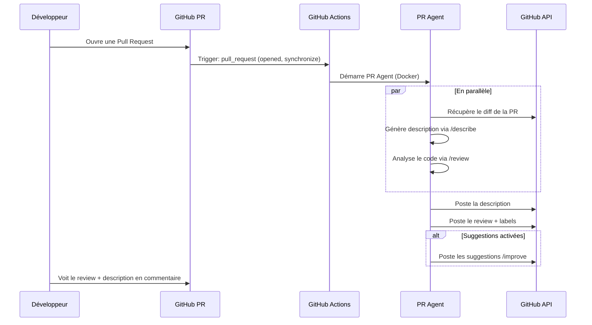

# PR Agent — Architecture

> **Status**: Implemented
> **Migration**: Remplace `openhands-pr-review-architecture.md`
> **Note importante**: PR Agent tourne de manière **autonome** dans GitHub Actions, **sans intégration avec Yagr**. Yagr est simplement le repository qui sera review.

## Contexte

PR Agent est un agent IA **indépendant** qui s'exécute dans GitHub Actions. Il n'est pas intégré à Yagr — Yagr est juste le repo à reviewer.

---

## 1. PR Agent — Vue d'ensemble

### 1.1 Qu'est-ce que PR Agent ?

[PR Agent](https://github.com/qodo-ai/pr-agent) est un agent IA open-source conçu pour automatiser les reviews de Pull Requests avec plusieurs outils :

- **`/describe`** : Génère une description automatique de la PR
- **`/review`** : Analyse et commente les PRs via GitHub Actions
- **`/improve`** : Suggère des améliorations de code
- **`/ask`** : Pose des questions sur le code

### 1.2 Mode GitHub Actions

PR Agent s'exécute **autonomement** dans GitHub Actions via un container Docker :

1. Déclenchement sur événements PR (`pull_request`)
2. Exécution de l'agent via la GitHub Action officielle
3. Posting de commentaires via l'API GitHub
4. Labels automatiques optionnels

---

## 2. Architecture — PR Agent Standalone

```
┌─────────────────────────────────────────────────────────────┐
│                    GitHub Actions                           │
│                                                              │
│  ┌───────────────────────────────────────────────────────┐  │
│  │   .github/workflows/pr-agent.yml                       │  │
│  └───────────────────────┬───────────────────────────────┘  │
│                          │                                   │
│                          ▼                                   │
│  ┌───────────────────────────────────────────────────────┐  │
│  │   Codium-ai/pr-agent Docker Container                  │  │
│  │   • /describe, /review, /improve                       │  │
│  │   • Posting via GitHub API                            │  │
│  │   • Labels, comments, suggestions                     │  │
│  └───────────────────────┬───────────────────────────────┘  │
│                          │                                   │
│                          ▼                                   │
│  ┌───────────────────────────────────────────────────────┐  │
│  │   GitHub PR                                            │  │
│  │   • Description générée                                │  │
│  │   • Review détaillé                                    │  │
│  │   • Suggestions de code                               │  │
│  └───────────────────────────────────────────────────────┘  │
│                                                              │
└─────────────────────────────────────────────────────────────┘

Yagr n'est PAS impliqué dans ce flux. Yagr = le repository sous review.
```

### 2.1 Flux détaillé



---

## 3. Configuration Requise

### 3.1 Secrets GitHub à configurer

| Secret | Description | Required |
|--------|-------------|----------|
| `LLM_API_KEY` | Clé API MiniMax (ou autre provider) | Oui |
| `PAT_TOKEN` | GitHub Personal Access Token | Oui |

### 3.2 Variables GitHub (non-secrets)

| Variable | Description | Default |
|----------|-------------|---------|
| `OPENHANDS_LLM_BASE_URL` | URL base de l'API LLM | `https://api.minimax.io/v1` |
| `OPENHANDS_LLM_MODEL` | Modèle LLM | `minimax/MiniMax-M2.7` |
| `OPENHANDS_REVIEW_STYLE` | Style de review | `roasted` |

### 3.3 Emplacement des clés

```
┌─────────────────────────────────────────────────────────────┐
│                    STOCKAGE DES CLÉS D'API                    │
├─────────────────────────────────────────────────────────────┤
│                                                              │
│  GitHub Actions Secrets (Settings → Secrets → Actions)       │
│  ┌─────────────────────────────────────────────────────┐    │
│  │  LLM_API_KEY      → Clé API MiniMax/other provider   │    │
│  │  PAT_TOKEN        → GitHub Personal Access Token     │    │
│  └─────────────────────────────────────────────────────┘    │
│                                                              │
│  GitHub Actions Variables (Settings → Variables → Actions)   │
│  ┌─────────────────────────────────────────────────────┐    │
│  │  OPENHANDS_LLM_BASE_URL  → https://api.minimax.io/v1│   │
│  │  OPENHANDS_LLM_MODEL     → minimax/MiniMax-M2.7     │    │
│  │  OPENHANDS_REVIEW_STYLE  → roasted                  │    │
│  └─────────────────────────────────────────────────────┘    │
│                                                              │
└─────────────────────────────────────────────────────────────┘
```

---

## 4. Fichiers de Configuration

### 4.1 Workflow GitHub Actions

**Fichier**: [`.github/workflows/pr-agent.yml`](.github/workflows/pr-agent.yml)

```yaml
name: PR Agent

on:
  pull_request:
    types: [opened, synchronize, reopened, ready_for_review]
  issue_comment:
    types: [created]

permissions:
  contents: read
  pull-requests: write
  id-token: write

jobs:
  pr_agent_job:
    runs-on: ubuntu-latest
    if: github.event.pull_request.draft == false
    
    steps:
      - name: PR Agent action step
        uses: Codium-ai/pr-agent@main
        with:
          CONFIG_FILE_PATH: .pr_agent.toml
        env:
          GITHUB_TOKEN: ${{ secrets.PAT_TOKEN }}
          OPENAI_KEY: ${{ secrets.LLM_API_KEY }}
          OPENAI_API_BASE: https://api.minimax.io/v1
```

### 4.2 Configuration PR Agent

**Fichier**: [`.pr_agent.toml`](.pr_agent.toml)

```toml
[config]
model="gpt-4o"
fallback_models=["gpt-3.5-turbo"]
git_provider="github"
publish_output=true

[pr_reviewer]
enable_review_labels_effort = true
enable_review_labels_security = true
require_tests_review = true
require_security_review = true

[pr_description]
enable_pr_diagram = true

[github_app]
pr_commands = [
    "/describe --pr_description.publish_description_as_comment=true",
    "/review",
    "/improve"
]
handle_push_trigger = true
push_commands = [
    "/improve"
]
```

---

## 5. Outils PR Agent

| Outil | Description | Déclencheur |
|-------|-------------|-------------|
| `/describe` | Génère une description de la PR | Automatique à l'ouverture |
| `/review` | Analyse complète du code | Automatique à l'ouverture |
| `/improve` | Suggère des améliorations | Automatique après review |
| `/ask` | Questions sur le code | Commentaire sur PR |

---

## 6. Considérations de Sécurité

### 6.1 Principes

1. **Clés API dans GitHub Secrets** — Jamais dans le code
2. **Sandbox Docker** — PR Agent s'exécute dans un container isolé
3. **Validation humaine** — Les suggestions sont proposées, jamais auto-merged
4. **Permissions minimales** — `contents: read`, `pull-requests: write`

### 6.2 Permissions GitHub

```yaml
permissions:
  contents: read      # Lecture du code pour review
  pull-requests: write # Posting des reviews et labels
  id-token: write     # Pour OIDC (optionnel)
```

---

## 7. Coûts et Limitations

### 7.1 Coûts estimés

| Composant | Coût |
|-----------|------|
| PR Agent execution (GPT-5) | ~$0.10-0.50 / PR |
| GitHub Actions (1-2 min) | ~$0.01-0.02 / PR |

### 7.2 Limitations

- **Token context** — Les très grandes PRs utilisent le mécanisme de compression
- **Temps d'exécution** — ~30-90 secondes par PR
- **Rate limiting** — GitHub API limit (5000 req/h)

---

## 8. Comparaison OpenHands vs PR Agent

| Critère | OpenHands | PR Agent |
|---------|-----------|------------|
| Type | Agent généraliste | Spécialisé PR review |
| Complexité | Setup plus complexe | Setup simple via GitHub Action |
| Personnalisation | Très flexible | JSON-based prompts |
| Auto-fix | Possible avec validation | Suggestions uniquement |
| Performance | ~2-5 min / PR | ~30-90 sec / PR |
| Coût | Plus élevé | Plus économique |

---

## 9. Liens Utiles

- [PR Agent GitHub](https://github.com/qodo-ai/pr-agent)
- [Documentation](https://qodo-merge-docs.qodo.ai/)
- [Configuration guide](https://qodo-merge-docs.qodo.ai/configuration/)