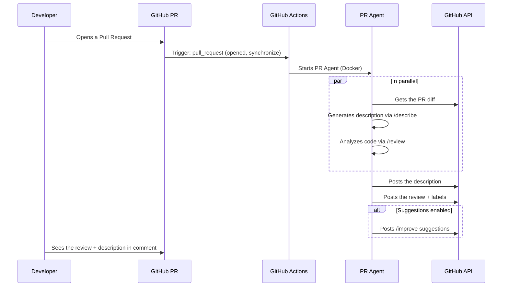

# PR Agent — Architecture

> **Status**: Implemented
> **Migration**: Replaces `openhands-pr-review-architecture.md`
> **Important note**: PR Agent runs **autonomously** in GitHub Actions, **without integration with Yagr**. Yagr is simply the repository that will be reviewed.

## Context

PR Agent is an **independent** AI agent that runs in GitHub Actions. It is not integrated into Yagr — Yagr is just the repo to be reviewed.

---

## 1. PR Agent — Overview

### 1.1 What is PR Agent?

[PR Agent](https://github.com/qodo-ai/pr-agent) is an open-source AI agent designed to automate Pull Request reviews with multiple tools:

- **`/describe`**: Generates an automatic PR description
- **`/review`**: Analyzes and comments on PRs via GitHub Actions
- **`/improve`**: Suggests code improvements
- **`/ask`**: Asks questions about the code

### 1.2 GitHub Actions Mode

PR Agent runs **autonomously** in GitHub Actions via a Docker container:

1. Trigger on PR events (`pull_request`)
2. Execution of the agent via the official GitHub Action
3. Posting comments via the GitHub API
4. Optional automatic labels

---

## 2. Architecture — PR Agent Standalone

```
┌─────────────────────────────────────────────────────────────┐
│                    GitHub Actions                           │
│                                                              │
│  ┌───────────────────────────────────────────────────────┐  │
│  │   .github/workflows/pr-agent.yml                       │  │
│  └───────────────────────┬───────────────────────────────┘  │
│                          │                                   │
│                          ▼                                   │
│  ┌───────────────────────────────────────────────────────┐  │
│  │   Codium-ai/pr-agent Docker Container                  │  │
│  │   • /describe, /review, /improve                      │  │
│  │   • Posting via GitHub API                            │  │
│  │   • Labels, comments, suggestions                     │  │
│  └───────────────────────┬───────────────────────────────┘  │
│                          │                                   │
│                          ▼                                   │
│  ┌───────────────────────────────────────────────────────┐  │
│  │   GitHub PR                                           │  │
│  │   • Generated description                             │  │
│  │   • Detailed review                                    │  │
│  │   • Code suggestions                                  │  │
│  └───────────────────────────────────────────────────────┘  │
│                                                              │
└─────────────────────────────────────────────────────────────┘

Yagr is NOT involved in this flow. Yagr = the repository under review.
```

### 2.1 Detailed Flow



---

## 3. Required Configuration

### 3.1 GitHub Secrets to configure

| Secret | Description | Required |
|--------|-------------|----------|
| `LLM_API_KEY` | MiniMax API key (or other provider) | Yes |
| `PAT_TOKEN` | GitHub Personal Access Token | Yes |

### 3.2 GitHub Variables (non-secrets)

| Variable | Description | Default |
|----------|-------------|---------|
| `OPENHANDS_LLM_BASE_URL` | LLM API base URL | `https://api.minimax.io/v1` |
| `OPENHANDS_LLM_MODEL` | LLM model | `minimax/MiniMax-M2.7` |
| `OPENHANDS_REVIEW_STYLE` | Review style | `roasted` |

### 3.3 Key Storage Location

```
┌─────────────────────────────────────────────────────────────┐
│                    API KEY STORAGE                              │
├─────────────────────────────────────────────────────────────┤
│                                                              │
│  GitHub Actions Secrets (Settings → Secrets → Actions)        │
│  ┌─────────────────────────────────────────────────────┐    │
│  │  LLM_API_KEY      → MiniMax/other provider API key    │    │
│  │  PAT_TOKEN        → GitHub Personal Access Token      │    │
│  └─────────────────────────────────────────────────────┘    │
│                                                              │
│  GitHub Actions Variables (Settings → Variables → Actions)    │
│  ┌─────────────────────────────────────────────────────┐    │
│  │  OPENHANDS_LLM_BASE_URL  → https://api.minimax.io/v1│   │
│  │  OPENHANDS_LLM_MODEL     → minimax/MiniMax-M2.7      │    │
│  │  OPENHANDS_REVIEW_STYLE  → roasted                   │    │
│  └─────────────────────────────────────────────────────┘    │
│                                                              │
└─────────────────────────────────────────────────────────────┘
```

---

## 4. Configuration Files

### 4.1 GitHub Actions Workflow

**File**: [`.github/workflows/pr-agent.yml`](.github/workflows/pr-agent.yml)

```yaml
name: PR Agent

on:
  pull_request:
    types: [opened, synchronize, reopened, ready_for_review]
  issue_comment:
    types: [created]

permissions:
  contents: read
  pull-requests: write
  id-token: write

jobs:
  pr_agent_job:
    runs-on: ubuntu-latest
    if: github.event.pull_request.draft == false

    steps:
      - name: PR Agent action step
        uses: Codium-ai/pr-agent@main
        with:
          CONFIG_FILE_PATH: .pr_agent.toml
        env:
          GITHUB_TOKEN: ${{ secrets.PAT_TOKEN }}
          OPENAI_KEY: ${{ secrets.LLM_API_KEY }}
          OPENAI_API_BASE: https://api.minimax.io/anthropic/v1/messages
```

### 4.2 PR Agent Configuration

**File**: [`.pr_agent.toml`](.pr_agent.toml)

```toml
[config]
model="gpt-4o"
fallback_models=["gpt-3.5-turbo"]
git_provider="github"
publish_output=true

[pr_reviewer]
enable_review_labels_effort = true
enable_review_labels_security = true
require_tests_review = true
require_security_review = true

[pr_description]
enable_pr_diagram = true

[github_app]
pr_commands = [
    "/describe --pr_description.publish_description_as_comment=true",
    "/review",
    "/improve"
]
handle_push_trigger = true
push_commands = [
    "/improve"
]
```

---

## 5. PR Agent Tools

| Tool | Description | Trigger |
|-------|-------------|-------------|
| `/describe` | Generates a PR description | Automatic on open |
| `/review` | Complete code analysis | Automatic on open |
| `/improve` | Suggests improvements | Automatic after review |
| `/ask` | Questions about the code | Comment on PR |

---

## 6. Security Considerations

### 6.1 Principles

1. **API keys in GitHub Secrets** — Never in code
2. **Docker sandbox** — PR Agent runs in an isolated container
3. **Human validation** — Suggestions are proposed, never auto-merged
4. **Minimal permissions** — `contents: read`, `pull-requests: write`

### 6.2 GitHub Permissions

```yaml
permissions:
  contents: read      # Code reading for review
  pull-requests: write # Posting reviews and labels
  id-token: write     # For OIDC (optional)
```

---

## 7. Costs and Limitations

### 7.1 Estimated Costs

| Component | Cost |
|-----------|------|
| PR Agent execution (GPT-5) | ~$0.10-0.50 / PR |
| GitHub Actions (1-2 min) | ~$0.01-0.02 / PR |

### 7.2 Limitations

- **Token context** — Very large PRs use the compression mechanism
- **Execution time** — ~30-90 seconds per PR
- **Rate limiting** — GitHub API limit (5000 req/h)

---

## 8. OpenHands vs PR Agent Comparison

| Criteria | OpenHands | PR Agent |
|---------|-----------|------------|
| Type | Generalist agent | Specialized PR review |
| Complexity | More complex setup | Simple setup via GitHub Action |
| Customization | Very flexible | JSON-based prompts |
| Auto-fix | Possible with validation | Suggestions only |
| Performance | ~2-5 min / PR | ~30-90 sec / PR |
| Cost | Higher | More economical |

---

## 9. Useful Links

- [PR Agent GitHub](https://github.com/qodo-ai/pr-agent)
- [Documentation](https://qodo-merge-docs.qodo.ai/)
- [Configuration guide](https://qodo-merge-docs.qodo.ai/configuration/)
