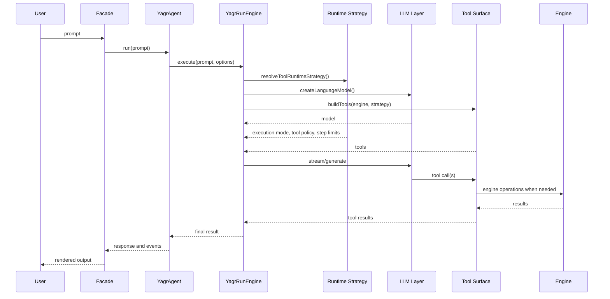
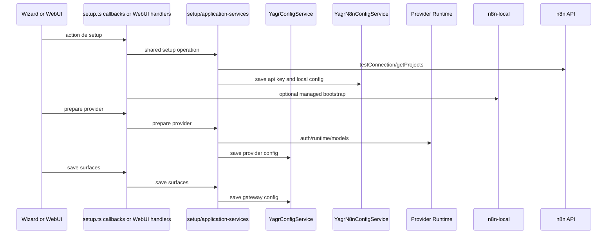
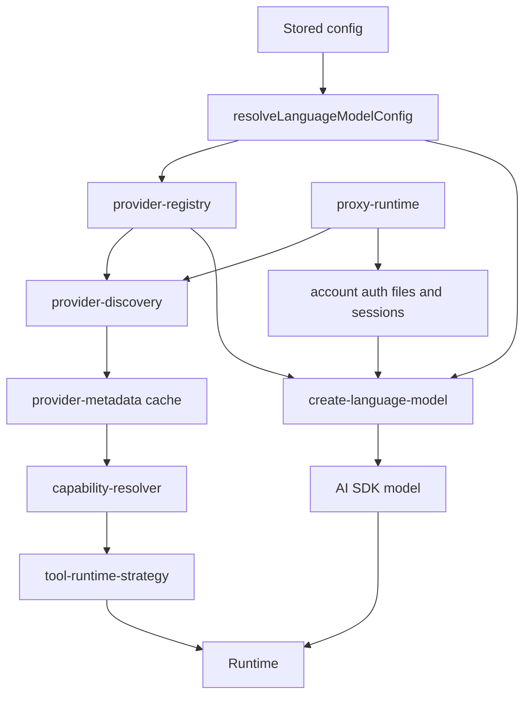
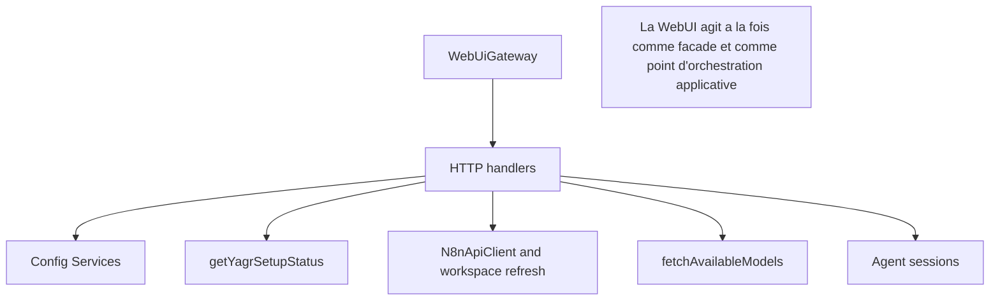

# Runtime Flows

Cette page documente les flux transverses principaux du repo tel qu'il fonctionne aujourd'hui.

## 1. Message entrant vers execution agentique

## 2. Setup et onboarding

## 3. Flux provider actuel

Observation:

- le flux comporte maintenant un debut de couche distincte entre metadata provider, normalisation des capacites et strategie runtime
- la migration n'est pas encore complete pour tous les providers ni pour tous les cas dynamiques

## 4. Flux facade WebUI actuel

## 5. Regle de maintenance

Quand un flux transverse change, il faut:

- mettre a jour le graphe Mermaid
- verifier que les noms de modules correspondent encore au repo
- signaler clairement tout nouveau couplage transverse
