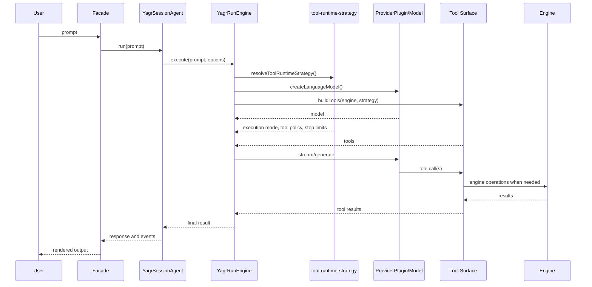
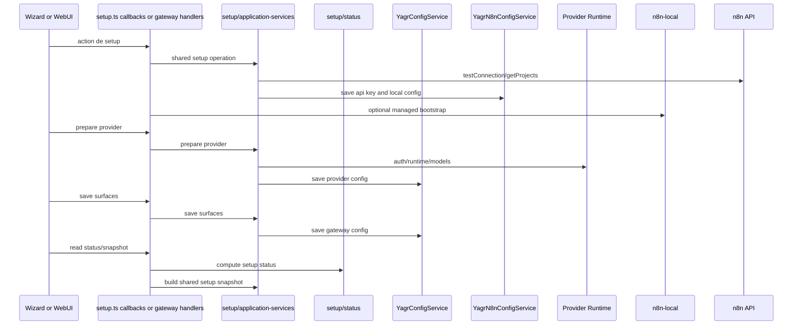
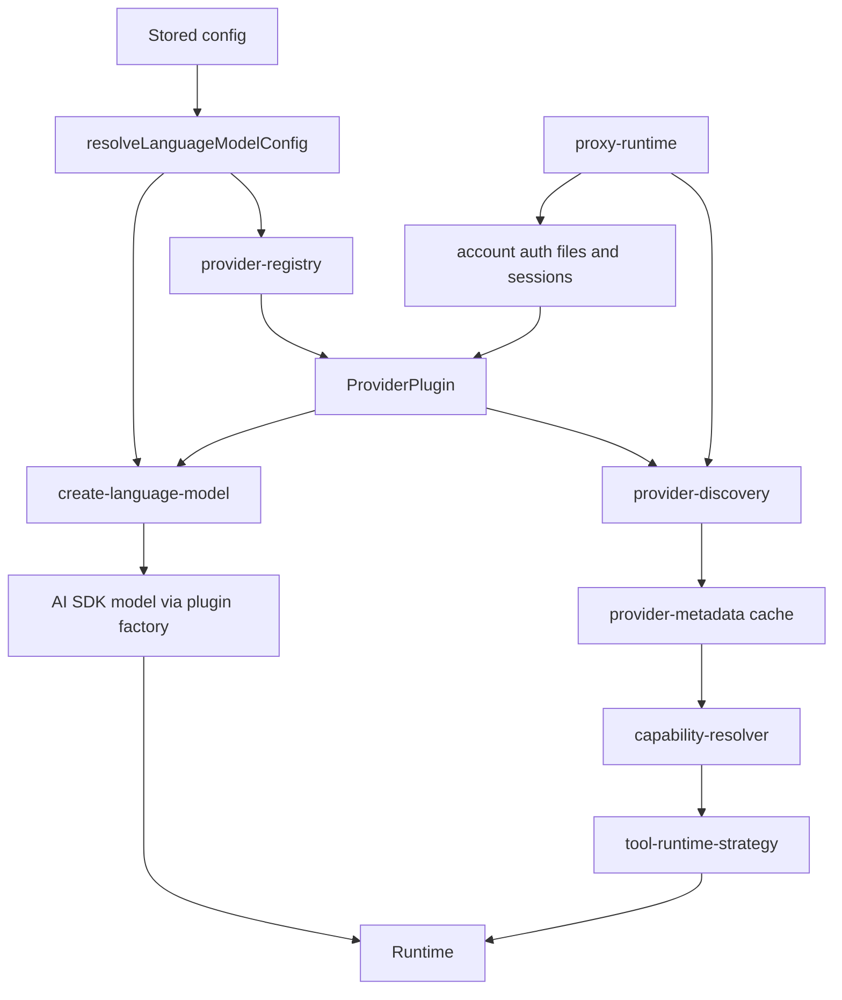
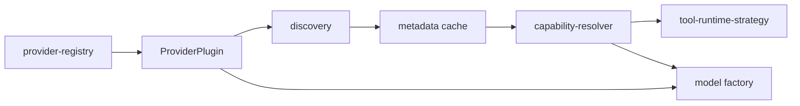
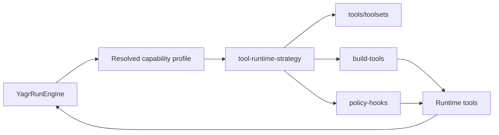
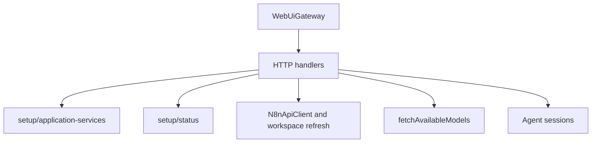

# Runtime Flows

Cette page documente les flux transverses principaux du repo tel qu'il fonctionne aujourd'hui.

## 1. Message entrant vers execution agentique

Observation:

- les facades conversationnelles passent maintenant par `YagrSessionAgent`
- `YagrRunEngine` choisit lui-meme la strategie runtime, la surface d'outils et les hooks associes
- le flux est maintenant explicitement pilote par `tool-runtime-strategy.ts`

Invariants runtime a conserver:

- la completion est une responsabilite runtime, pas juste un texte assistant
- un run ne doit pas etre "complete" uniquement parce que le modele s'arrete
- les blocages et required actions doivent rester representes explicitement
- les politiques produit doivent rester au-dessus du coeur runtime

## 2. Setup et onboarding

Observation:

- les facades ne portent plus directement les mutations de config metier
- `application-services.ts` et `status.ts` sont maintenant le point commun de setup/lecture de statut

## 3. Flux provider actuel

Observation:

- `ProviderPlugin` porte maintenant discovery, metadata hooks et factory de modele
- le flux est maintenant structurellement `metadata -> normalisation -> runtime strategy`

## 3bis. Resolution provider/capability

## 4. Flux tooling/runtime actuel

Observation:

- `toolsets.ts` est maintenant le SSOT des groupes d'outils
- `tool-runtime-strategy.ts` choisit la surface exposee, le mode de tool calling et la politique post-sync
- `policy-hooks.ts` applique cette politique au lieu de porter ses propres regles implicites

## 5. Flux facade WebUI actuel

Observation:

- la WebUI reste une facade HTTP avec un peu d'orchestration technique
- les lectures de statut et snapshots de setup passent maintenant par la couche applicative partagee

## 6. Regle de maintenance

Quand un flux transverse change, il faut:

- mettre a jour le graphe Mermaid
- verifier que les noms de modules correspondent encore au repo
- signaler clairement tout nouveau couplage transverse
