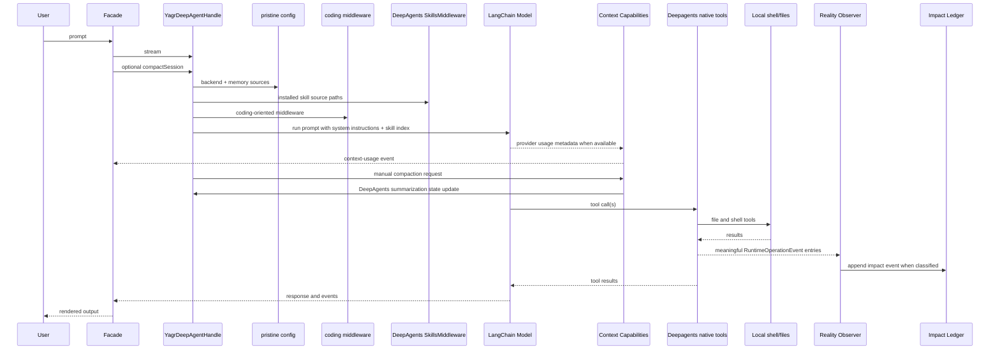
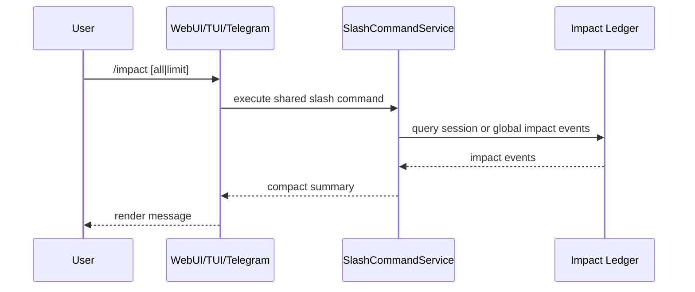
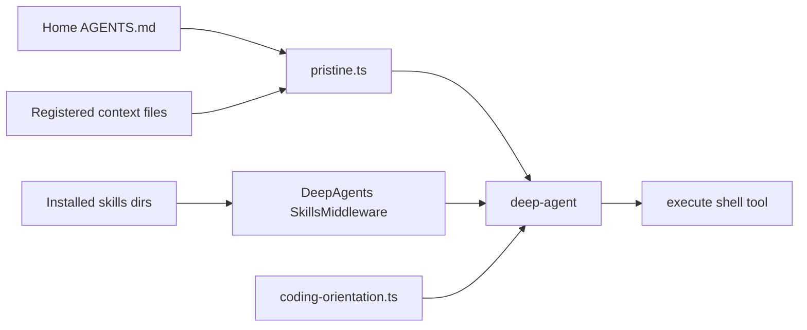
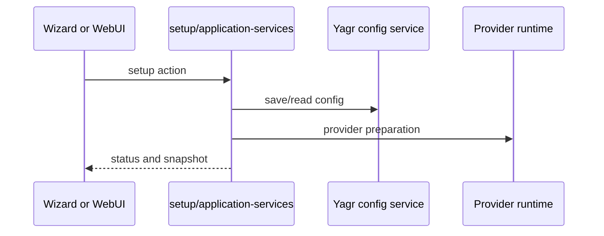
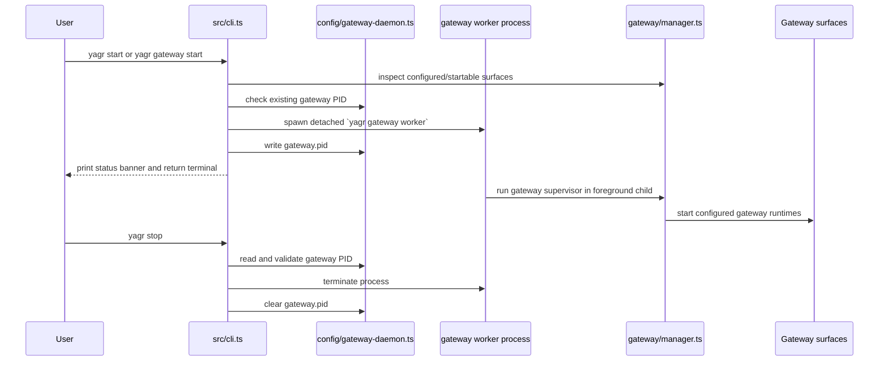
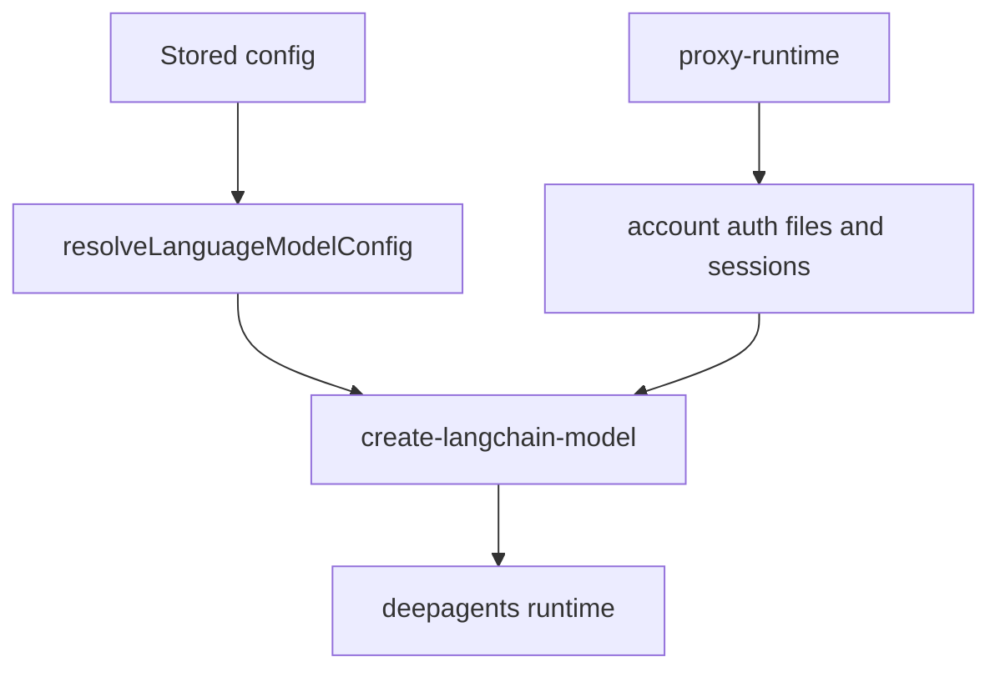

# Runtime Flows

This page documents the main cross-cutting flows of the current local coding-agent model.

## Incoming Message to Agentic Execution

```mermaid
sequenceDiagram
    participant U as User
    participant F as Facade
    participant H as YagrDeepAgentHandle
    participant P as pristine config
    participant C as coding middleware
    participant S as DeepAgents SkillsMiddleware
    participant M as LangChain Model
    participant Cx as Context Capabilities
    participant T as Deepagents native tools
    participant E as Local shell/files
    participant O as Reality Observer
    participant L as Impact Ledger

    U->>F: prompt
    F->>H: stream
    F->>H: optional compactSession
    H->>P: backend + memory sources
    H->>S: installed skill source paths
    H->>C: coding-oriented middleware
    H->>M: run prompt with system instructions + skill index
    M-->>Cx: provider usage metadata when available
    Cx-->>F: context-usage event
    H->>Cx: manual compaction request
    Cx->>H: DeepAgents summarization state update
    M->>T: tool call(s)
    T->>E: file and shell tools
    E-->>T: results
    T-->>O: meaningful RuntimeOperationEvent entries
    O->>L: append impact event when classified
    T-->>M: tool results
    M-->>F: response and events
    F-->>U: rendered output
```

Observations:

- all conversational facades consume a `YagrDeepAgentHandle`
- the deep-agent directly carries its deepagents native tool surface
- the coding-oriented overlay is applied via middleware
- installed skills are passed as native DeepAgents.js `skills` sources; DeepAgents.js owns discovery and progressive disclosure
- external integrations are not built in; they are invoked only as ordinary local commands or files when present in the user's environment
- impact recording is a runtime-side concern: the shared gateway stream adapter passes operation events to `@yagr/reality-observer`, and `@yagr/impact-ledger` persists append-only JSONL records
- WebUI, TUI, and Telegram expose recorded impact through the same `/impact` slash command handled by `@yagr/conversation-service`
- manual context compaction is a runtime capability exposed through `CompactionService.compactSession(...)`; it adapts native DeepAgents.js summarization state instead of implementing surface-specific fallback summaries
- context usage is emitted through the stream adapter only when provider/runtime token usage metadata is available, with `source: api`; surfaces do not emit hidden estimates by default

## Impact Summary Command

```mermaid
sequenceDiagram
    participant U as User
    participant F as WebUI/TUI/Telegram
    participant C as SlashCommandService
    participant L as Impact Ledger

    U->>F: /impact [all|limit]
    F->>C: execute shared slash command
    C->>L: query session or global impact events
    L-->>C: impact events
    C-->>F: compact summary
    F-->>U: render message
```

Observations:

- facades do not query or format impact records directly
- `/impact` defaults to the current session/thread and accepts `all` for global recent events
- rich dashboard views remain future work; the current surface contract is a compact shared summary

## Instructions And Middleware

```mermaid
flowchart LR
    HOME[Home AGENTS.md]
    CTX[Registered context files]
    SKILLS[Installed skills dirs]
    PR[pristine.ts]
    DS[DeepAgents SkillsMiddleware]
    CODE[coding-orientation.ts]
    AGENT[deep-agent]
    SHELL[execute shell tool]

    HOME --> PR
    CTX --> PR
    SKILLS --> DS
    PR --> AGENT
    DS --> AGENT
    CODE --> AGENT
    AGENT --> SHELL
```

## Setup And Onboarding

```mermaid
sequenceDiagram
    participant UI as Wizard or WebUI
    participant AS as setup/application-services
    participant CFG as Yagr config service
    participant PR as Provider runtime

    UI->>AS: setup action
    AS->>CFG: save/read config
    AS->>PR: provider preparation
    AS-->>UI: status and snapshot
```

Setup readiness depends on LLM/provider configuration. Gateway surfaces are optional and remain thin.

## Gateway Daemon Startup

```mermaid
sequenceDiagram
    participant U as User
    participant CLI as src/cli.ts
    participant PID as config/gateway-daemon.ts
    participant W as gateway worker process
    participant GM as gateway/manager.ts
    participant S as Gateway surfaces

    U->>CLI: yagr start or yagr gateway start
    CLI->>GM: inspect configured/startable surfaces
    CLI->>PID: check existing gateway PID
    CLI->>W: spawn detached `yagr gateway worker`
    CLI->>PID: write gateway.pid
    CLI-->>U: print status banner and return terminal
    W->>GM: run gateway supervisor in foreground child
    GM->>S: start configured gateway runtimes
    U->>CLI: yagr stop
    CLI->>PID: read and validate gateway PID
    CLI->>W: terminate process
    CLI->>PID: clear gateway.pid
```

Observations:

- `yagr start` and `yagr gateway start` are non-blocking daemon launchers
- `yagr gateway worker` is the internal foreground entrypoint that owns gateway runtime lifetimes
- PID and log paths are centralized in `config/gateway-daemon.ts`

## Provider Flow

```mermaid
flowchart TD
    CFG[Stored config] --> RES[resolveLanguageModelConfig]
    RES --> CLM[create-langchain-model]
    CLM --> RT[deepagents runtime]
    PR[proxy-runtime] --> ACC[account auth files and sessions]
    ACC --> CLM
```

## Maintenance Rules

When a cross-cutting flow changes:

- update the concerned Mermaid graph
- verify module names still match the repo
- clearly signal any new cross-cutting coupling
