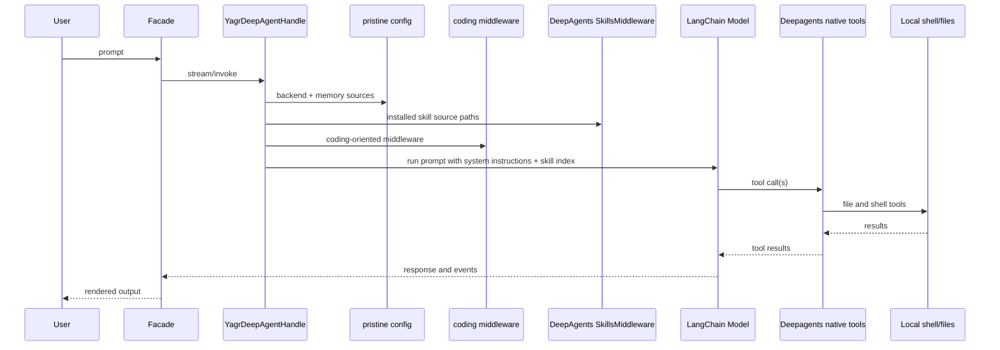
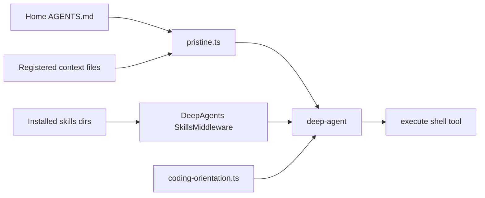
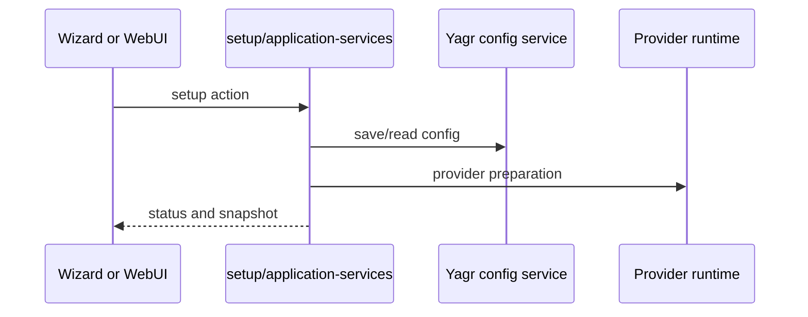
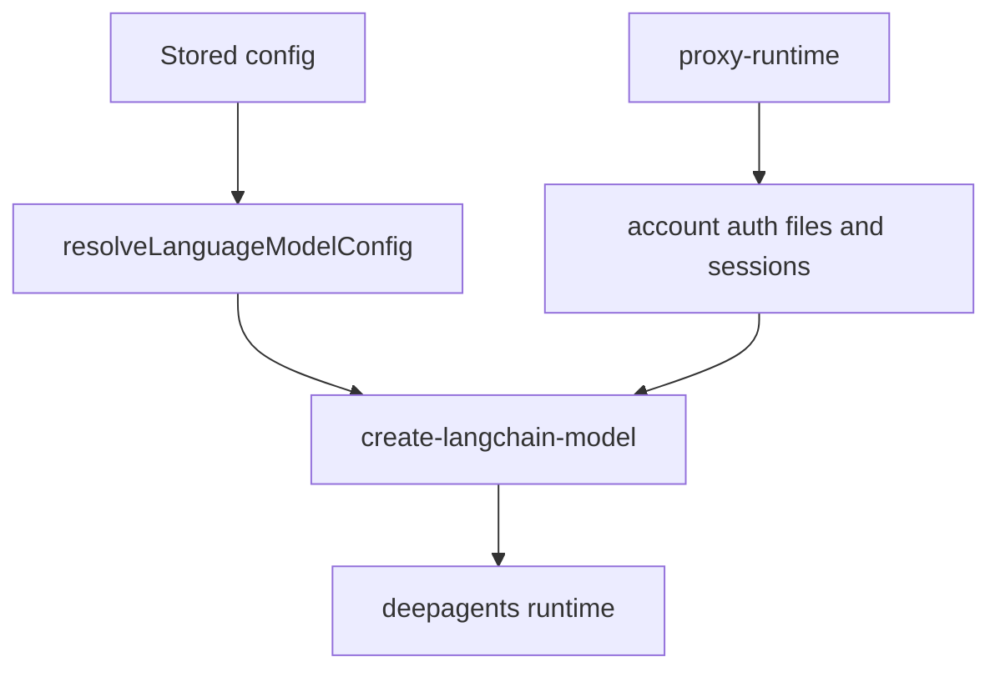

# Runtime Flows

This page documents the main cross-cutting flows of the current local coding-agent model.

## Incoming Message to Agentic Execution

```mermaid
sequenceDiagram
    participant U as User
    participant F as Facade
    participant H as YagrDeepAgentHandle
    participant P as pristine config
    participant C as coding middleware
    participant S as DeepAgents SkillsMiddleware
    participant M as LangChain Model
    participant T as Deepagents native tools
    participant E as Local shell/files

    U->>F: prompt
    F->>H: stream/invoke
    H->>P: backend + memory sources
    H->>S: installed skill source paths
    H->>C: coding-oriented middleware
    H->>M: run prompt with system instructions + skill index
    M->>T: tool call(s)
    T->>E: file and shell tools
    E-->>T: results
    T-->>M: tool results
    M-->>F: response and events
    F-->>U: rendered output
```

Observations:

- all conversational facades consume a `YagrDeepAgentHandle`
- the deep-agent directly carries its deepagents native tool surface
- the coding-oriented overlay is applied via middleware
- installed skills are passed as native DeepAgents.js `skills` sources; DeepAgents.js owns discovery and progressive disclosure
- external integrations are not built in; they are invoked only as ordinary local commands or files when present in the user's environment

## Instructions And Middleware

```mermaid
flowchart LR
    HOME[Home AGENTS.md]
    CTX[Registered context files]
    SKILLS[Installed skills dirs]
    PR[pristine.ts]
    DS[DeepAgents SkillsMiddleware]
    CODE[coding-orientation.ts]
    AGENT[deep-agent]
    SHELL[execute shell tool]

    HOME --> PR
    CTX --> PR
    SKILLS --> DS
    PR --> AGENT
    DS --> AGENT
    CODE --> AGENT
    AGENT --> SHELL
```

## Setup And Onboarding

```mermaid
sequenceDiagram
    participant UI as Wizard or WebUI
    participant AS as setup/application-services
    participant CFG as Yagr config service
    participant PR as Provider runtime

    UI->>AS: setup action
    AS->>CFG: save/read config
    AS->>PR: provider preparation
    AS-->>UI: status and snapshot
```

Setup readiness depends on LLM/provider configuration. Gateway surfaces are optional and remain thin.

## Provider Flow

```mermaid
flowchart TD
    CFG[Stored config] --> RES[resolveLanguageModelConfig]
    RES --> CLM[create-langchain-model]
    CLM --> RT[deepagents runtime]
    PR[proxy-runtime] --> ACC[account auth files and sessions]
    ACC --> CLM
```

## Maintenance Rules

When a cross-cutting flow changes:

- update the concerned Mermaid graph
- verify module names still match the repo
- clearly signal any new cross-cutting coupling
