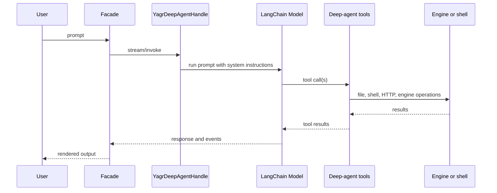
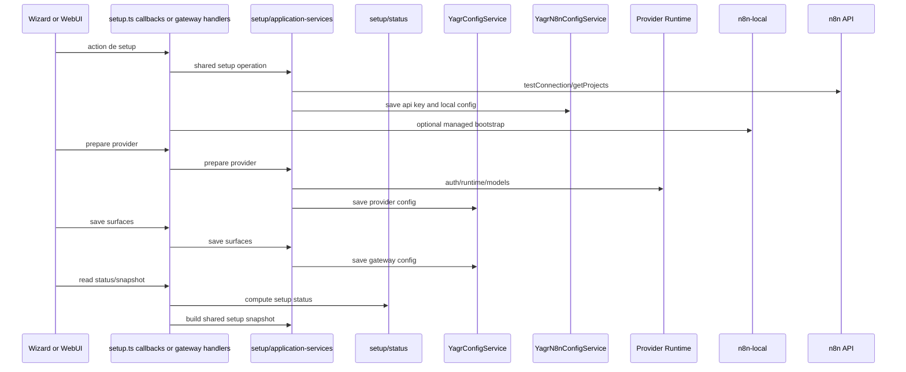
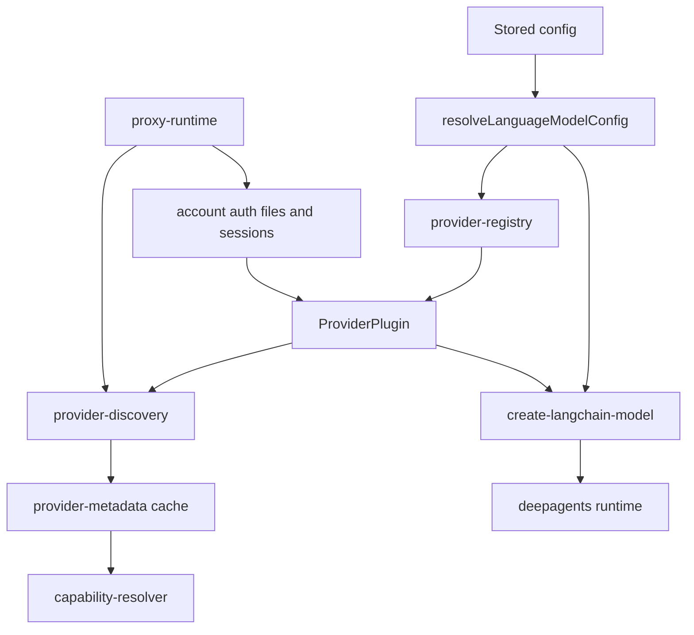
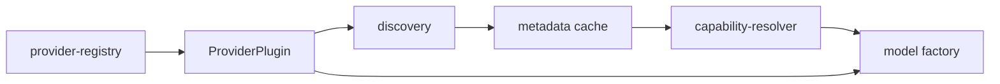
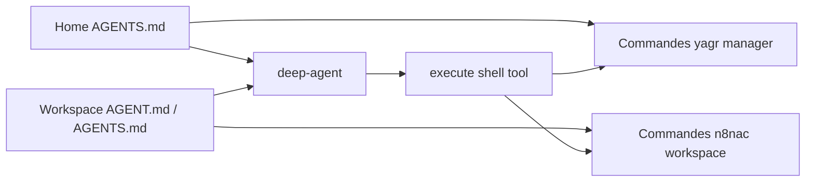
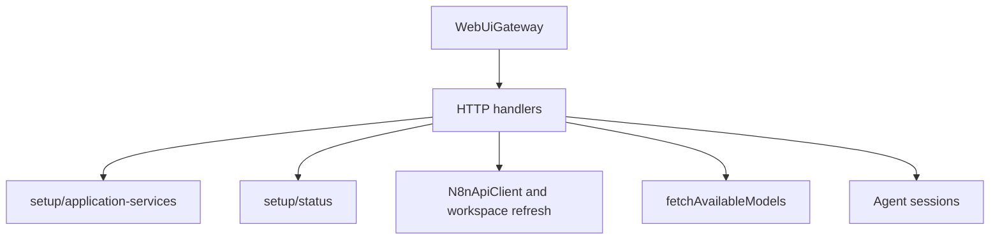
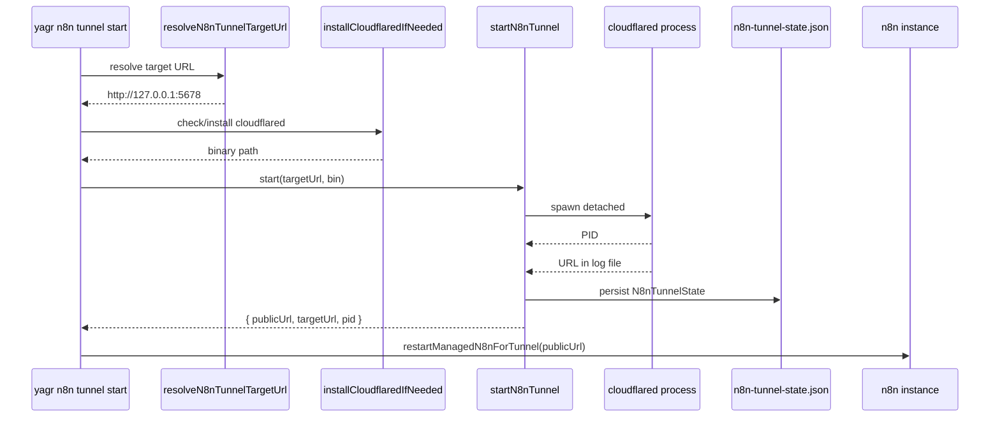
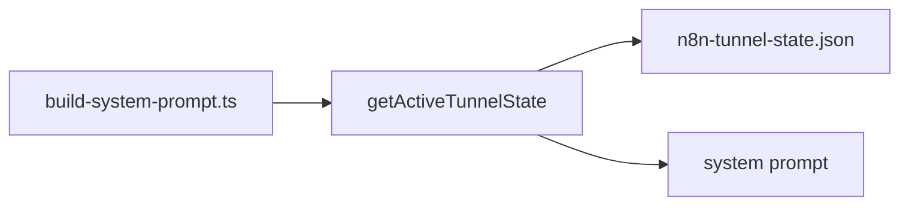

# Runtime Flows

Cette page documente les flux transverses principaux du repo dans le modele deep-agent actuel.

## 1. Message entrant vers execution agentique

```mermaid
sequenceDiagram
    participant U as User
    participant F as Facade
    participant H as YagrDeepAgentHandle
    participant M as LangChain Model
    participant T as Deep-agent tools
    participant E as Engine or shell

    U->>F: prompt
    F->>H: stream/invoke
    H->>M: run prompt with system instructions
    M->>T: tool call(s)
    T->>E: file, shell, HTTP, engine operations
    E-->>T: results
    T-->>M: tool results
    M-->>F: response and events
    F-->>U: rendered output
```

Observation:

- les facades conversationnelles consomment toutes un `YagrDeepAgentHandle`
- le deep-agent porte directement sa surface d'outils agnostiques
- les comportements manager et workspace passent ensuite par shell via `yagr ...` et `npx n8nac ...`
- les messages assistant libres ne doivent plus servir de canal d'avancement pendant l'execution: l'avancement montrable passe par les evenements runtime/user-visible updates, puis la prose assistant n'est emise qu'au moment de la vraie reponse finale

Invariants runtime a conserver:

- la completion est une responsabilite runtime, pas juste un texte assistant
- un run ne doit pas etre "complete" uniquement parce que le modele s'arrete
- les blocages et required actions doivent rester representes explicitement
- une `requiredAction` peut etre bloquante ou non bloquante: les follow-ups de configuration ne doivent pas etre confondus avec un blocker terminal si le livrable actuel peut encore etre produit
- les politiques produit doivent rester au-dessus du coeur runtime
- si un run a deja engage du travail materiel, il doit finir par un resultat concret, une `requiredAction` structuree, ou une poursuite de la boucle; pas par un simple aveu d'echec en prose

## 2. Setup et onboarding

```mermaid
sequenceDiagram
    participant UI as Wizard or WebUI
    participant H as setup.ts callbacks or gateway handlers
    participant AS as setup/application-services
    participant ST as setup/status
    participant YC as YagrConfigService
    participant NC as YagrN8nConfigService
    participant PR as Provider Runtime
    participant NL as n8n-local
    participant N8N as n8n API

    UI->>H: action de setup
    H->>AS: shared setup operation
    AS->>N8N: testConnection/getProjects
    AS->>NC: save api key and local config
    H->>NL: optional managed bootstrap
    UI->>H: prepare provider
    H->>AS: prepare provider
    AS->>PR: auth/runtime/models
    AS->>YC: save provider config
    UI->>H: save surfaces
    H->>AS: save surfaces
    AS->>YC: save gateway config
    UI->>H: read status/snapshot
    H->>ST: compute setup status
    H->>AS: build shared setup snapshot
```

Observation:

- les facades ne portent plus directement les mutations de config metier
- `application-services.ts` et `status.ts` sont maintenant le point commun de setup/lecture de statut

## 3. Flux provider actuel

```mermaid
flowchart TD
    CFG[Stored config] --> RES[resolveLanguageModelConfig]
    RES --> REG[provider-registry]
    RES --> CLM[create-langchain-model]
    REG --> PLUG[ProviderPlugin]
    PLUG --> DISC[provider-discovery]
    DISC --> META[provider-metadata cache]
    META --> CAP[capability-resolver]
    PLUG --> CLM
    PR[proxy-runtime] --> DISC
    PR --> ACC[account auth files and sessions]
    ACC --> PLUG
    CLM --> RT[deepagents runtime]
```

Observation:

- `ProviderPlugin` porte maintenant discovery, metadata hooks et factory de modele
- le flux est maintenant structurellement `metadata -> normalisation -> model LangChain`

## 3bis. Resolution provider/capability

```mermaid
flowchart LR
    REG[provider-registry]
    PLUG[ProviderPlugin]
    DISC[discovery]
    META[metadata cache]
    CAP[capability-resolver]
    MODEL[model factory]

    REG --> PLUG
    PLUG --> DISC
    DISC --> META
    META --> CAP
    CAP --> MODEL
    PLUG --> MODEL
```

## 4. Flux instructions + CLI actuel

```mermaid
flowchart LR
    HOME[Home AGENTS.md]
    HCLI[Commandes yagr manager]
    WORK[Workspace AGENT.md / AGENTS.md]
    WCLI[Commandes n8nac workspace]
    AGENT[deep-agent]
    SHELL[execute shell tool]

    HOME --> AGENT
    HOME --> HCLI
    WORK --> AGENT
    WORK --> WCLI
    AGENT --> SHELL
    SHELL --> HCLI
    SHELL --> WCLI
```

Observation:

- la home Yagr cadre l'usage des commandes manager `yagr ...`
- le workspace n8n cadre l'usage des commandes `npx n8nac ...`
- le deep-agent ne recoit pas de tools manager ou n8nac injectes explicitement
- le runtime n8n utilise maintenant une resolution partagee de disponibilite (`config locale` par defaut, `env` seulement pour le harness automatise)
- la presentation workflow ne doit plus exposer de diagramme brut infere: le diagramme doit passer par le parseur partage de `src/gateway/workflow-diagram.ts` avant d'etre emis puis rendu
- cette separation doit rester visible dans `src/config/n8n-config-service.ts`, `src/manager-tooling/*`, `src/cli.ts` et `scripts/provider-integration-matrix.mjs`

## 5. Flux facade WebUI actuel

```mermaid
flowchart TD
    WEB[WebUiGateway]
    WEB --> API[HTTP handlers]
    API --> AS[setup/application-services]
    API --> ST[setup/status]
    API --> N8N[N8nApiClient and workspace refresh]
    API --> LLM[fetchAvailableModels]
    API --> AG[Agent sessions]
```

Observation:

- la WebUI reste une facade HTTP avec un peu d'orchestration technique
- les lectures de statut et snapshots de setup passent maintenant par la couche applicative partagee

## 6. Regle de maintenance

Quand un flux transverse change, il faut:

- mettre a jour le graphe Mermaid
- verifier que les noms de modules correspondent encore au repo
- signaler clairement tout nouveau couplage transverse

## 7. Separation runtime produit / harness automatise

- le runtime produit ne doit pas dependre de `N8N_HOST` / `N8N_API_KEY`
- le harness de tests providers peut injecter ces valeurs, mais uniquement via l'opt-in `YAGR_ALLOW_N8N_ENV=1`
- cette separation doit rester visible dans `src/config/n8n-config-service.ts`, `src/tools/n8nac.ts`, `src/runtime/policy-hooks.ts` et `scripts/provider-integration-matrix.mjs`

## 8. Cloudflare Tunnel n8n

### Flux de demarrage du tunnel

```mermaid
sequenceDiagram
    participant CLI as yagr n8n tunnel start
    participant Resolver as resolveN8nTunnelTargetUrl
    participant CF as installCloudflaredIfNeeded
    participant TunnelMgr as startN8nTunnel
    participant CFProc as cloudflared process
    participant State as n8n-tunnel-state.json
    participant N8N as n8n instance

    CLI->>Resolver: resolve target URL
    Resolver-->>CLI: http://127.0.0.1:5678
    CLI->>CF: check/install cloudflared
    CF-->>CLI: binary path
    CLI->>TunnelMgr: start(targetUrl, bin)
    TunnelMgr->>CFProc: spawn detached
    CFProc-->>TunnelMgr: PID
    CFProc-->>TunnelMgr: URL in log file
    TunnelMgr->>State: persist N8nTunnelState
    TunnelMgr-->>CLI: { publicUrl, targetUrl, pid }
    CLI->>N8N: restartManagedN8nForTunnel(publicUrl)
```

### Injection dans le system prompt

```mermaid
flowchart LR
    SP[build-system-prompt.ts]
    TUNNEL[getActiveTunnelState]
    STATE[n8n-tunnel-state.json]
    PROMPT[system prompt]

    SP --> TUNNEL
    TUNNEL --> STATE
    TUNNEL --> PROMPT
```

Quand le tunnel est actif, le system prompt injecte:

> The n8n instance is publicly reachable via Cloudflare Tunnel at {publicUrl}. Use this URL for webhooks and externally-triggered workflows.

### Substitution URL workflow

`resolveWorkflowOpenLink` dans `workflow-links.ts` substitue l'origine de l'URL workflow par l'URL tunnel publique quand `n8nTunnelPublicUrl` est fourni, pour que les liens presentes soient cliquables depuis l'exterieur.
