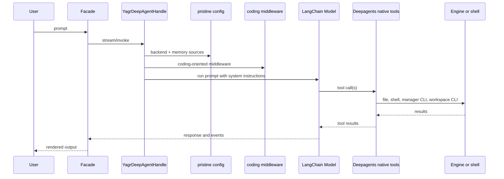
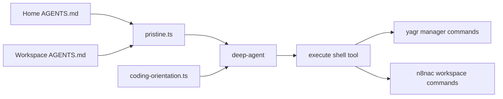
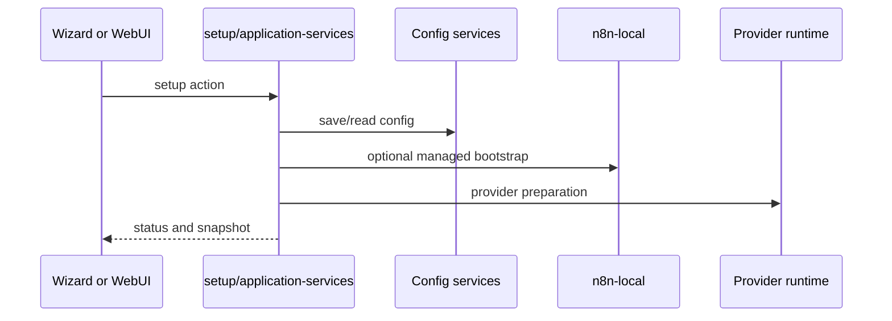
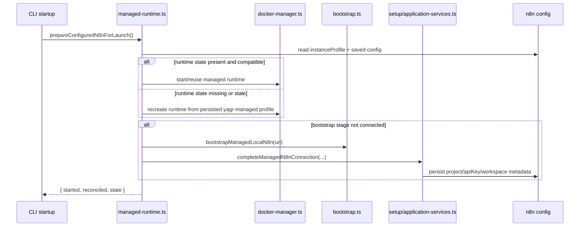
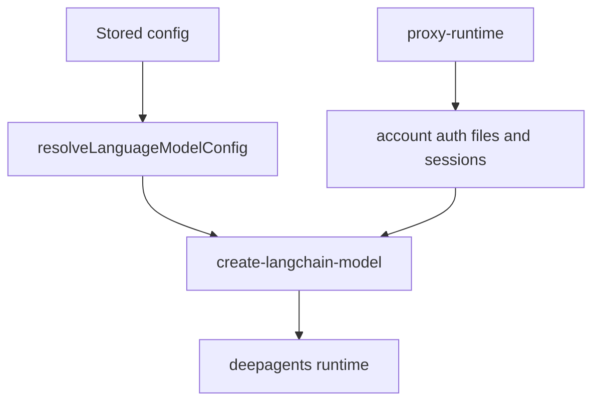
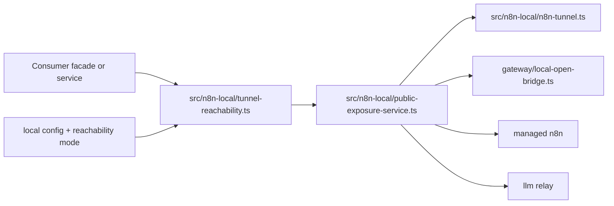
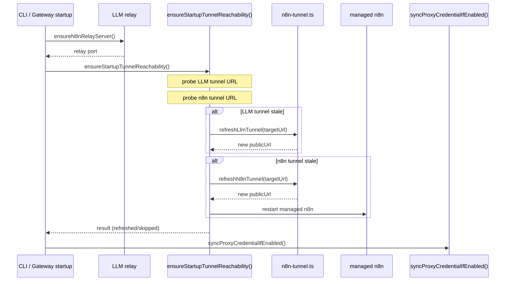
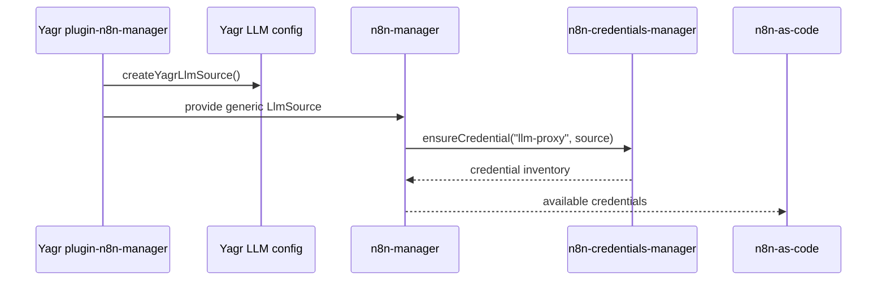

# Runtime Flows

This page documents the main cross-cutting flows of the repo in the current deep-agent model.

## 1. Incoming Message to Agentic Execution

```mermaid
sequenceDiagram
    participant U as User
    participant F as Facade
    participant H as YagrDeepAgentHandle
    participant P as pristine config
    participant C as coding middleware
    participant M as LangChain Model
    participant T as Deepagents native tools
    participant E as Engine or shell

    U->>F: prompt
    F->>H: stream/invoke
    H->>P: backend + memory sources
    H->>C: coding-oriented middleware
    H->>M: run prompt with system instructions
    M->>T: tool call(s)
    T->>E: file, shell, manager CLI, workspace CLI
    E-->>T: results
    T-->>M: tool results
    M-->>F: response and events
    F-->>U: rendered output
```

Observation:

- all conversational facades consume a `YagrDeepAgentHandle`
- the deep-agent directly carries its deepagents native surface
- the coding-oriented overlay is applied via middleware, not via a monolithic runtime prompt file
- manager and workspace behaviors then go through shell via `yagr ...` and `npx n8nac ...`

## 2. Current Instructions + Middleware + CLI Flow

```mermaid
flowchart LR
    HOME[Home AGENTS.md]
    WORK[Workspace AGENTS.md]
    PR[pristine.ts]
    CODE[coding-orientation.ts]
    AGENT[deep-agent]
    SHELL[execute shell tool]
    HCLI[yagr manager commands]
    WCLI[n8nac workspace commands]

    HOME --> PR
    WORK --> PR
    PR --> AGENT
    CODE --> AGENT
    AGENT --> SHELL
    SHELL --> HCLI
    SHELL --> WCLI
```

Observation:

- the Yagr home frames the usage of manager commands `yagr ...`
- the n8n workspace frames the usage of commands `npx n8nac ...`
- the deep-agent does not receive explicit manager or `n8nac` tools injected
- the coding-oriented overlay is physically separated from the pristine base
- the Yagr home remains the operational root; `n8n-workspace` is a business sub-workspace, not the implicit cwd of the process

## 3. Setup and Onboarding

```mermaid
sequenceDiagram
    participant UI as Wizard or WebUI
    participant AS as setup/application-services
    participant CFG as Config services
    participant NL as n8n-local
    participant PR as Provider runtime

    UI->>AS: setup action
    AS->>CFG: save/read config
    AS->>NL: optional managed bootstrap
    AS->>PR: provider preparation
    AS-->>UI: status and snapshot
```

Observation:

- facades no longer directly carry business config mutations
- `application-services.ts` and `status.ts` are the common setup point

## 3b. Startup of a Yagr-managed n8n Instance

At standard launch (`yagr start`, `yagr gateway`, gateway worker), Yagr no longer just restarts the managed local runtime. Startup also reconciles the bootstrap/config state when the instance is marked `yagr-managed-docker`.

```mermaid
sequenceDiagram
    participant CLI as CLI startup
    participant MGR as managed-runtime.ts
    participant RT as docker-manager.ts
    participant BOOT as bootstrap.ts
    participant APP as setup/application-services.ts
    participant CFG as n8n config

    CLI->>MGR: prepareConfiguredN8nForLaunch()
    MGR->>CFG: read instanceProfile + saved config
    alt runtime state present and compatible
        MGR->>RT: start/reuse managed runtime
    else runtime state missing or stale
        MGR->>RT: recreate runtime from persisted yagr-managed profile
    end
    alt bootstrap stage not connected
        MGR->>BOOT: bootstrapManagedLocalN8n(url)
        MGR->>APP: completeManagedN8nConnection(...)
        APP->>CFG: persist project/apiKey/workspace metadata
    end
    MGR-->>CLI: { started, reconciled, state }
```

Managed startup rules:

- `instanceProfile` persisted by setup remains the canonical product signal that an instance is `yagr-managed-docker`
- the runtime state file remains the authority source for runtime details when present and coherent
- if this state file is missing or stale, startup can recreate the runtime from the persisted managed profile instead of silently skipping startup
- final n8n connection persistence continues through `setup/application-services.ts`, not through CLI

## 4. Current Provider Flow

```mermaid
flowchart TD
    CFG[Stored config] --> RES[resolveLanguageModelConfig]
    RES --> CLM[create-langchain-model]
    CLM --> RT[deepagents runtime]
    PR[proxy-runtime] --> ACC[account auth files and sessions]
    ACC --> CLM
```

## 4b. Tunnel Wake-up

```mermaid
flowchart LR
    C[Consumer facade or service]
    CFG[local config + reachability mode]
    SSOT[src/n8n-local/tunnel-reachability.ts]
    EXP[src/n8n-local/public-exposure-service.ts]
    TUN[src/n8n-local/n8n-tunnel.ts]
    BR[gateway/local-open-bridge.ts]
    N8N[managed n8n]
    RELAY[llm relay]

    C --> SSOT
    CFG --> SSOT
    SSOT --> EXP
    EXP --> TUN
    EXP --> BR
    EXP --> N8N
    EXP --> RELAY
```

Observation:

- n8n / n8n-auth / llm tunnel wake-up decisions are centralized in `tunnel-reachability.ts`
- `public-exposure-service.ts` centralizes the business orchestration of the 3 public exposures without merging the lifecycles of target services
- `n8n-tunnel.ts` remains responsible for the `cloudflared` process lifecycle, not for facade activation policy
- `force-all-facades` mode allows forcing public paths for testing without duplicating logic in each facade
- `TUNNEL_DOMAIN` is resolved in `n8n-tunnel.ts`, which avoids duplicating custom-domain logic in facades, setup, or relay
- facade/gateway shutdown is non-destructive for autonomous tunnels (`n8n`, `n8n auth`, `llm`); the auth bridge also runs in a shared detached runtime

## 4c. Tunnel Startup Preflight

At startup (`yagr start`, gateway, worker), preflight first goes through `managed-runtime.ts` for `yagr-managed-local` instances.

- the n8n runtime managed by Yagr is restarted if necessary
- if the local runtime state has disappeared but the `instanceProfile` persists as `yagr-managed-docker`, `managed-runtime.ts` also recreates the runtime from this product authority signal
- if the instance is not already `connected`, preflight also completes the bootstrap/config reconciliation by reusing `bootstrap.ts` then `setup/application-services.ts`
- this preflight remains upstream of workspace refresh and relay/tunnels preflight, so that downstream steps consume an already-persisted host, API key, and project

Before LLM proxy credential synchronization at startup, Yagr executes a tunnel preflight in a single pass. This makes it possible to detect and reactivate Cloudflare tunnels that have become inaccessible (expired `trycloudflare` URL) before deprovisioning the credential.

```mermaid
sequenceDiagram
    participant CLI as CLI / Gateway startup
    participant RELAY as LLM relay
    participant PRE as ensureStartupTunnelReachability()
    participant TUN as n8n-tunnel.ts
    participant N8N as managed n8n
    participant CRED as syncProxyCredentialIfEnabled()

    CLI->>RELAY: ensureN8nRelayServer()
    RELAY-->>CLI: relay port
    CLI->>PRE: ensureStartupTunnelReachability()
    Note over PRE: probe LLM tunnel URL
    Note over PRE: probe n8n tunnel URL
    alt LLM tunnel stale
        PRE->>TUN: refreshLlmTunnel(targetUrl)
        TUN-->>PRE: new publicUrl
    end
    alt n8n tunnel stale
        PRE->>TUN: refreshN8nTunnel(targetUrl)
        TUN-->>PRE: new publicUrl
        PRE->>N8N: restart managed n8n
    end
    PRE-->>CLI: result (refreshed/skipped)
    CLI->>CRED: syncProxyCredentialIfEnabled()
```

Preflight rules:

- Probes stored public URLs BEFORE any blind cloudflared restart — no blind restarts.
- Only restarts truly inaccessible tunnels (network error / timeout on public URL).
- Does not trigger n8n auth tunnel at startup — it remains consumer-driven.
- Does not touch the credential if refresh fails — existing configuration is preserved.
- The preflight result is exposed for debugging via `getTunnelReachabilityDebugSnapshot()`.

## 5. Maintenance Rules

When a cross-cutting flow changes, you must:

- update the concerned Mermaid graph
- verify that module names still match the repo
- clearly signal any new cross-cutting coupling

## 6. External n8n Manager and Credentials Readiness

The target n8n readiness responsibility now lives outside Yagr in the standalone `n8n-as-code/n8n-manager` repo.

```mermaid
sequenceDiagram
    participant Y as Yagr plugin-n8n-manager
    participant LS as Yagr LLM config
    participant NM as n8n-manager
    participant CM as n8n-credentials-manager
    participant NAC as n8n-as-code

    Y->>LS: createYagrLlmSource()
    Y->>NM: provide generic LlmSource
    NM->>CM: ensureCredential("llm-proxy", source)
    CM-->>NM: credential inventory
    NM-->>NAC: available credentials
```

Rules:

- Yagr may provide an LLM source descriptor.
- `n8n-credentials-manager` owns credential recipes, starter kits, inventory statuses, and credential readiness semantics.
- `N8nRestCredentialClient` owns n8n credential list/create/PATCH/test calls through the n8n REST API.
- `src/manager-tooling/yagr-proxy.ts` now delegates LLM proxy credential provisioning to `@n8n-as-code/n8n-credentials-manager` instead of spawning `n8nac credential ...`.
- `n8n-manager` must not depend on Yagr.
- Yagr core remains agnostic; optional n8n integration stays behind `@yagr/plugin-n8n-manager`.

## 7. Central Invariant

The following boundary must remain visible:

- `src/deepagents/pristine.ts` = Deepagents base
- `src/deepagents/coding-orientation.ts` = coding-oriented overlay
- `src/manager-tooling/*` = manager behaviors and instruction templates

If new logic does not clearly fit into one of these three areas, it must be isolated before being added.
