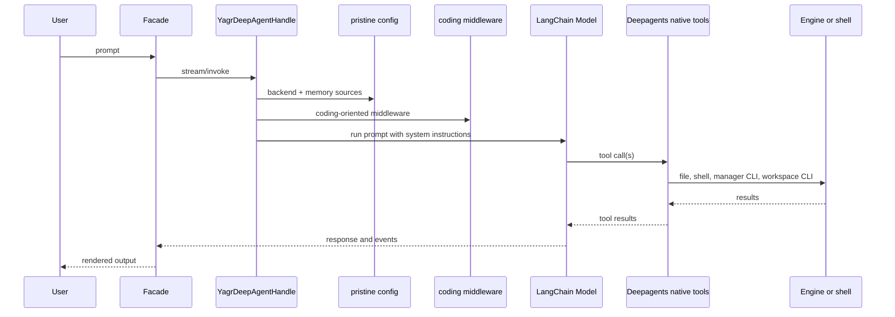
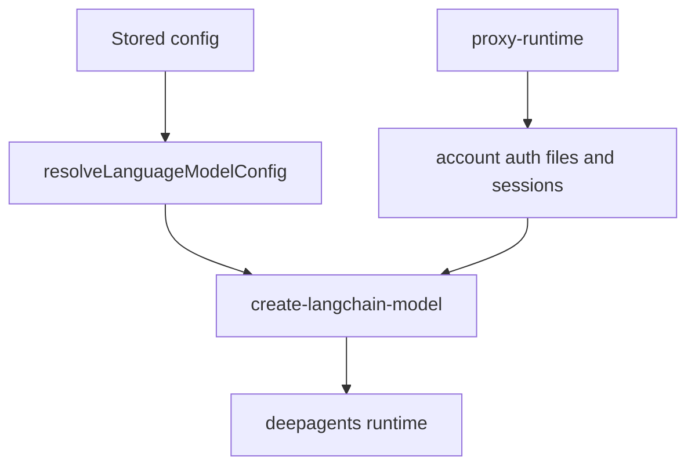

# Runtime Flows

Cette page documente les flux transverses principaux du repo dans le modele deep-agent actuel.

## 1. Message entrant vers execution agentique

```mermaid
sequenceDiagram
    participant U as User
    participant F as Facade
    participant H as YagrDeepAgentHandle
    participant P as pristine config
    participant C as coding middleware
    participant M as LangChain Model
    participant T as Deepagents native tools
    participant E as Engine or shell

    U->>F: prompt
    F->>H: stream/invoke
    H->>P: backend + memory sources
    H->>C: coding-oriented middleware
    H->>M: run prompt with system instructions
    M->>T: tool call(s)
    T->>E: file, shell, manager CLI, workspace CLI
    E-->>T: results
    T-->>M: tool results
    M-->>F: response and events
    F-->>U: rendered output
```

Observation:

- les facades conversationnelles consomment toutes un `YagrDeepAgentHandle`
- le deep-agent porte directement sa surface native deepagents
- la surcouche coding-oriented est appliquee via middleware, pas via un fichier de prompt runtime monolithique
- les comportements manager et workspace passent ensuite par shell via `yagr ...` et `npx n8nac ...`

## 2. Flux instructions + middleware + CLI actuel

```mermaid
flowchart LR
    HOME[Home AGENTS.md]
    WORK[Workspace AGENTS.md]
    PR[pristine.ts]
    CODE[coding-orientation.ts]
    AGENT[deep-agent]
    SHELL[execute shell tool]
    HCLI[Commandes yagr manager]
    WCLI[Commandes n8nac workspace]

    HOME --> PR
    WORK --> PR
    PR --> AGENT
    CODE --> AGENT
    AGENT --> SHELL
    SHELL --> HCLI
    SHELL --> WCLI
```

Observation:

- la home Yagr cadre l'usage des commandes manager `yagr ...`
- le workspace n8n cadre l'usage des commandes `npx n8nac ...`
- le deep-agent ne recoit pas de tools manager ou `n8nac` injectes explicitement
- la surcouche coding-oriented est separee physiquement du socle pristine
- la home Yagr reste la racine operationnelle; `n8n-workspace` est un sous-workspace metier, pas le cwd implicite du process

## 3. Setup et onboarding

```mermaid
sequenceDiagram
    participant UI as Wizard or WebUI
    participant AS as setup/application-services
    participant CFG as Config services
    participant NL as n8n-local
    participant PR as Provider runtime

    UI->>AS: action de setup
    AS->>CFG: save/read config
    AS->>NL: optional managed bootstrap
    AS->>PR: provider preparation
    AS-->>UI: status and snapshot
```

Observation:

- les facades ne portent plus directement les mutations de config metier
- `application-services.ts` et `status.ts` sont le point commun du setup

## 4. Flux provider actuel

```mermaid
flowchart TD
    CFG[Stored config] --> RES[resolveLanguageModelConfig]
    RES --> CLM[create-langchain-model]
    CLM --> RT[deepagents runtime]
    PR[proxy-runtime] --> ACC[account auth files and sessions]
    ACC --> CLM
```

## 5. Regles de maintenance

Quand un flux transverse change, il faut:

- mettre a jour le graphe Mermaid concerne
- verifier que les noms de modules correspondent encore au repo
- signaler clairement tout nouveau couplage transverse

## 6. Invariant central

La frontiere suivante doit rester visible:

- `src/deepagents/pristine.ts` = socle Deepagents
- `src/deepagents/coding-orientation.ts` = surcouche coding-oriented
- `src/manager-tooling/*` = comportements manager et templates d'instructions

Si une nouvelle logique ne rentre pas clairement dans l'une de ces trois zones, elle doit etre isolee avant d'etre ajoutee.
