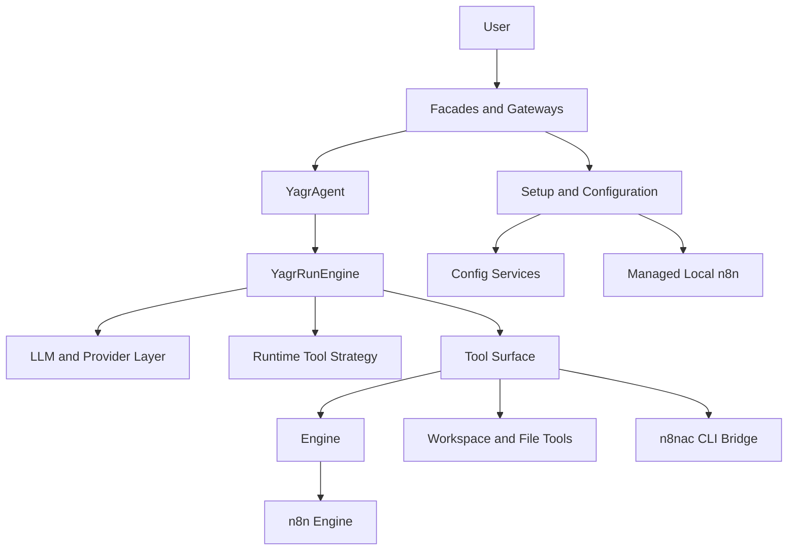
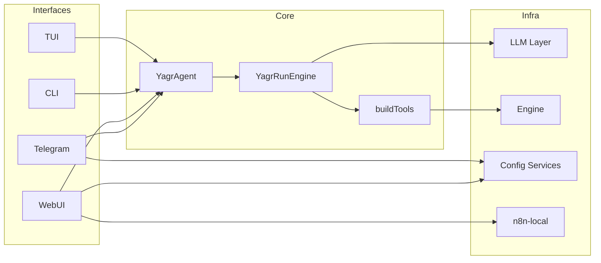

# System Overview

Cette page decrit les grands blocs logiques actuellement presents dans le repo.

## Vue d'ensemble

## Blocs principaux

### Boucle agentique

- `src/agent.ts`: session agent, historique, system prompt, invalidation de session
- `src/runtime/run-engine.ts`: boucle principale de run, streaming, phases, recovery, completion gate
- `src/runtime/tool-runtime-strategy.ts`: strategie runtime derivee du profil de capacite
- `src/runtime/*`: compaction, policy hooks, required actions, outcome
- `src/prompt/build-system-prompt.ts`: composition du system prompt runtime

Responsabilite actuelle:

- executer la boucle de raisonnement
- brancher le modele
- choisir une strategie runtime selon les capacites resolues
- exposer les outils
- maintenir l'etat de run et les evenements

### LLM / providers

- `src/llm/provider-registry.ts`
- `src/llm/provider-plugin.ts`
- `src/llm/create-language-model.ts`
- `src/llm/provider-discovery.ts`
- `src/llm/provider-metadata.ts`
- `src/llm/capability-resolver.ts`
- `src/llm/proxy-runtime.ts`
- `src/llm/*-account.ts`

Responsabilite actuelle:

- registre des providers
- contrat plugin/provider thin pour les faits de transport et l'hydratation metadata
- resolution de config provider/model/baseUrl/apiKey
- creation du modele AI SDK
- auth et runtimes comptes/OAuth
- model discovery
- mise en cache de metadonnees provider/model
- normalisation des capacites provider/model
- quelques adaptations provider-specifiques

Observation actuelle:

- la separation commence a etre plus nette entre metadata provider, normalisation des capacites et strategie runtime
- un contrat `ProviderPlugin` existe maintenant pour exposer les faits de transport et les hooks metadata sans empiler la politique runtime dans chaque adapter
- la migration n'est pas terminee, mais la direction `metadata -> normalisation -> runtime strategy` existe maintenant dans le code
- les providers OpenAI-compatible faibles ne sont plus artificiellement limites au premier tool visible
- la strategie runtime commune pilote maintenant le mode `stream` vs `generate`, les directives inspect/execute/recovery et la reduction de surface d'outils pour le niveau `none`

### Tooling

- `src/tools/build-tools.ts`
- `src/tools/*.ts`

Responsabilite actuelle:

- construire la surface d'outils exposee au runtime
- fournir des outils workspace, n8nac, workflow et required action

Observation actuelle:

- la surface reste plate, mais elle est maintenant filtree par la strategie runtime pour exposer une capacite coherente selon `native / compatible / weak / none`
- le bridge `n8nac` privilegie desormais le repertoire de sync actif lors des retries `push`, ce qui evite une partie des divergences entre instances/scope locaux

### Gateway / facades

- `src/gateway/telegram.ts`
- `src/gateway/webui.ts`
- `src/gateway/cli.ts`
- `src/gateway/manager.ts`
- `src/gateway/interactive-ui.tsx`

Responsabilite actuelle:

- exposer l'agent via Telegram, WebUI, CLI et TUI
- gerer les sessions facade-side
- afficher le statut des surfaces et demarrer les runtimes de gateway

Observation actuelle:

- certaines facades portent aussi de la logique applicative de setup/configuration

### Setup / wizard / bootstrap

- `src/setup.ts`
- `src/setup/application-services.ts`
- `src/setup/setup-wizard.tsx`
- `src/n8n-local/*`

Responsabilite actuelle:

- services applicatifs partages pour setup n8n, LLM et surfaces
- onboarding n8n
- onboarding provider LLM
- onboarding Telegram
- bootstrap local managed n8n

Observation actuelle:

- `src/setup/application-services.ts` centralise maintenant une partie du SSOT applicatif de setup
- `src/setup.ts` reste encore un point d'orchestration important, mais moins charge qu'avant

### Configuration et SSOT local

- `src/config/yagr-config-service.ts`
- `src/config/n8n-config-service.ts`
- `src/config/*`

Responsabilite actuelle:

- configuration locale Yagr
- credentials providers
- credentials n8n
- chemins Yagr home
- etat local et daemon/gateway config

## Frontieres actuelles

## Points d'attention actuels

- La couche providers a maintenant un contrat plugin de base, mais tous les adapters ne sont pas encore amincis jusqu'au minimum souhaitable.
- La frontiere tooling/providers est plus propre, mais reste encore implicite au lieu d'etre formalisee par un vrai contrat de negociation.
- Le SSOT applicatif est partiellement duplique entre `setup.ts` et `gateway/webui.ts`.
- Le contrat `Engine` agrege plusieurs responsabilites.
- La capture de la reponse finale utilisateur dans le harness `advanced` remonte maintenant correctement le resultat final du run, mais la formulation finale reste encore un resume technique plutot qu'une vraie reponse produit.
