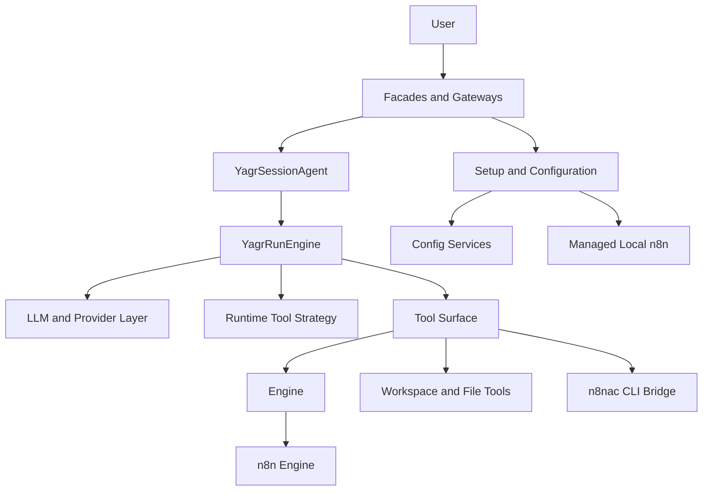
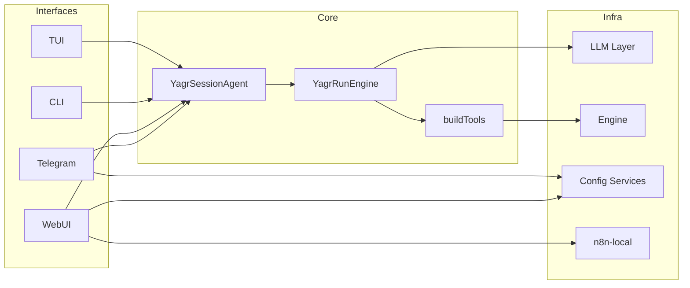

# System Overview

Cette page decrit les grands blocs logiques actuellement presents dans le repo.

## Vue d'ensemble

## Blocs principaux

### Boucle agentique

- `src/agent.ts`: session agent runtime (`YagrSessionAgent`), agent complet (`YagrAgent`), historique, system prompt, invalidation de session
- `src/runtime/run-engine.ts`: boucle principale de run, streaming, phases, recovery, completion gate
- `src/runtime/tool-runtime-strategy.ts`: strategie runtime derivee du profil de capacite
- `src/runtime/*`: compaction, policy hooks, required actions, outcome
- `src/prompt/build-system-prompt.ts`: composition du system prompt runtime

Responsabilite actuelle:

- executer la boucle de raisonnement
- brancher le modele
- choisir une strategie runtime selon les capacites resolues
- exposer les outils
- maintenir l'etat de run et les evenements

Observation actuelle:

- `build-system-prompt.ts` ne depend plus que du port identitaire de l'engine
- `run-engine.ts` ne depend plus que du port runtime (`EngineRuntimePort`)
- les facades conversationnelles passent maintenant par `YagrSessionAgent`, sans dependre du contrat `Engine` complet

### LLM / providers

- `src/llm/provider-registry.ts`
- `src/llm/provider-plugin.ts`
- `src/llm/create-language-model.ts`
- `src/llm/provider-discovery.ts`
- `src/llm/provider-metadata.ts`
- `src/llm/capability-resolver.ts`
- `src/llm/proxy-runtime.ts`
- `src/llm/*-account.ts`

Responsabilite actuelle:

- registre des providers
- contrat plugin/provider thin pour les faits de transport, discovery, creation de modele et l'hydratation metadata
- resolution de config provider/model/baseUrl/apiKey
- creation du modele AI SDK via le plugin provider
- auth et runtimes comptes/OAuth
- model discovery via le plugin provider
- mise en cache de metadonnees provider/model
- normalisation des capacites provider/model
- quelques adaptations provider-specifiques

Observation actuelle:

- la separation commence a etre plus nette entre metadata provider, normalisation des capacites et strategie runtime
- `ProviderPlugin` porte maintenant aussi la factory de modele et la discovery, ce qui retire les `switch` provider-specific de `create-language-model.ts` et `provider-discovery.ts`
- les adapters providers gardent maintenant principalement auth, transport, conversion minimale et hooks metadata/discovery
- `google-proxy` n'est plus expose comme provider supporte: le backend OAuth / Code Assist reste conserve en interne, mais il est retire des surfaces utilisateur et des runs provider par defaut tant qu'une refonte propre n'existe pas
- la migration n'est pas terminee, mais la direction `metadata -> normalisation -> runtime strategy` existe maintenant dans le code
- les providers OpenAI-compatible faibles ne sont plus artificiellement limites au premier tool visible
- la strategie runtime commune pilote maintenant le mode `stream` vs `generate`, les directives inspect/execute/recovery et la reduction de surface d'outils pour le niveau `none`

### Tooling

- `src/tools/build-tools.ts`
- `src/tools/toolsets.ts`
- `src/tools/*.ts`
- `src/runtime/tool-runtime-strategy.ts`
- `src/runtime/policy-hooks.ts`

Responsabilite actuelle:

- construire la surface d'outils exposee au runtime
- fournir des outils workspace, n8nac, workflow et required action
- normaliser les groupes d'outils et les contraintes post-sync
- faire porter par la strategie runtime la selection de surface et le mode de tool calling

Observation actuelle:

- `src/tools/toolsets.ts` definit maintenant le SSOT des groupes d'outils runtime (`core`, `discovery`, `edit`, `workflow execution`)
- `src/runtime/tool-runtime-strategy.ts` choisit maintenant explicitement la surface exposee, le mode `parallel / sequential / disabled` et les tools autorises apres un `push/verify`
- `src/runtime/policy-hooks.ts` consomme cette politique runtime au lieu de porter sa propre allowlist implicite
- la surface reste plate cote implementation, mais elle est maintenant filtree et contrainte de maniere coherente selon `native / compatible / weak / none`
- le bridge `n8nac` privilegie desormais le repertoire de sync actif lors des retries `push`, ce qui evite une partie des divergences entre instances/scope locaux
- le tool `presentWorkflowResult` et ses embeds workflow sont maintenant traites comme une sortie produit de premier plan: le harness `advanced` verifie explicitement la presence d'une banniere workflow complete avec URL et diagramme quand un workflow a ete cree/pousse

### Gateway / facades

- `src/gateway/telegram.ts`
- `src/gateway/webui.ts`
- `src/gateway/cli.ts`
- `src/gateway/manager.ts`
- `src/gateway/interactive-ui.tsx`

Responsabilite actuelle:

- exposer l'agent via Telegram, WebUI, CLI et TUI
- gerer les sessions facade-side
- afficher le statut des surfaces et demarrer les runtimes de gateway

Observation actuelle:

- les facades se limitent maintenant a l'I/O, aux sessions et a une orchestration legere
- les mutations setup/config et l'etat metier associe sont delegues aux services applicatifs partages

### Setup / wizard / bootstrap

- `src/setup.ts`
- `src/setup/application-services.ts`
- `src/setup/status.ts`
- `src/setup/setup-wizard.tsx`
- `src/n8n-local/*`

Responsabilite actuelle:

- services applicatifs partages pour setup n8n, LLM et surfaces
- calcul partage du statut setup
- onboarding n8n
- onboarding provider LLM
- onboarding Telegram
- bootstrap local managed n8n

Observation actuelle:

- `src/setup/application-services.ts` centralise maintenant les mutations principales de setup/configuration pour n8n, LLM, surfaces et Telegram
- `src/setup/status.ts` porte maintenant le calcul partage de `YagrSetupStatus`
- la WebUI demande maintenant son snapshot de configuration au service applicatif au lieu de reconstituer localement toute la vue setup/config
- la facade Telegram delegue maintenant au service applicatif le setup/reset et les mutations d'etat des chats lies
- `src/setup.ts` reste un point d'orchestration/wizard, mais n'est plus le lieu principal des mutations setup/config

### Configuration et SSOT local

- `src/config/yagr-config-service.ts`
- `src/config/n8n-config-service.ts`
- `src/config/*`

Responsabilite actuelle:

- configuration locale Yagr
- credentials providers
- credentials n8n
- chemins Yagr home
- etat local et daemon/gateway config

## Frontieres actuelles

## Points d'attention actuels

- La couche providers a maintenant un contrat plugin de base, mais tous les adapters ne sont pas encore amincis jusqu'au minimum souhaitable.
- La frontiere tooling/providers est maintenant centralisee autour d'une strategie runtime unique et de groupes d'outils normalises; il reste surtout a finir l'amincissement des adapters providers eux-memes.
- Le SSOT applicatif est partiellement duplique entre `setup.ts` et `gateway/webui.ts`.
- Le contrat `Engine` agrege encore plusieurs responsabilites pour compatibilite, mais le prompt, le runtime et les gateways consomment maintenant des ports plus fins (`EngineIdentityPort`, `EngineRuntimePort`, etc.) au lieu du contrat complet.
- La capture de la reponse finale utilisateur dans le harness `advanced` remonte maintenant correctement le resultat final du run, et la presence d'une banniere workflow complete est verifiee. La formulation finale reste encore perfectible sur certains providers.
