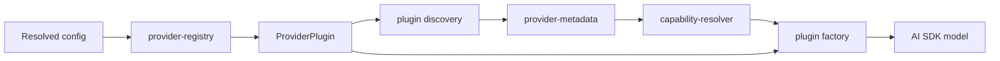
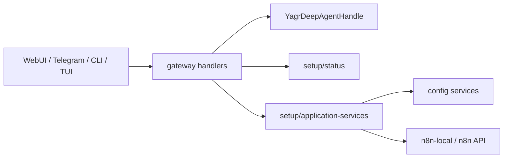
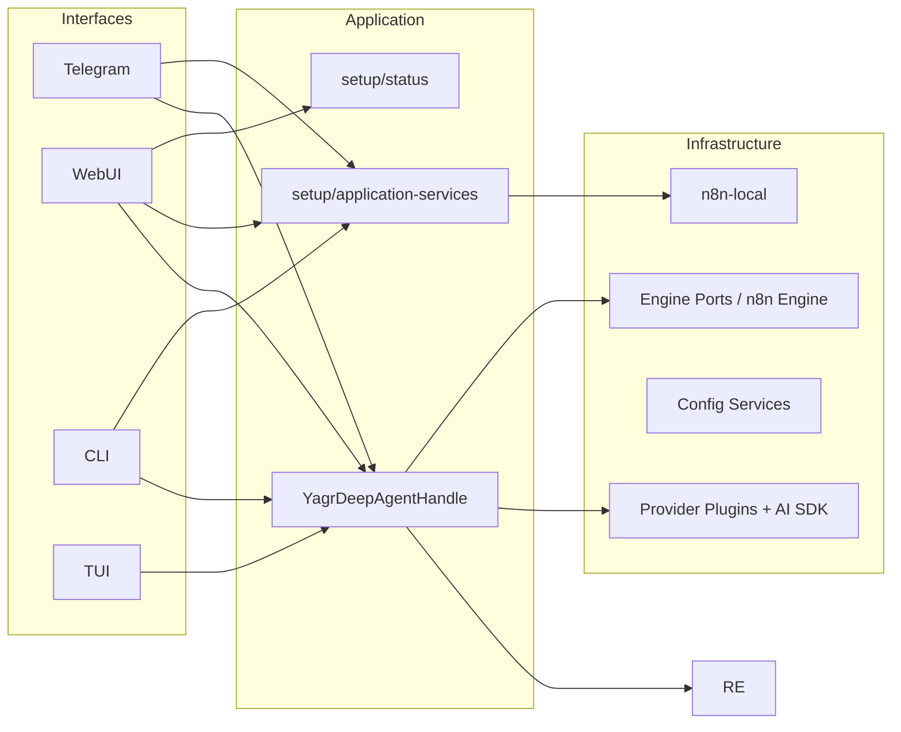

# System Overview

Cette page decrit les grands blocs logiques actuellement presents dans le repo.

## Vue d'ensemble


```mermaid
flowchart TD
    User[User]

    subgraph Interfaces[Interfaces]
      Facades[WebUI / Telegram / CLI / TUI]
    end

    subgraph Application[Application]
      AF[agent-factory\ncreateYagrDeepAgent]
      DA[deepagentsjs\nLangGraph]
      EVT[langgraph-events\nadaptateur events]
      Setup[Setup Application Services]
    end

    subgraph Infra[Infrastructure]
      LLM[LangChain BaseChatModel\ncreate-langchain-model]
      Tools[LangChain Tools\ntools/ + manager-tooling/]
      Engine[Engine Ports\nn8n Engine]
      Checkpointer[MemorySaver\ncheckpointer par thread]
      Config[Config Services]
      N8nLocal[Managed Local n8n]
    end

    subgraph Relay[Relay LLM pour n8n]
      Proxy[proxy-runtime\nllm-relay-server]
      Accounts[*-account.ts\nCopilot / OpenAI / Anthropic]
    end

    User --> Facades
    Facades --> EVT
    EVT --> DA
    DA --> AF
    AF --> LLM
    AF --> Tools
    AF --> Checkpointer
    Facades --> Setup
    Tools --> Engine
    LLM --> Accounts
    Setup --> Config
    Setup --> N8nLocal
    Setup --> Relay
```

## Blocs principaux

### Boucle agentique (deepagentsjs)

- `src/agent-factory.ts`: `createYagrDeepAgent(engine, configService)` → `YagrDeepAgentHandle`
- `deepagentsjs`: `createDeepAgent({ model, tools, systemPrompt, checkpointer })` — LangGraph sous le capot
- `src/gateway/langgraph-events.ts`: adaptateur events LangGraph → `YagrUserVisibleUpdate`
- `src/prompt/build-system-prompt.ts`: composition du system prompt (engine, tunnel, n8n host, workspace instructions, memoire cross-session)

**Deleted:**
- `src/agent.ts` (`YagrSessionAgent`) — supprimé
- `src/runtime/` (7 fichiers) — supprimé

### LLM / providers

Deux couches distinctes :

**Couche agent (LangChain)** — utilisée par deepagentsjs :
- `src/llm/create-langchain-model.ts` : factory `BaseChatModel` + resolution config
- `src/llm/*-account.ts` : auth OAuth (Copilot Device Flow, OpenAI Codex, Claude Pro/Max)

**Couche relay (Vercel AI SDK)** — utilisée par le relay proxy n8n :
- `src/llm/proxy-runtime.ts` + `llm-relay-server.ts` : relay OpenAI-compatible local
- `src/llm/provider-plugin.ts` + `provider-registry.ts` : plugins provider avec factory Vercel AI SDK
- `src/llm/capability-resolver.ts` + `model-capabilities.ts` : classification capacite (relay uniquement)

**Deleted:** `src/llm/create-language-model.ts` — supprimé.

### N8N Cloudflare Tunnel Exposure

Yagr peut exposer des endpoints Yagr locaux via trois tunnels Cloudflare distincts, chacun avec une responsabilite explicite:

- `n8n tunnel`: exposition publique de l'instance n8n locale Yagr-managed pour les webhooks
- `n8n auth tunnel`: exposition publique du bridge d'auth local utilise pour l'ouverture distante de workflows
- `llm tunnel`: exposition publique du relay LLM local quand une instance n8n cloud doit joindre Yagr

**Composants implementes**

| Fichier | Role |
|---|---|
| `src/n8n-local/n8n-tunnel.ts` | SSOT du lifecycle process des tunnels Cloudflare : start/stop/refresh/status, persistance des state files, auto-install de `cloudflared`, support `trycloudflare` ou domaine DNS dedie |
| `src/n8n-local/tunnel-reachability.ts` | SSOT de wake-up des tunnels par consommateur (`telegram`, `webui`, `tui`, `cli`, `llm`) + mode force |
| `src/gateway/local-open-bridge.ts` | Bridge HTTP tokenise d'auth n8n qui materialise `presentWorkflowResult.url` pour les surfaces qui ne savent pas ouvrir une `data:` URL |
| `src/config/yagr-config-service.ts` | `N8nTunnelConfig` : `enabled`, `publicUrl`, `targetUrl` |
| `src/gateway/workflow-links.ts` | Substitution de l'URL locale par l'URL tunnel publique quand active |
| `src/prompt/build-system-prompt.ts` | Injection de l'URL tunnel publique dans le system prompt |

**Flux operationnel**

```
yagr n8n tunnel start
  → resolveN8nTunnelTargetUrl()        → URL locale n8n (managed uniquement)
  → installCloudflaredIfNeeded()       → telecharge cloudflared si absent
  → ensureN8nTunnel(targetUrl)         → demarre/reuse un unique tunnel cloudflared
  → detecte URL trycloudflare.com      → parse le log file
  → persiste N8nTunnelState            → YAGR_HOME/n8n-tunnel-state.json
  → restartManagedN8nForTunnel()       → redemarre n8n avec N8N_WEBHOOK_URL
```

**Regles de cycle de vie**

- Le lifecycle process des tunnels Cloudflare est centralise dans `src/n8n-local/n8n-tunnel.ts`.
- Les decisions de wake-up par facade/consommateur sont centralisees dans `src/n8n-local/tunnel-reachability.ts`.
- Les erreurs/timeouts de startup nettoient maintenant le processus `cloudflared` au lieu de le laisser detache.
- Les tunnels `n8n` et `n8n auth` sont maintenant lazy: demarrage explicite au setup/CLI, puis wake-up uniquement par les consommateurs qui en ont besoin.
- Le tunnel `llm` passe par le meme orchestrateur de reachability et se reveille uniquement si le proxy LLM est configure en mode `tunnel`.
- Le mode `force-all-facades` permet de tester les chemins publics depuis toutes les facades sans changer les call sites metier.
- Le support `TUNNEL_DOMAIN` est centralise dans `n8n-tunnel.ts`: il bascule du mode `trycloudflare` vers un tunnel DNS dedie et assure aussi le routage `cloudflared tunnel route dns`.
- Variables d'environnement SSOT:
  - `YAGR_TUNNEL_REACHABILITY_MODE` pilote la politique de wake-up des tunnels.
  - `TUNNEL_DOMAIN` active le mode tunnel Cloudflare sur domaine DNS dedie au lieu du mode `trycloudflare`.
  - Ces variables sont consommees depuis les modules SSOT (`tunnel-reachability.ts`, `n8n-tunnel.ts`) et sont heritees par les workers/processus detaches via `process.env`.

**Portee et limitations**

- Le `n8n tunnel` ne s'applique qu'aux instances **Yagr-managed locales** (direct ou docker). Les instances cloud/distantes sont deja publiques.
- Trois tunnels distincts peuvent coexister: `n8n tunnel`, `n8n auth tunnel`, `llm tunnel`.
- Quand l'exposition n8n est active, Yagr peut aussi demarrer un tunnel public dedie au bridge d'auth n8n pour les surfaces distantes (ex: Telegram mobile).
- Les URL `trycloudflare.com` changent a chaque restart; en mode `TUNNEL_DOMAIN`, les hostnames sont stables mais restent dependants du compte Cloudflare configure localement.
- `N8N_WEBHOOK_URL` est positionne au demarrage n8n ; un refresh tunnel propose un redemarrage explicite.
- Le tunnel expose une surface **non authentifiee** par defaut pour les webhooks.

**Commandes CLI**

| Commande | Description |
|---|---|
| `yagr n8n tunnel setup` | Installe cloudflared automatiquement |
| `yagr n8n tunnel start` | Demarre le tunnel |
| `yagr n8n tunnel stop` | Arrete le tunnel |
| `yagr n8n tunnel refresh` | Renouvelle l'URL |
| `yagr n8n tunnel status` | Affiche l'etat courant |
| `yagr n8n tunnel url` | Retourne l'URL publique seule |

### LLM Relay Proxy (Yagr → n8n)

Yagr expose un serveur HTTP OpenAI-compatible local (`llm-relay-server.ts`) qui proxifie vers le provider actif de Yagr. Les noeuds Chat Model n8n (ex: `lmChatOpenAi`) peuvent pointer sur ce relay via une credential `openAiApi` avec `baseUrl` custom — sans necessiter de cle API separee.

**Composants implementes**

| Fichier | Role |
|---|---|
| `src/llm/llm-relay-server.ts` | Cycle de vie du relay : demarrage, detection de port libre, health-check, arret |
| `src/llm/llm-relay-entrypoint.ts` | Point d'entree du processus relay detache |
| `src/llm/anthropic-relay.ts` | Adaptation de format Anthropic → OpenAI pour le relay |
| `src/llm/proxy-runtime.ts` | Preparation du runtime provider pour le relay |

**Flux operationnel**

```
n8nac action=yagr_proxy_relay_start
  → ensureN8nRelayServer()            // demarre le relay si mort, idempotent
  → cree/reuse la credential openAiApi dans n8n (nom fixe "Yagr LLM Proxy")
  → retourne { port, baseUrl, credentialId }
  → l'agent assigne credentialId au noeud lmChatOpenAi

n8n execute le workflow
  → lmChatOpenAi appelle http://host.docker.internal:PORT/v1/chat/completions
  → relay proxifie vers le provider actif Yagr (Copilot, Anthropic, OpenAI, etc.)
  → rotation de token transparente (le relay fait l'intermediaire en temps reel)
```

**Points d'attention**

- Le relay tourne como processus detache qui survit a la session agent ; il est redemarre automatiquement au prochain lancement de `ensureRelayAtLaunch()` si mort
- Le noeud `lmChatOpenAi` v1.3 exige `responsesApiEnabled: false` quand une `baseURL` custom est configuree — sinon n8n envoie la requete a `api.openai.com/v1/responses` en ignorant la `baseURL`
- Quand n8nac test retourne `asyncTrigger=true` (`{"message":"Workflow was started"}`), l'execution est asynchrone ; l'agent doit enchaîner avec `execution list/get` pour confirmer le statut reel


```mermaid
flowchart LR
    CFG[Resolved config]
    REG[provider-registry]
    PLUG[ProviderPlugin]
    META[provider-metadata]
    CAP[capability-resolver]
    FACT[plugin factory]
    SDK[AI SDK model]
    DISC[plugin discovery]

    CFG --> REG
    REG --> PLUG
    PLUG --> DISC
    DISC --> META
    META --> CAP
    CAP --> FACT
    PLUG --> FACT
    FACT --> SDK
```

### Tooling

**Outils generalistes (`src/tools/`) :**

- `src/tools/*.ts` (FS, shell, HTTP, status)
- `src/manager-tooling/YAGENTS.md` — template source des instructions manager semees dans la home Yagr

Responsabilite actuelle:
#### Doctrine d'outillage

> Yagr est un agent generaliste de codage et d'orchestration, avec une fine surcouche d'outillage dediee a n8n.

La regle est simple : **qui peut le plus peut le moins**. Un agent capable de lire n'importe quel fichier peut lire un fichier de workflow. Un outil de recherche generique peut chercher dans un workspace n8nac. L'outillage n8n-specifique ne doit couvrir que ce qu'un outil generaliste ne peut pas faire par construction.

Dans le modele cible et attendu, la racine operationnelle est la **home Yagr** (`YAGR_HOME`). Le dossier `n8n-workspace` est un sous-workspace de cette home, pas le root implicite du process.

```
┌─────────────────────────────────────────────────────────────────┐
│  readFile   grep   listDir                                      │
│  ↳ lisent le FS visible depuis la home Yagr                    │
│                                                                 │
│  writeFile  replaceInFile  moveFile  deleteFile                 │
│                                                                 │
│  httpRequest   — appels HTTP arbitraires (API REST, relay…)    │
│  runScript     — shell restraint (allowlist : build/test/git)  │
│  reportProgress   requestRequiredAction                        │
└─────────────────────────────────────────────────────────────────┘
┌─────────────────────────────────────────────────────────────────┐
└─────────────────────────────────────────────────────────────────┘
┌─────────────────────────────────────────────────────────────────┐
│  COUCHE 3 — Specificites Yagr (src/manager-tooling/)            │
│  yagr yagrProxy — proxy LLM + credential n8n                    │
│  YAGENTS.md — template manager pour la home Yagr               │
└─────────────────────────────────────────────────────────────────┘
```

Outils FS et leur scope :

| Outil | Scope par defaut | Scope etendu |
|---|---|---|
| `readFile` | home Yagr (`YAGR_HOME`) et sous-dossiers | selon l'outil/backend effectif |
| `grep` | home Yagr (`YAGR_HOME`) et sous-dossiers | selon l'outil/backend effectif |
| `listDir` | home Yagr (`YAGR_HOME`) et sous-dossiers | selon l'outil/backend effectif |
| `writeFile` | home Yagr (`YAGR_HOME`) et sous-dossiers | selon l'outil/backend effectif |
| `replaceInFile` | home Yagr (`YAGR_HOME`) et sous-dossiers | selon l'outil/backend effectif |
| `moveFile` | home Yagr (`YAGR_HOME`) et sous-dossiers | selon l'outil/backend effectif |
| `deleteFile` | home Yagr (`YAGR_HOME`) et sous-dossiers | selon l'outil/backend effectif |

Le workspace `n8n-workspace` reste le sous-dossier metier principal pour les automatisations n8n, mais il ne doit pas etre confondu avec la racine de processus ou avec un faux root de filesystem.

**runScript (allowlist)** : commandes autorisees : `npm run`, `npm test`, `npx tsc`, `node --test`, `git status/diff/log`, `node -e`, `cat`, `ls`, `find`. Toujours disponible.

**runShell (opt-in)** : shell bash libre. Desactive par defaut. Activation : `YAGR_ENABLE_SHELL=1`. Ne jamais activer par defaut — permet des operations irreversibles.

#### Regles d'evolution

1. Avant d'ajouter un outil n8n-specifique, verifier si un outil generaliste (httpRequest, runScript, FS) ne suffit pas.
2. Ne pas introduire de faux root implicite sur `n8n-workspace` qui divergerait du shell ou du FS reel.
3. `runShell` reste opt-in, avec warning explicite dans sa description.
4. `n8nac` reste une dependance externe, jamais reimplementee dans le core.
5. `yagr presentWorkflowResult` doit etre appele systematiquement quand l'agent manipule un workflow connu.
6. Les comportements n8n-specific vivent dans `src/manager-tooling/`, pas dans `src/tools/`.

#### Observation actuelle

- la surface d'outils du deep-agent est maintenant simple et agnostique: fichiers, shell, HTTP, progression et required actions
- le bridge `n8nac` privilegie le repertoire de sync actif lors des retries `push`
- la commande `yagr presentWorkflowResult` est traitee comme une sortie produit de premier plan : le harness `advanced` verifie la presence d'une banniere workflow complete avec URL et diagramme
- le diagramme workflow est valide via `src/gateway/workflow-diagram.ts` avant presentation
- la resolution du runtime n8n est partagee entre le manager, le relay et le bridge `n8nac`
- `N8N_HOST` / `N8N_API_KEY` ne sont pris en compte que lorsque le harness active explicitement `YAGR_ALLOW_N8N_ENV=1`
- les required actions non bloquantes ne forcent plus l'arret d'un run qui a deja un resultat concret
- les comportements n8n-specific (`presentWorkflowResult`, `yagrProxy`) vivent dans `src/manager-tooling/` et sont atteints via CLI interne pour que yagr-agent reste agnostique

### Gateway / facades

- `src/gateway/telegram.ts`
- `src/gateway/webui.ts`
- `src/gateway/cli.ts`
- `src/gateway/manager.ts`
- `src/gateway/interactive-ui.tsx`

Responsabilite actuelle:

- exposer l'agent via Telegram, WebUI, CLI et TUI
- gerer les sessions facade-side
- afficher le statut des surfaces et demarrer les runtimes de gateway

Observation actuelle:

- les facades se limitent maintenant a l'I/O, aux sessions et a une orchestration legere
- les mutations setup/config et l'etat metier associe sont delegues aux services applicatifs partages
- les surfaces partagent maintenant une base unifiee pour les updates montrables; la prose assistant intermediaire ne doit plus etre le canal principal de progression


```mermaid
flowchart LR
    UI[WebUI / Telegram / CLI / TUI]
    GW[gateway handlers]
  SA[YagrDeepAgentHandle]
    SS[setup/status]
    AS[setup/application-services]
    CFG[config services]
    N8N[n8n-local / n8n API]

    UI --> GW
    GW --> SA
    GW --> SS
    GW --> AS
    AS --> CFG
    AS --> N8N
```

### Setup / wizard / bootstrap

- `src/setup.ts`
- `src/setup/application-services.ts`
- `src/setup/status.ts`
- `src/setup/setup-wizard.tsx`
- `src/n8n-local/*`

Responsabilite actuelle:

- services applicatifs partages pour setup n8n, LLM et surfaces
- calcul partage du statut setup
- onboarding n8n
- onboarding provider LLM
- onboarding Telegram
- bootstrap local managed n8n

Observation actuelle:

- `src/setup/application-services.ts` centralise maintenant les mutations principales de setup/configuration pour n8n, LLM, surfaces et Telegram
- `src/setup/status.ts` porte maintenant le calcul partage de `YagrSetupStatus`
- la WebUI demande maintenant son snapshot de configuration au service applicatif au lieu de reconstituer localement toute la vue setup/config
- la facade Telegram delegue maintenant au service applicatif le setup/reset et les mutations d'etat des chats lies
- `src/setup.ts` reste un point d'orchestration/wizard, mais n'est plus le lieu principal des mutations setup/config

### Configuration et SSOT local

- `src/config/yagr-config-service.ts`
- `src/config/n8n-config-service.ts`
- `src/config/*`

Responsabilite actuelle:

- configuration locale Yagr
- credentials providers
- credentials n8n
- chemins Yagr home
- etat local et daemon/gateway config

Observation actuelle:

- la source de verite normale pour n8n reste la config locale Yagr/n8n persistee
- le fallback environnement n8n est reserve aux tests automatises et doit etre active explicitement
- le runtime agent local utilise `YAGR_HOME` comme cwd reel, pas comme faux root virtuel slash-prefixed; `n8n-workspace` est donc un chemin relatif normal sous cette home

## Frontieres actuelles


```mermaid
flowchart LR
    subgraph Interfaces
      TG[Telegram]
      WEB[WebUI]
      CLI[CLI]
      TUI[TUI]
    end

    subgraph Application
      AG[YagrDeepAgentHandle]
      AS[setup/application-services]
      ST[setup/status]
    end

    subgraph Infrastructure
      LLM[Provider Plugins + AI SDK]
      ENG[Engine Ports / n8n Engine]
      CFG[Config Services]
      N8NLOCAL[n8n-local]
    end

    TG --> AG
    WEB --> AG
    CLI --> AG
    TUI --> AG
    TG --> AS
    WEB --> AS
    CLI --> AS
    AG --> RE
    WEB --> ST
    AG --> LLM
    AG --> ENG
    AS --> N8NLOCAL
```

## Points d'attention actuels

- Le contrat `Engine` agrege encore plusieurs responsabilites pour compatibilite, meme si le prompt, le runtime et les gateways consomment deja des ports plus fins (`EngineIdentityPort`, `EngineRuntimePort`, etc.).
- `setup.ts` reste un point d'orchestration historique, meme si les mutations et snapshots principaux sont remontes dans `setup/application-services.ts` et `setup/status.ts`.
- La capture de la reponse finale utilisateur et de la banniere workflow est maintenant bonne cote harness, mais la qualite redactionnelle varie encore selon les providers/modeles.
