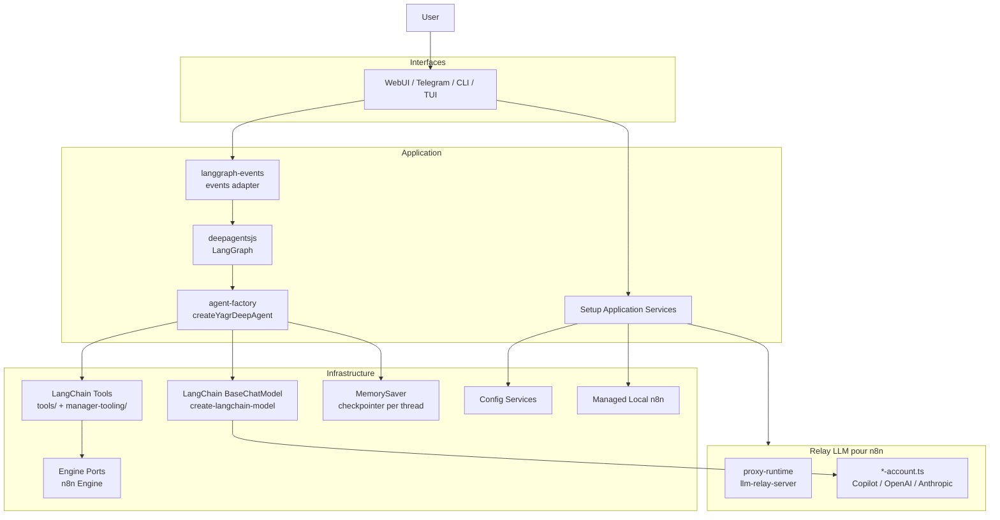
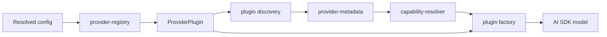
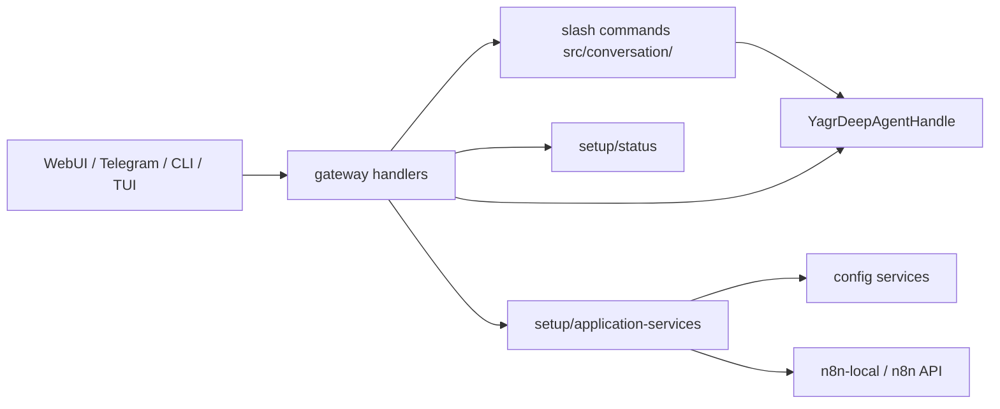
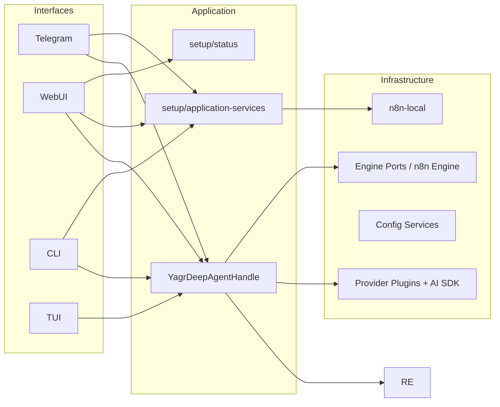

# System Overview

This page describes the major logical blocks currently present in the repo.

## Overview


```mermaid
flowchart TD
    User[User]

    subgraph Interfaces[Interfaces]
      Facades[WebUI / Telegram / CLI / TUI]
    end

    subgraph Application[Application]
      AF[agent-factory\ncreateYagrDeepAgent]
      DA[deepagentsjs\nLangGraph]
      EVT[langgraph-events\nevents adapter]
      Setup[Setup Application Services]
    end

    subgraph Infra[Infrastructure]
      LLM[LangChain BaseChatModel\ncreate-langchain-model]
      Tools[LangChain Tools\ntools/ + manager-tooling/]
      Engine[Engine Ports\nn8n Engine]
      Checkpointer[MemorySaver\ncheckpointer per thread]
      Config[Config Services]
      N8nLocal[Managed Local n8n]
    end

    subgraph Relay[Relay LLM pour n8n]
      Proxy[proxy-runtime\nllm-relay-server]
      Accounts[*-account.ts\nCopilot / OpenAI / Anthropic]
    end

    User --> Facades
    Facades --> EVT
    EVT --> DA
    DA --> AF
    AF --> LLM
    AF --> Tools
    AF --> Checkpointer
    Facades --> Setup
    Tools --> Engine
    LLM --> Accounts
    Setup --> Config
    Setup --> N8nLocal
    Setup --> Relay
```

## Main Blocks

### Agentic Loop (deepagentsjs)

- `src/agent-factory.ts`: `createYagrDeepAgent(engine, configService)` → `YagrDeepAgentHandle`
- `deepagentsjs`: `createDeepAgent({ model, tools, systemPrompt, checkpointer })` — LangGraph under the hood
- `src/gateway/langgraph-events.ts`: events adapter LangGraph → `YagrUserVisibleUpdate`
- `src/prompt/build-system-prompt.ts`: system prompt composition (engine, tunnel, n8n host, workspace instructions, cross-session memory)

**Deleted:**
- `src/agent.ts` (`YagrSessionAgent`) — deleted
- `src/runtime/` (7 files) — deleted

### LLM / providers

Two distinct layers:

**Agent layer (LangChain)** — used by deepagentsjs:
- `src/llm/create-langchain-model.ts`: factory `BaseChatModel` + config resolution
- `src/llm/*-account.ts`: OAuth auth (Copilot Device Flow, OpenAI Codex, Claude Pro/Max)

**Relay layer (Vercel AI SDK)** — used by the n8n relay proxy:
- `src/llm/proxy-runtime.ts` + `llm-relay-server.ts`: OpenAI-compatible local relay
- `src/llm/provider-plugin.ts` + `provider-registry.ts`: provider plugins with Vercel AI SDK factory
- `src/llm/capability-resolver.ts` + `model-capabilities.ts`: capability classification (relay only)

**Deleted:** `src/llm/create-language-model.ts` — deleted.

### N8N Cloudflare Tunnel Exposure

For the lifecycle of a Yagr-managed n8n instance, the current application boundary is as follows:

- `src/n8n-local/managed-runtime.ts` orchestrates the product preflight startup: restart/recreation of the managed runtime from the persisted `instanceProfile`, then bootstrap reconciliation if the instance is not already `connected`
- `src/n8n-local/bootstrap.ts` remains the SSOT of silent owner/API key bootstrap against a live n8n instance
- `src/setup/application-services.ts` remains the SSOT of final persistence host/API key/project/workspace

Yagr can expose local Yagr endpoints via three distinct Cloudflare tunnels, each with explicit responsibility:

- `n8n tunnel`: public exposure of the Yagr-managed local n8n instance for webhooks
- `n8n auth tunnel`: public exposure of the local auth bridge used for remote workflow opening
- `llm tunnel`: public exposure of the local LLM relay when a cloud n8n instance needs to reach Yagr

**Implemented Components**

| File | Role |
|---|---|
| `src/n8n-local/n8n-tunnel.ts` | SSOT of Cloudflare tunnel lifecycle process: start/stop/refresh/status, state files persistence, auto-install of `cloudflared`, `trycloudflare` support or dedicated DNS domain |
| `src/n8n-local/public-exposure-service.ts` | SSOT of application orchestration for public exposures: compose tunnel lifecycle, auth bridge, LLM relay and config/restart side effects |
| `src/n8n-local/tunnel-reachability.ts` | SSOT of tunnel wake-up by consumer (`telegram`, `webui`, `tui`, `cli`, `llm`). `force-all-facades` is the default since this change. |
| `src/n8n-local/managed-runtime.ts` | SSOT of application startup of a Yagr-managed n8n instance: runtime resuscitation from persisted profile, then bootstrap/config reconciliation if necessary |
| `src/system/process.ts` | SSOT of platform process behavior: executable resolution, native shell policy, detached process spawning, PID checks, and process-tree termination |
| `src/gateway/local-open-bridge.ts` | Internal tokenized HTTP bridge within `workflow-links.ts`. Facades do not call it directly — `presentWorkflowResult` is the only authority source for the workflow URL. |
| `src/config/yagr-config-service.ts` | `N8nTunnelConfig`: `enabled`, `publicUrl`, `targetUrl` |
| `src/gateway/workflow-links.ts` | Substitution of local URL by tunnel public URL when active |
| `src/prompt/build-system-prompt.ts` | Injection of tunnel public URL into system prompt |

**Operational Flow**

```
yagr n8n tunnel start
  → resolveN8nTunnelTargetUrl()        → local n8n URL (managed only)
  → installCloudflaredIfNeeded()       → downloads cloudflared if missing
  → ensureN8nTunnel(targetUrl)         → starts/reuses a single cloudflared tunnel
  → detect trycloudflare.com URL       → parses log file
  → persists N8nTunnelState            → YAGR_HOME/n8n-tunnel-state.json
  → restartManagedN8nForTunnel()       → restarts n8n with N8N_WEBHOOK_URL
```

**Lifecycle Rules**

- The Cloudflare tunnel lifecycle process is centralized in `src/n8n-local/n8n-tunnel.ts`.
- The business orchestration of public exposures (`n8n`, `n8n auth`, `llm`) is centralized in `src/n8n-local/public-exposure-service.ts`.
- Wake-up decisions by facade/consumer are centralized in `src/n8n-local/tunnel-reachability.ts`.
- Startup errors/timeouts now clean up the `cloudflared` process instead of leaving it detached.
- The `n8n` and `n8n auth` tunnels are now lazy: explicit start at setup/CLI, then wake-up only by consumers that need them.
- The `llm` tunnel goes through the same reachability orchestrator and wakes only if the LLM proxy is configured in `tunnel` mode.
- `force-all-facades` mode is the default: all facades wake public tunnels so URLs are homogeneous and shareable. Set `YAGR_TUNNEL_REACHABILITY_MODE=on-demand` to revert to lazy behavior.
- Stopping a facade or the gateway does not kill already-started tunnels (`n8n`, `n8n auth`, `llm`). The local auth bridge also runs outside of facades and survives surface kill.
- `TUNNEL_DOMAIN` support is centralized in `n8n-tunnel.ts`: it switches from `trycloudflare` mode to dedicated DNS tunnel mode and also handles `cloudflared tunnel route dns` routing.
- Environment variable SSOTs:
  - `YAGR_TUNNEL_REACHABILITY_MODE` drives tunnel wake-up policy.
  - `TUNNEL_DOMAIN` activates Cloudflare tunnel mode on dedicated DNS domain instead of `trycloudflare` mode.
  - These variables are consumed from SSOT modules (`tunnel-reachability.ts`, `n8n-tunnel.ts`) and inherited by detached workers/processes via `process.env`.

**Scope and Limitations**

- The `n8n tunnel` only applies to **Yagr-managed local** instances (Docker-managed). Cloud/remote instances are already public.
- Three distinct tunnels can coexist: `n8n tunnel`, `n8n auth tunnel`, `llm tunnel`.
- When n8n exposure is active, Yagr can also start a dedicated public tunnel for the n8n auth bridge for remote surfaces (e.g., Telegram mobile).
- `trycloudflare.com` URLs change on every restart; in `TUNNEL_DOMAIN` mode, hostnames are stable but remain dependent on the locally configured Cloudflare account.
- `N8N_WEBHOOK_URL` is set at n8n startup; a tunnel refresh proposes an explicit restart.
- The tunnel exposes an **unauthenticated** surface by default for webhooks.

**CLI Commands**

| Command | Description |
|---|---|
| `yagr n8n tunnel setup` | Automatically installs cloudflared |
| `yagr n8n tunnel start` | Starts the tunnel |
| `yagr n8n tunnel stop` | Stops the tunnel |
| `yagr n8n tunnel refresh` | Renews the URL |
| `yagr n8n tunnel status` | Displays current state |
| `yagr n8n tunnel url` | Returns the public URL only |

### LLM Relay Proxy (Yagr → n8n)

Yagr exposes a local OpenAI-compatible HTTP server (`llm-relay-server.ts`) that proxies to Yagr's active provider. n8n Chat Model nodes (e.g., `lmChatOpenAi`) can point to this relay via an `openAiApi` credential with custom `baseUrl` — without requiring a separate API key.

**Implemented Components**

| File | Role |
|---|---|
| `src/llm/llm-relay-server.ts` | Relay lifecycle: startup, free port detection, health-check, shutdown |
| `src/llm/llm-relay-entrypoint.ts` | Entry point of the detached relay process |
| `src/llm/anthropic-relay.ts` | Anthropic → OpenAI format adaptation for the relay |
| `src/llm/proxy-runtime.ts` | Provider runtime preparation for the relay |

**Operational Flow**

```
n8nac action=yagr_proxy_relay_start
  → ensureN8nRelayServer()            // starts the relay if dead, idempotent
  → creates/reuses the openAiApi credential in n8n (fixed name "Yagr LLM Proxy")
  → returns { port, baseUrl, credentialId }
  → the agent assigns credentialId to lmChatOpenAi node

n8n executes the workflow
  → lmChatOpenAi calls http://host.docker.internal:PORT/v1/chat/completions
  → relay proxies to Yagr's active provider (Copilot, Anthropic, OpenAI, etc.)
  → transparent token rotation (the relay acts as intermediary in real time)
```

**Points of Attention**

- The relay runs as a detached process that survives the agent session; it is automatically restarted at the next `ensureRelayAtLaunch()` if dead
- The `lmChatOpenAi` v1.3 node requires `responsesApiEnabled: false` when a custom `baseURL` is configured — otherwise n8n sends the request to `api.openai.com/v1/responses` ignoring the `baseURL`
- When n8nac test returns `asyncTrigger=true` (`{"message":"Workflow was started"}`), execution is asynchronous; the agent must chain with `execution list/get` to confirm the real status


```mermaid
flowchart LR
    CFG[Resolved config]
    REG[provider-registry]
    PLUG[ProviderPlugin]
    META[provider-metadata]
    CAP[capability-resolver]
    FACT[plugin factory]
    SDK[AI SDK model]
    DISC[plugin discovery]

    CFG --> REG
    REG --> PLUG
    PLUG --> DISC
    DISC --> META
    META --> CAP
    CAP --> FACT
    PLUG --> FACT
    FACT --> SDK
```

### Tooling

**Generalist Tools (`src/tools/`):**

- `src/tools/*.ts` (FS, shell, HTTP, status)
- `src/manager-tooling/YAGENTS.md` — source template of manager instructions seeded in the Yagr home

Current responsibility:
#### Tooling Doctrine

> Yagr is a generalist coding and orchestration agent, with a thin layer of tooling dedicated to n8n.

The rule is simple: **who can do more can do less**. An agent capable of reading any file can read a workflow file. A generic search tool can search in an n8nac workspace. n8n-specific tooling should only cover what a generalist tool cannot do by design.

In the target and expected model, the operational root is the **Yagr home** (`YAGR_HOME`). The `n8n-workspace` folder is a sub-workspace of this home, not the implicit root of the process.

```
┌─────────────────────────────────────────────────────────────────┐
│  readFile   grep   listDir                                      │
│  ↳ read the FS visible from the Yagr home                       │
│                                                                 │
│  writeFile  replaceInFile  moveFile  deleteFile                 │
│                                                                 │
│  httpRequest   — arbitrary HTTP calls (REST API, relay…)        │
│  runScript     — restrained shell (allowlist: build/test/git)  │
│  reportProgress   requestRequiredAction                        │
└─────────────────────────────────────────────────────────────────┘
┌─────────────────────────────────────────────────────────────────┘
└─────────────────────────────────────────────────────────────────┘
┌─────────────────────────────────────────────────────────────────┐
│  LAYER 3 — Yagr Specificities (src/manager-tooling/)            │
│  yagr yagrProxy — LLM proxy + n8n credential                    │
│  YAGENTS.md — manager template for the Yagr home               │
└─────────────────────────────────────────────────────────────────┘
```

FS Tools and their scope:

| Tool | Default scope | Extended scope |
|---|---|---|
| `readFile` | Yagr home (`YAGR_HOME`) and subfolders | according to effective tool/backend |
| `grep` | Yagr home (`YAGR_HOME`) and subfolders | according to effective tool/backend |
| `listDir` | Yagr home (`YAGR_HOME`) and subfolders | according to effective tool/backend |
| `writeFile` | Yagr home (`YAGR_HOME`) and subfolders | according to effective tool/backend |
| `replaceInFile` | Yagr home (`YAGR_HOME`) and subfolders | according to effective tool/backend |
| `moveFile` | Yagr home (`YAGR_HOME`) and subfolders | according to effective tool/backend |
| `deleteFile` | Yagr home (`YAGR_HOME`) and subfolders | according to effective tool/backend |

The `n8n-workspace` workspace remains the main business subfolder for n8n automations, but it must not be confused with the process root or with a fake filesystem root.

**runScript (allowlist)**: authorized commands: `npm run`, `npm test`, `npx tsc`, `node --test`, `git status/diff/log`, `node -e`, `cat`, `ls`, `find`. Always available.

**runShell (opt-in)**: free bash shell. Disabled by default. Activation: `YAGR_ENABLE_SHELL=1`. Never enable by default — allows irreversible operations.

#### Evolution Rules

1. Before adding an n8n-specific tool, verify if a generalist tool (httpRequest, runScript, FS) is sufficient.
2. Do not introduce an implicit fake root on `n8n-workspace` that would diverge from the real shell or FS.
3. `runShell` remains opt-in, with explicit warning in its description.
4. `n8nac` remains an external dependency, never reimplemented in core.
5. `yagr presentWorkflowResult` must be called systematically when the agent manipulates a known workflow.
6. n8n-specific behaviors live in `src/manager-tooling/`, not in `src/tools/`.

#### Current Observation

- the deep-agent tool surface is now simple and agnostic: files, shell, HTTP, progress, and required actions
- the `n8nac` bridge privileges the active sync directory during `push` retries
- the `yagr presentWorkflowResult` command is treated as a first-class product output: the `advanced` harness verifies the presence of a complete workflow banner with URL and diagram
- the workflow diagram is validated via `src/gateway/workflow-diagram.ts` before presentation
- n8n runtime resolution is shared between manager, relay, and the `n8nac` bridge
- `N8N_HOST` / `N8N_API_KEY` are only taken into account when the harness explicitly activates `YAGR_ALLOW_N8N_ENV=1`
- non-blocking required actions no longer force a run that already has a concrete result to stop
- n8n-specific behaviors (`presentWorkflowResult`, `yagrProxy`) live in `src/manager-tooling/` and are reached via internal CLI so yagr-agent remains agnostic

### Gateway / facades

- `src/gateway/telegram.ts`
- `src/gateway/webui.ts`
- `src/gateway/cli.ts`
- `src/gateway/manager.ts`
- `src/gateway/interactive-ui.tsx`
- `src/conversation/` — SSOT of slash commands

Current responsibility:

- expose the agent via Telegram, WebUI, CLI, and TUI
- slash commands (/help, /sessions, /resume, /restore, etc.) are despatched via `src/conversation/slash-command-service.ts`
- facades remain thin: parse I/O, render, and delegate to common service
- sessions and checkpoints are managed via `SessionService` as SSOT


```mermaid
flowchart LR
    UI[WebUI / Telegram / CLI / TUI]
    GW[gateway handlers]
    SC[slash commands src/conversation/]
    SA[YagrDeepAgentHandle]
    SS[setup/status]
    AS[setup/application-services]
    CFG[config services]
    N8N[n8n-local / n8n API]

    UI --> GW
    GW --> SC
    SC --> SA
    GW --> SA
    GW --> SS
    GW --> AS
    AS --> CFG
    AS --> N8N
```

### Setup / wizard / bootstrap

- `src/setup.ts`
- `src/setup/application-services.ts`
- `src/setup/status.ts`
- `src/setup/setup-wizard.tsx`
- `src/n8n-local/*`

Current responsibility:

- shared application services for n8n, LLM, and surfaces setup
- shared setup status calculation
- n8n onboarding
- LLM provider onboarding
- Telegram onboarding
- local managed n8n bootstrap

Current observation:

- `src/setup/application-services.ts` now centralizes the main setup/configuration mutations for n8n, LLM, surfaces, and Telegram
- `src/setup/status.ts` now carries the shared calculation of `YagrSetupStatus`
- WebUI now requests its configuration snapshot from the application service instead of locally reconstructing the entire setup/config view
- Telegram facade now delegates to the application service for setup/reset and related chat state mutations
- `src/setup.ts` remains an orchestration/wizard point, but is no longer the main location for setup/config mutations

### Configuration and Local SSOT

- `src/config/yagr-config-service.ts`
- `src/config/n8n-config-service.ts`
- `src/config/*`

Current responsibility:

- local Yagr configuration
- provider credentials
- n8n credentials
- Yagr home paths
- local state and daemon/gateway config

Current observation:

- the normal source of truth for n8n remains the persisted local Yagr/n8n config
- the n8n environment fallback is reserved for automated tests and must be explicitly activated
- the local agent runtime uses `YAGR_HOME` as the real cwd, not as a fake virtual root with slash-prefix; `n8n-workspace` is therefore a normal relative path under this home

## Current Boundaries


```mermaid
flowchart LR
    subgraph Interfaces
      TG[Telegram]
      WEB[WebUI]
      CLI[CLI]
      TUI[TUI]
    end

    subgraph Application
      AG[YagrDeepAgentHandle]
      AS[setup/application-services]
      ST[setup/status]
    end

    subgraph Infrastructure
      LLM[Provider Plugins + AI SDK]
      ENG[Engine Ports / n8n Engine]
      CFG[Config Services]
      N8NLOCAL[n8n-local]
    end

    TG --> AG
    WEB --> AG
    CLI --> AG
    TUI --> AG
    TG --> AS
    WEB --> AS
    CLI --> AS
    AG --> RE
    WEB --> ST
    AG --> LLM
    AG --> ENG
    AS --> N8NLOCAL
```

## Current Points of Attention

- The `Engine` contract still aggregates several responsibilities for compatibility, even though the prompt, runtime, and gateways already consume finer ports (`EngineIdentityPort`, `EngineRuntimePort`, etc.).
- `setup.ts` remains a historical orchestration point, even though the main mutations and snapshots have moved to `setup/application-services.ts` and `setup/status.ts`.
- the capture of the final user response and workflow banner is now good on the harness side, but the writing quality still varies by provider/model.
