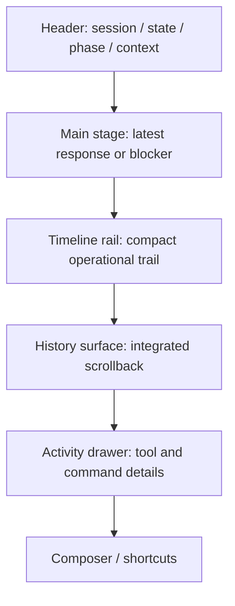
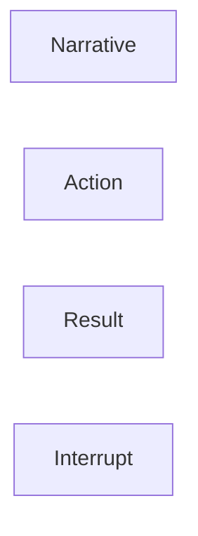

# TUI UX

Cette page conserve les principes encore valides de l'ancienne direction UX TUI, sans garder le bruit de planification ou les doublons.

## But

La TUI doit permettre de comprendre rapidement:

1. ce que Yagr fait maintenant
2. si le run est sain, bloque, ou attend quelque chose
3. ce que l'utilisateur doit faire, le cas echeant

## Principes durables

- frame-first, pas feed-first
- separation claire entre narration, action, resultat, interruption
- required actions impossibles a manquer
- scrollback integre disponible sans mode debug
- thinking secondaire par defaut
- sorties de commande curatees sur la surface live, inspectables dans l'historique
- identite de session visible
- pression contexte visible mais calme

## Structure cible encore valide

## Mapping fonctionnel actuel

Le repo n'implemente pas encore tout ce schema visuel, mais plusieurs briques existent deja:

- [interactive-ui.tsx](/home/etienne/repos/yagr/src/gateway/interactive-ui.tsx)
- [format-message.ts](/home/etienne/repos/yagr/src/gateway/format-message.ts)
- [request-required-action.ts](/home/etienne/repos/yagr/src/tools/request-required-action.ts)
- [run-engine.ts](/home/etienne/repos/yagr/src/runtime/run-engine.ts)

Etat reel aujourd'hui:

- les etats runtime sont explicites
- les required actions sont structurees
- thinking et execution sont deja pilotables
- la reponse finale et les evenements tools sont differencies

Ce qui reste une direction UX, pas un engagement architectural:

- raffiner la composition visuelle
- mieux separer les lanes
- rendre l'historique plus premium

## Lanes de messages a conserver comme modele

Interpretation durable:

- `Narrative`: ce que Yagr comprend et annonce
- `Action`: tools, commandes, execution mecanique
- `Result`: validation, push, verification, reponse finalisee
- `Interrupt`: permission, input, bloqueur externe

## Regles de transmission

- ne pas noyer l'utilisateur dans chaque evenement interne
- afficher les actions de maniere operationnelle et non brute
- ne pas melanger la reponse finale avec les traces techniques
- faire des required actions un moment central de l'interface

## Decision de maintenance

Les anciens plans TUI ne doivent plus etre conserves comme backlog narratif.

Si l'UX TUI evolue, cette page doit etre mise a jour pour:

- les principes qui restent vrais
- les structures d'ecran qui deviennent reelles
- les references de fichiers qui portent effectivement cette UX
