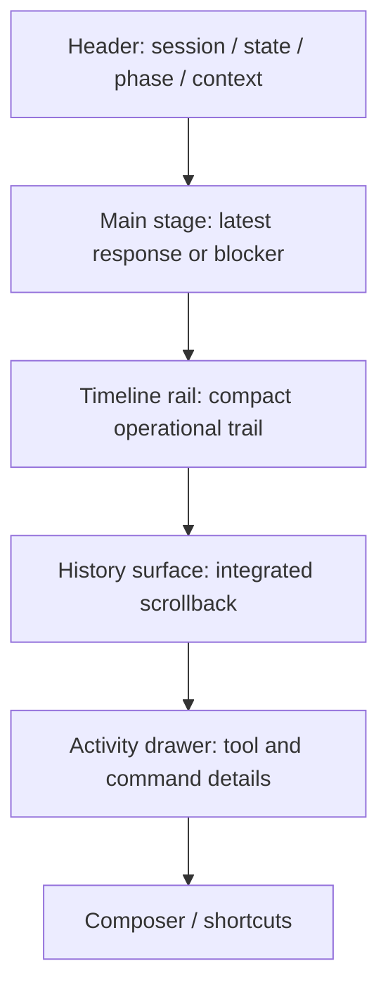
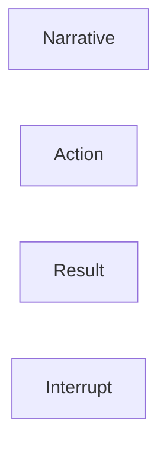

# TUI UX

This page preserves the still-valid principles of the old TUI UX direction, without keeping planning noise or duplicates.

## Purpose

The TUI must allow quickly understanding:

1. what Yagr is doing now
2. if the run is healthy, blocked, or waiting for something
3. what the user must do, if applicable

## Durable Principles

- frame-first, not feed-first
- clear separation between narration, action, result, interruption
- required actions impossible to miss
- integrated scrollback available without debug mode
- thinking secondary by default
- curated command outputs on the live surface, inspectable in history
- visible session identity
- visible but calm context pressure

## Target Structure Still Valid

```mermaid
flowchart TD
    Header[Header: session / state / phase / context]
    Stage[Main stage: latest response or blocker]
    Timeline[Timeline rail: compact operational trail]
    History[History surface: integrated scrollback]
    Activity[Activity drawer: tool and command details]
    Footer[Composer / shortcuts]

    Header --> Stage
    Stage --> Timeline
    Timeline --> History
    History --> Activity
    Activity --> Footer
```

## Current Functional Mapping

The repo does not yet implement this entire visual schema, but several bricks already exist:

- [interactive-ui.tsx](/home/etienne/repos/yagr/src/gateway/interactive-ui.tsx)
- [format-message.ts](/home/etienne/repos/yagr/src/gateway/format-message.ts)
- [request-required-action.ts](/home/etienne/repos/yagr/src/tools/request-required-action.ts)
- [run-engine.ts](/home/etienne/repos/yagr/src/runtime/run-engine.ts)

Real state today:

- runtime states are explicit
- required actions are structured
- thinking and execution are already controllable
- the final response and tool events are differentiated

What remains a UX direction, not an architectural commitment:

- refining visual composition
- better separating lanes
- making history more premium

## Message Lanes to Preserve as Model

```mermaid
flowchart LR
    N[Narrative]
    A[Action]
    R[Result]
    I[Interrupt]
```

Durable interpretation:

- `Narrative`: what Yagr understands and announces
- `Action`: tools, commands, mechanical execution
- `Result`: validation, push, verification, finalized response
- `Interrupt`: permission, input, external blocker

## Transmission Rules

- do not drown the user in every internal event
- display actions in an operational rather than raw manner
- do not mix the final response with technical traces
- make required actions a central moment of the interface

## Maintenance Decision

Old TUI plans must no longer be kept as a narrative backlog.

If TUI UX evolves, this page must be updated to:

- principles that remain true
- screen structures that become real
- file references that actually carry this UX
