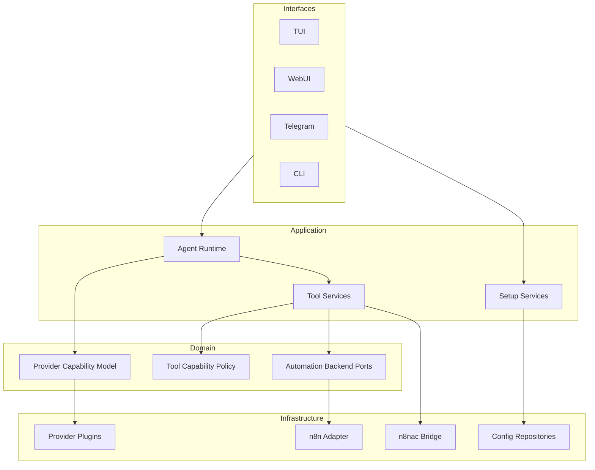

# Architecture Target

Cette page decrit la cible architecturale actuellement visee.

Elle est volontairement ephemere et doit se reduire au fil des refactors.

## Cible globale

## Principes cibles

### 1. Facades minces

Les facades ne doivent faire que:

- I/O
- session facade-side
- rendu des evenements
- appel de services applicatifs explicites

Elles ne doivent pas:

- porter la logique de setup
- porter la logique de persistance
- porter la logique provider

### 2. Providers comme plugins fins

La cible est une couche provider standard avec plugins minimaux.

Chaque provider doit fournir seulement:

- sa factory de modele
- ses metadonnees
- ses mecanismes d'auth/session
- ses specificites strictement necessaires

La logique commune doit vivre ailleurs:

- capacites de tooling
- fallback strategies
- normalisation du resultat
- structured output policy

### 3. Interface tooling/providers explicite

La cible est de formaliser une couche entre runtime et providers avec niveaux de capacites.

Exemples de niveaux:

- `native`
- `compatible`
- `weak`
- `none`

Cette couche choisit la strategie:

- tool calling natif
- schemas assouplis
- fallback texte structure
- degradation controlee

### 4. SSOT applicatif renforce

La cible est d'avoir un SSOT fort via:

- services d'application explicites pour le setup
- points uniques de lecture/ecriture config
- aucune duplication de logique entre wizard, WebUI et autres facades

### 5. Contrats backend plus fins

L'interface `Engine` actuelle doit converger vers des ports plus nets:

- knowledge/catalog
- workflow build/validation
- workflow repository/lifecycle

## Ecarts majeurs avec l'existant

- `Engine` est encore trop large.
- la couche LLM/providers melange plusieurs concerns.
- l'interface tooling/providers n'est pas encore explicite.
- `setup.ts` et `gateway/webui.ts` concentrent encore trop de logique applicative.

## Deepagents

Decision actuelle:

- s'inspirer de l'architecture et des patterns
- ne pas integrer directement comme dependance coeur

Patterns a reprendre:

- middleware stack
- backend protocol
- subagents bien isoles
- human-in-the-loop explicite
- separation forte tool layer / model layer
