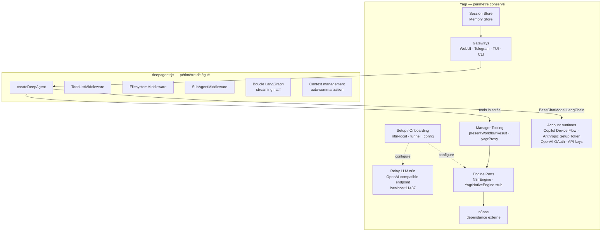

# Migration vers deepagentsjs — Spec de migration

> Document d'architecture cible pour le remplacement de la couche agentique Yagr
> par `deepagentsjs` (LangChain/LangGraph).
>
> Statut : document de référence consolidé

---

## 0. Contexte et motivation

Yagr a été refactorisé pour rendre son agent **agnostique** du backend
d'automation (Engine Port). Dans ce contexte, la couche runtime interne
(`src/runtime/`, `src/agent.ts`, `src/llm/`) représente une surface de
maintenance significative alors que des solutions tiers matures existent.

`deepagentsjs` (TypeScript, MIT, LangChain) implémente exactement le pattern
"agent harness" : boucle agentique complète, planification, sous-agents,
gestion de contexte — sans imposer d'UI ni de backend métier.

**Principe directeur de cette migration** : Yagr délègue la boucle
agentique à deepagentsjs et se concentre sur ce qui lui est propre —
façades, infrastructure n8n, proxy LLM, sessions, mémoire et tooling
métier.

---

## 1. Vue d'ensemble : ce qui change, ce qui reste



---

## 2. Ce qui est supprimé de Yagr

Ces modules sont **entièrement remplacés** par deepagentsjs et ses
middlewares. Ils ne disparaissent pas du codebase en une seule passe —
la migration se fait module par module — mais leur suppression est
l'objectif final.

### 2.1 `src/runtime/`

| Fichier actuel | Rôle | Remplacé par |
|---|---|---|
| `run-engine.ts` | Boucle principale, streaming, phases, recovery | Boucle LangGraph de `createDeepAgent` |
| `tool-runtime-strategy.ts` | Stratégie runtime selon capacité modèle | Supprimé (voir section 5.1 sur les modèles faibles) |
| `context-compaction.ts` | Résumé automatique quand le contexte déborde | `auto-summarization` natif deepagentsjs |
| `completion-gate.ts` | Enforcement de fin de run structurée | Logique LangGraph + prompt système |
| `policy-hooks.ts` | Hooks pré/post tool, politiques runtime | `middleware` deepagentsjs |
| `required-actions.ts` | Représentation structurée des blockers | Outil `requestRequiredAction` conservé, injecté comme tool custom |
| `outcome.ts` | Analyse de l'issue du run | Supprimé |
| `user-visible-updates.ts` | Mapping events → updates UI | **Conservé et adapté** pour mapper les events LangGraph (voir section 4) |

### 2.2 `src/agent.ts`

`YagrSessionAgent` est **remplacé** par `createDeepAgent`. Les
responsabilités qu'il portait sont redistribuées :

| Responsabilité actuelle | Destination |
|---|---|
| Historique `CoreMessage[]` | LangGraph checkpointer (par thread/session) |
| `run(prompt, options)` | `agent.stream({ messages })` LangGraph |
| `compactHistory()` | Auto-summarization deepagentsjs |
| `clearConversation()` | Reset du thread LangGraph |
| Invalidation de session sur changement d'instructions | Hook `onSessionInvalidated` dans l'adaptateur Gateway (voir section 4.3) |
| `buildSystemPromptSnapshot()` | `systemPrompt` passé à `createDeepAgent` — reconstruit au démarrage de chaque session |

### 2.3 `src/llm/`

La couche LLM Yagr est **restructurée**, pas supprimée en bloc. Voir
section 5.3 pour la distinction complète des trois couches LLM.

| Module | Sort |
|---|---|
| `create-language-model.ts` | **Adapté** — output devient `BaseChatModel` LangChain au lieu de Vercel AI SDK model |
| `provider-plugin.ts` | Conservé — alimente la factory LangChain et le relay n8n |
| `provider-registry.ts` | Conservé |
| `provider-discovery.ts` | Conservé |
| `provider-metadata.ts` | Conservé |
| `capability-resolver.ts` | **Supprimé** (deepagentsjs ne segmente pas par capacité) |
| `model-capabilities.ts` | **Supprimé** |
| `proxy-runtime.ts` | **Conservé** — sert uniquement les nœuds LLM n8n (voir section 5.3) |
| `llm-relay-server.ts` | **Conservé** — sert uniquement les nœuds LLM n8n |
| `anthropic-relay.ts` | **Conservé** — traduction OpenAI → Anthropic pour le relay n8n |
| `*-account.ts` | **Conservés intégralement** — auth OAuth, Device Flow, Setup Token (voir section 5.3) |

---

## 3. Ce qui reste entièrement dans Yagr

### 3.1 `src/setup/` et `src/setup.ts` — Inchangé

L'onboarding, le wizard de configuration, `application-services.ts`,
`status.ts` — rien ne change. Le setup configure le proxy LLM et les
Engine Ports exactement comme aujourd'hui.

### 3.2 `src/n8n-local/` — Inchangé

Bootstrap n8n local (Docker / direct), `managed-runtime.ts`,
`docker-manager.ts`, `direct-manager.ts`, `owner-credentials.ts`,
`browser-auth.ts`, `state.ts`, `n8n-tunnel.ts` (Cloudflare Tunnel) —
aucun impact. Ce bloc est totalement découplé de la boucle agentique.

### 3.3 `src/config/` — Inchangé

`YagrConfigService`, `YagrN8nConfigService`, `yagr-home.ts`,
`load-n8n-engine-config.ts`, `local-state.ts` — aucun impact.

### 3.4 `src/engine/` — Inchangé

Les Engine Ports (`EngineRuntimePort`, `NodeCatalogPort`,
`WorkflowLifecyclePort`, etc.), `N8nEngine`, et le stub
`YagrNativeEngine` restent identiques. La migration deepagentsjs
n'accélère ni ne ralentit la livraison de `YagrNativeEngine` — les deux
sont indépendants.

### 3.5 `src/manager-tooling/` — Inchangé, réinjecté

`presentWorkflowResult`, `yagrProxy`, `YAGENTS.md` restent dans Yagr.
Ils sont passés à `createDeepAgent` comme tools custom :

```typescript
const agent = createDeepAgent({
  model: new ChatOpenAI({ baseURL: yagrProxyBaseUrl }),
  tools: [
    presentWorkflowResultTool,
    yagrProxyTool,
    requestRequiredActionTool,
    // ... outils FS/shell non couverts nativement par deepagentsjs
  ],
  systemPrompt: buildSystemPrompt(engine),
});
```

Les tools génériques déjà couverts par deepagentsjs (`readFile`,
`writeFile`, `grep`, `listDir`, `glob`) peuvent être **supprimés de
`src/tools/`** puisqu'ils sont fournis nativement par
`FilesystemMiddleware`. Ceux propres à Yagr (`httpRequest`, `runScript`,
`runShell`, `requestRequiredAction`) restent injectés.

### 3.6 `src/prompt/build-system-prompt.ts` — Conservé, adapté

La construction du system prompt reste dans Yagr :

- inject contexte engine (`engine.name`)
- inject `n8nHost`, tunnel URL, `workflowDir`
- inject `MANAGER_INSTRUCTIONS`, `YAGENTS.md`, home instructions, workspace instructions
- inject mémoire des sessions récentes

Ce prompt est passé à `createDeepAgent({ systemPrompt })`. Il est
reconstruit à chaque nouvelle session (même comportement qu'aujourd'hui).

L'invalidation de session sur changement d'instructions workspace (logique
actuelle dans `YagrSessionAgent.run`) devient un hook dans l'adaptateur
Gateway (voir section 4.3).

### 3.7 `src/session/` — Conservé intégralement

`SessionStore` et `session-types.ts` restent. Les sessions Yagr sont des
entités persistées sur disque (`YAGR_HOME/sessions/`), indépendantes du
mécanisme de thread LangGraph. La continuité de conversation est assurée
par le rechargement de l'historique sérialisé dans le thread LangGraph
au démarrage d'une session existante.

**Articulation session Yagr ↔ thread LangGraph :**

```
SessionStore (Yagr)            LangGraph Checkpointer
─────────────────────          ──────────────────────
PersistedSession.id  ───────►  thread_id
SerializedChatMessages  ────►  messages reloaded on resume
```

### 3.8 `src/memory/` — Conservé intégralement

`MemoryStore` et `memory-types.ts` restent. La mémoire cross-session
(résumés de sessions passées) continue d'être injectée dans le system
prompt via `loadRecentMemory()` dans `build-system-prompt.ts`.

À terme, deepagentsjs supporte la `long-term memory` via LangGraph Store.
C'est une évolution optionnelle, pas un prérequis de migration.

---

## 4. Adaptation des Gateways

C'est **le principal travail de migration côté Yagr**. Chaque gateway
consomme aujourd'hui des events Yagr typés (`YagrPhaseEvent`,
`YagrStateEvent`, `YagrToolEvent`). Ces events viennent de `run-engine.ts`.
Après migration, ils viennent du streaming LangGraph.

### 4.1 Mapping events LangGraph → YagrUserVisibleUpdate

`user-visible-updates.ts` est **conservé comme interface stable** côté
gateways. Un adaptateur traduit les events LangGraph en cette interface :

| Event LangGraph | Event Yagr équivalent |
|---|---|
| `on_chain_start` (node `agent`) | `YagrPhaseEvent { phase: 'inspect', status: 'started' }` |
| `on_tool_start` | `YagrToolEvent { status: 'started', toolName }` |
| `on_tool_end` | `YagrToolEvent { status: 'completed', toolName }` |
| `on_chat_model_stream` | streaming texte assistant |
| `write_todos` tool call | nouveau event `YagrPhaseEvent { phase: 'plan' }` |
| interrupt (HITL) | `YagrStateEvent { state: 'waiting_for_permission' }` |

Cet adaptateur vit dans un nouveau fichier `src/gateway/langgraph-events.ts`.

### 4.2 WebUI Gateway (`src/gateway/webui.ts`)

Changements ciblés :

- **Session bootstrap** : à la réception d'un message, si `sessionId` est
  connu → charger `PersistedSession` → recharger l'historique dans le
  thread LangGraph via `checkpointer`.
- **Streaming SSE** : remplacer la consommation des events `YagrRunEngine`
  par `agent.streamEvents(...)` LangGraph, passé dans l'adaptateur ci-dessus.
- **Session persistence** : à la fin de chaque run, sérialiser les nouveaux
  messages dans `SessionStore` (idem aujourd'hui).
- **Extraction de mémoire** : `extractSessionMemory` reste appelé
  post-run, identique.
- **`YagrSessionAgent`** supprimé des imports.

API HTTP inchangée côté client React. Les types `WebUiChatStreamEvent`
restent stables — seul le producteur change.

### 4.3 Telegram Gateway (`src/gateway/telegram.ts`)

Changements ciblés :

- **Session par chat** : le `chatId` Telegram est le `thread_id` LangGraph.
  La continuité de conversation est automatique si le checkpointer est
  persistant (ou en mémoire par process).
- **Streaming** : Telegram ne supporte pas le streaming natif. Le gateway
  collecte la réponse finale via `agent.invoke(...)` comme aujourd'hui,
  ou utilise `streamEvents` pour les progress updates intermédiaires.
- **Required actions** : le tool `requestRequiredAction` injecté dans
  deepagentsjs émet un event capté par le gateway pour envoyer un message
  bloquant à l'utilisateur Telegram.
- **Invalidation de session** : si le system prompt change entre deux runs
  (détecté par fingerprint sur `workspaceInstructions`), réinitialiser
  le thread LangGraph pour ce `chatId`.

### 4.4 TUI Gateway (`src/gateway/interactive-ui.tsx`)

Changements ciblés :

- Remplacer la consommation de `YagrRunEngine.execute(...)` par
  `agent.streamEvents(...)` avec l'adaptateur LangGraph → `YagrUserVisibleUpdate`.
- Les lanes de la TUI (Narrative / Action / Result / Interrupt) restent
  le modèle UX — elles sont alimentées par les events mappés, pas par
  les phases internes.
- Le todo-list visible (`write_todos`) peut être rendu comme une nouvelle
  lane "Plan" dans la TUI si souhaité.

### 4.5 CLI Gateway (`src/gateway/cli.ts`)

Usage non-interactif. `agent.invoke(...)` suffit. Aucun streaming nécessaire.
Changement minimal.

---

## 5. Points de vigilance

### 5.1 Modèles faibles (sans tool calling natif) — code vestigial

Le mode `capability: 'none'` dans `tool-runtime-strategy.ts` est du code
**vestigial**. Il n'a jamais été un path fonctionnel de bout en bout :

- Les directives JSON (`{"tool":"writeFile",...}`) demandent au modèle
  d'émettre des objets structurés à la place d'appels d'outils.
- Mais `run-engine.ts` ne parse et n'exécute jamais ces JSON — il se
  contente de limiter les steps à 1.
- Le seul test couvrant ce mode utilise `text-embedding-3-small`
  (un modèle d'embedding, pas un modèle de chat).

**Conclusion** : ce path n'est pas à préserver dans la migration. Il est
supprimé avec `tool-runtime-strategy.ts` sans dette fonctionnelle.

### 5.2 `requestRequiredAction` — outil Yagr spécifique

Ce tool est central dans la doctrine Yagr (blockers structurés,
distinction `blocking` vs `follow-up`). deepagentsjs supporte `interruptOn`
(HITL natif LangGraph) mais la sémantique est différente (approbation
d'outil vs blocage ouvert).

**Recommandation** : conserver `requestRequiredAction` comme tool Yagr
injecté dans deepagentsjs. Ne pas le mapper sur `interruptOn`. C'est une
convention produit, pas un mécanisme d'orchestration.

### 5.3 Trois couches LLM — ne pas confondre

La couche LLM de Yagr couvre trois périmètres distincts qui n'ont pas le
même sort dans la migration.

#### Couche A — Façades agent autonome

WebUI / Telegram / TUI / CLI. Aucun LLM ici — c'est la couche I/O.
Totalement indépendante du choix deepagentsjs. Aucun impact.

#### Couche B — Relay LLM pour les nœuds n8n

**Fichiers** : `llm-relay-server.ts`, `proxy-runtime.ts`, `anthropic-relay.ts`

Expose un endpoint OpenAI-compatible local (`localhost:11437`) que les nœuds
`lmChatOpenAi` dans n8n pointent. Avantage produit fort : l'utilisateur
configure son LLM une fois dans Yagr et n8n l'utilise automatiquement.

**Sort** : **Conservé identique**. Orthogonal à deepagentsjs. LiteLLM /
AgentGateway sont hors scope — solutions Python infrastructure, sur-ingénierie
pour un CLI local.

#### Couche C — Providers LLM pour l'agent deepagentsjs

C'est la couche restructurée par la migration.

**Ce que LangChain couvre nativement** : API key standard pour tous les
providers majeurs (`@langchain/anthropic`, `@langchain/openai`,
`@langchain/google-genai`). Suffisant pour le cas standard.

**Ce que LangChain ne couvre pas** — les flux auth officiels permettant
aux utilisateurs de consommer leurs abonnements sans clé API de facturation :

| Flux | Provider | Fichier actuel |
|---|---|---|
| GitHub Device Flow | GitHub Copilot | `copilot-account.ts` |
| OAuth Authorization Code | OpenAI Codex | `openai-account.ts` |
| Claude Setup Token | Claude Pro / Max plans | `anthropic-account.ts` |

Ces trois flux restent dans Yagr intégralement. LiteLLM n'aide pas —
c'est un proxy de routage, pas un gestionnaire d'auth OAuth.

**Changement ciblé** : uniquement la factory dans `create-language-model.ts`
— elle passe de l'instanciation d'un modèle Vercel AI SDK à un
`BaseChatModel` LangChain, avec les mêmes credentials résolues par les
`*-account.ts`.

```typescript
// Avant
return anthropic(resolvedModel);  // Vercel AI SDK

// Après
return new ChatAnthropic({ apiKey, model: resolvedModel });  // LangChain
```

Toute la logique d'auth, de token refresh et de discovery reste intacte
dans `*-account.ts`. Seul le format de sortie de la factory change.

### 5.4 `YagrNativeEngine` — indépendance confirmée

La migration vers deepagentsjs est **orthogonale** à la livraison de
`YagrNativeEngine`. Les deux peuvent avancer en parallèle. La migration
deepagentsjs ne débloque pas V2 mais ne le bloque pas non plus.

---

## 6. `src/index.ts` après migration

Les exports publics impactés :

**Supprimés** :
- `YagrSessionAgent`
- `YagrRunEngine`
- `resolveToolRuntimeStrategy`
- `createLanguageModel`, `resolveLanguageModelConfig`, `resolveModelName`
- `filterFunctionToolsForCapability`, `getProviderOptionsForCapability`, etc.
- `buildTools` (remplacé par injection directe dans `createDeepAgent`)
- Types : `YagrToolRuntimeStrategy`, `YagrExecutionMode`, `YagrModelCapabilityProfile`, `YagrToolCallingCapability`, `YagrToolHookContext`, `YagrToolHookDecision`, `YagrCompletionAttempt`, `YagrCompletionHookDecision`, `YagrRuntimeHook`, `YagrRunPhase`, `YagrRunStep`, `YagrPhaseEvent`

**Conservés** :
- Tout ce qui concerne `Engine`, gateways, setup, config, sessions, mémoire
- `buildSystemPrompt`
- Tools unitaires exportés (pour usage externe éventuel)
- `YagrRunResult`, `YagrRequiredAction`, `YagrRunOptions`, `YagrAgentState`

---

## 7. Ordre de migration recommandé

```
Étape 1 — Proxy LLM ready
  Vérifier que llm-relay-server expose un endpoint compatible OpenAI
  Tester ChatOpenAI({ baseURL: proxyUrl }) → appel réel passant par proxy

Étape 2 — Premier createDeepAgent smoke test
  Créer un script de test isolé : createDeepAgent + quelques tools custom
  Valider streaming LangGraph → console

Étape 3 — Adaptateur events LangGraph → YagrUserVisibleUpdate
  Créer src/gateway/langgraph-events.ts
  Couvrir par tests unitaires (mock eventStream → updates attendus)

Étape 4 — Migration WebUI Gateway
  Remplacer YagrSessionAgent par agent.streamEvents dans webui.ts
  Valider session persistence + streaming SSE inchangé côté client

Étape 5 — Migration Telegram Gateway
  Remplacer YagrSessionAgent par agent.invoke dans telegram.ts
  Valider required actions + continuité de conversation par chatId

Étape 6 — Migration TUI / CLI
  Plus simples, pas de session persistence complexe

Étape 7 — Suppression src/runtime/ et src/agent.ts
  Après validation end-to-end sur toutes les gateways

Étape 8 — Nettoyage src/llm/
  Supprimer capability-resolver, model-capabilities, create-language-model
  Ne conserver que proxy-runtime, *-account, provider-registry (pour proxy)
```

---

## 8. Architecture finale — schéma complet

```mermaid
flowchart TD
    subgraph Interfaces
        TUI[TUI / Ink\ninteractive-ui.tsx]
        WEB[WebUI / React\nwebui.ts]
        TG[Telegram\ntelegram.ts]
        CLI[CLI\ncli.ts]
    end

    subgraph Gateway["src/gateway/"]
        LGE[langgraph-events.ts\nadaptateur events]
        FMT[format-message.ts]
        HV[history-viewport.ts]
        MW[n8n-workflow-middleware.ts]
        MGR[manager.ts\nGatewaySupervisor]
    end

    subgraph Sessions["src/session/ + src/memory/"]
        SS[SessionStore\ndisque YAGR_HOME/sessions/]
        MS[MemoryStore\ndisque YAGR_HOME/memories/]
    end

    subgraph DeepAgent["deepagentsjs"]
        DA[createDeepAgent]
        TODO[TodoListMiddleware\nwrite_todos]
        FS_MW[FilesystemMiddleware\nread_file write_file grep...]
        SUB[SubAgentMiddleware\ntask]
        CKPT[LangGraph Checkpointer\nthread par session]
    end

    subgraph YagrTools["src/manager-tooling/ + src/tools/"]
        MT[presentWorkflowResult\nyagrProxy\nrequestRequiredAction]
        GT[httpRequest · runScript · runShell]
    end

    subgraph Prompt["src/prompt/"]
        BSP[build-system-prompt.ts\nengine · tunnel · n8nHost\nworkflowDir · memory · YAGENTS.md]
    end

    subgraph Engine["src/engine/"]
        EP[EngineRuntimePort]
        N8N[N8nEngine]
        YENG[YagrNativeEngine stub V2]
    end

    subgraph Infra["src/n8n-local/ + src/setup/"]
        N8NLOCAL[n8n-local\nbootstrap · tunnel · docker · direct]
        SETUP[setup/\nonboarding · application-services · status]
    end

    subgraph Proxy["src/llm/ résiduel"]
        PX[proxy-runtime.ts\nllm-relay-server.ts]
        ACC[account runtimes\nCopilot · Anthropic · OpenAI · local]
    end

    subgraph Config["src/config/"]
        CFG[YagrConfigService\nYagrN8nConfigService\nyagr-home · local-state]
    end

    subgraph N8NAC["dépendances externes"]
        NAC[n8nac\n@n8n-as-code/skills\n@n8n-as-code/transformer]
    end

    Interfaces --> Gateway
    Gateway --> LGE
    LGE --> DA
    DA --> TODO
    DA --> FS_MW
    DA --> SUB
    DA --> CKPT
    DA -->|tools injectés| YagrTools
    DA -->|systemPrompt| BSP
    BSP --> MS
    BSP --> CFG
    YagrTools --> Engine
    Engine --> NAC
    N8N --> Engine
    YENG --> Engine
    DA -->|ChatOpenAI baseURL| PX
    PX --> ACC
    Gateway --> Sessions
    Sessions --> SS
    Infra --> CFG
    SETUP --> PX
    SETUP --> Engine
    SETUP --> N8NLOCAL
```

---

## 9. Risques et mitigations

| Risque | Impact | Mitigation |
|---|---|---|
| Deep Agents ne supporte pas le streaming | Haut | Tester en amont (Étape 2 smoke test), fallback sur Vercel AI temporairement |
| Incompatibilité des outils Yagr avec LangChain | Moyen | Envelopper progressivement, tester un par un (Étape 3) |
| Perte de qualité de réponse après migration | Haut | Comparer les résultats avant/apres sur des scénarios identiques |
| Complexité du checkpointing LangGraph | Moyen | Commencer par un checkpointer en mémoire, passer au persistant ensuite |
| Couplage fort avec LangChain | Moyen | Isoler l'intégration dans `langgraph-events.ts`, garder une interface stable |
| Modèles faibles sans tool calling (5.1) | Aucun | Code vestigial jamais fonctionnel — supprimé sans dette |
| `requestRequiredAction` vs `interruptOn` (5.2) | Moyen | Conserver comme tool custom injecté, ne pas mapper sur HITL natif |

---

## 10. Glossaire

| Terme | Définition |
|---|---|
| **Deep Agents** | Framework agentique de LangChain (`deepagentsjs` en TypeScript, MIT) |
| **createDeepAgent** | Fonction principale de deepagentsjs pour créer un agent avec tools, system prompt et middlewares |
| **Checkpointer** | Mécanisme LangGraph de sauvegarde de l'état du graphe (thread par session) |
| **thread_id** | Identifiant de conversation LangGraph, mappé sur `PersistedSession.id` |
| **TodoListMiddleware** | Middleware deepagentsjs implémentant `write_todos` (planification dynamique) |
| **FilesystemMiddleware** | Middleware deepagentsjs fournissant nativement readFile, writeFile, grep, listDir, glob |
| **SubAgentMiddleware** | Middleware deepagentsjs permettant la délégation à des sous-agents (`task` tool) |
| **HITL** | Human-In-The-Loop — mécanisme d'interruption pour approbation utilisateur (`interruptOn`) |
| **Bridge** | Composant de synchronisation entre les événements LangGraph et les gateways Yagr |
| **YagrUserVisibleUpdate** | Interface stable côté gateways pour les updates UI (conservée après migration) |
| **n8nac** | CLI externe pour la manipulation de workflows n8n (`@n8n-as-code/skills`, `@n8n-as-code/transformer`) |
| **Proxy LLM** | Serveur HTTP OpenAI-compatible local (`llm-relay-server.ts`) qui proxifie vers le provider actif |
| **Engine Ports** | Interfaces TypeScript définissant les contrats entre Yagr et les backends n8n |
| **Session Store** | Persistance file-based des sessions Yagr (`YAGR_HOME/sessions/`) |
| **Memory Store** | Persistance file-based de la mémoire cross-session (`YAGR_HOME/memories/`) |
