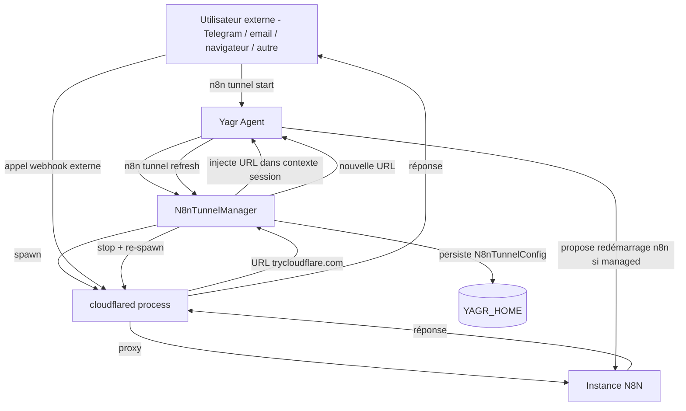

# Spec — Exposition des instances N8N via Tunnel Cloudflare

## Objectif

Permettre d'exposer toute instance N8N **locale** — qu'elle soit gérée par Yagr ou non, avec ou sans Docker — via un tunnel Cloudflare, de façon à ce que les triggers — notamment les webhooks — soient accessibles depuis l'extérieur (ex. façade Telegram, autres machines).

**Le tunnel ne s'applique qu'aux instances atteignables depuis la machine hôte Yagr.** Une instance N8N cloud ou hébergée à distance est déjà accessible publiquement par définition : tunneler depuis Yagr n'aurait aucun sens.

Le système doit être résilient : les URL de tunnel ne sont pas stables, il faut pouvoir les rafraîchir sans reconfigurer tout le système.

---

## Distinction Managed vs Non-Managed

**Managed** : Yagr a installé et démarre l'instance N8N lui-même. Il en contrôle les credentials, la clé d'API, les variables d'environnement et le cycle de vie (start/stop). L'instance est toujours locale.

**Non-Managed** : l'utilisateur saisit une URL et une clé d'API. Yagr n'a aucun contrôle sur le cycle de vie de l'instance. Cette URL peut pointer vers :
- une instance **locale** (ex. `http://localhost:5678`) — le tunnel s'applique
- une instance **cloud ou distante** (ex. `https://mon-n8n.example.com`) — le tunnel **ne s'applique pas**, l'instance est déjà publique

## Périmètre des configurations couvertes

| Configuration | Tunnel applicable ? | Description |
|---|---|---|
| Yagr-Managed, sans Docker | ✅ | n8n lancé en `direct` par Yagr, process local |
| Yagr-Managed, avec Docker | ✅ | n8n lancé dans un conteneur Docker géré par Yagr |
| Non Yagr-Managed, instance locale | ✅ | n8n déjà en cours sur la machine, URL `localhost` ou IP privée |
| Non Yagr-Managed, instance cloud | ❌ | URL publique déjà accessible, tunneler depuis Yagr n'a pas de sens |

---

## Problème structurel actuel

Le tunnel Cloudflare est aujourd'hui utilisé uniquement pour le LLM Proxy (exposition de `localhost:11437` vers n8n). Il est spawné dans `application-services.ts#startCloudflareTunnel()` et stocké dans `YagrLlmProxyConfig.tunnelUrl`.

Ce tunnel couvre un seul sens : **Yagr → n8n** (n8n appelle le proxy Yagr via tunnel). Il ne couvre pas le sens **externe → n8n** (ex. Telegram ou autre machine appelle un webhook n8n).

Il faut un second tunnel orthogonal : **exposition de n8n vers l'extérieur**.

---

## Architecture cible

### Deux tunnels distincts

```text
[Tunnel A - existant] LLM Proxy
  cloudflared tunnel → localhost:11437 (relay Yagr)
  Utilisé par : n8n pour joindre le LLM Proxy Yagr

[Tunnel B - nouveau] N8N Webhook Exposure
  cloudflared tunnel → <n8n-host>:<n8n-port>
  Utilisé par : Telegram, machines externes, pour déclencher des webhooks n8n
```

Ces deux tunnels sont gérés indépendamment.

### Résolution de l'adresse n8n à tunneler

| Cas | Adresse n8n à tunneler | Remarque |
|---|---|---|
| Managed direct | `localhost:<n8n-port>` (ex. `localhost:5678`) | Port connu de Yagr |
| Managed Docker | `localhost:<port-mappé-docker>` depuis l'hôte | Port exposé par Docker |
| Non-Managed local | URL fournie par l'utilisateur (ex. `http://localhost:5678`) | Yagr vérifie que l'URL est locale avant d'accepter |
| Non-Managed cloud | — (refus explicite) | Instance déjà publique, tunnel sans objet |

Dans les cas applicables, la cible du tunnel est toujours **l'adresse joignable depuis l'hôte Yagr**.

Pour les instances Non-Managed, Yagr détecte si l'URL est locale (host = `localhost`, `127.x`, `192.168.x`, `10.x`, `[::1]`, etc.) et refuse silencieusement de proposer le tunnel si elle est distante/publique, en l'indiquant clairement à l'utilisateur.

---

## Composants à créer / modifier

### 1. `n8n-local/n8n-tunnel.ts` (nouveau)

Responsabilité unique : gérer le cycle de vie du tunnel d8n webhook.

```typescript
export interface N8nTunnelState {
  publicUrl: string;       // URL publique trycloudflare.com
  targetUrl: string;       // URL locale n8n tunnelée
  startedAt: Date;
  pid?: number;            // PID du process cloudflared
}

export interface N8nTunnelManager {
  start(targetUrl: string): Promise<N8nTunnelState>;
  stop(): Promise<void>;
  refresh(targetUrl: string): Promise<N8nTunnelState>; // stop + start
  getCurrent(): N8nTunnelState | null;
}
```

- Spawne `cloudflared tunnel --url <targetUrl>` avec les mêmes gardes que le tunnel LLM Proxy actuel.
- Stocke l'état dans `YAGR_HOME/n8n-tunnel.json` pour persistance inter-sessions.
- Émet des événements observables (start, stop, url-changed).

### 2. `config/yagr-config-service.ts` (modification)

Ajouter un champ `n8nTunnel` dans la config persistée :

```typescript
export interface N8nTunnelConfig {
  enabled: boolean;
  publicUrl?: string;      // Dernière URL connue, peut être périmée
  targetUrl: string;       // URL locale de n8n (recalculée si instancee managed)
}
```

### 3. `setup/application-services.ts` (modification)

Ajouter une méthode `setupN8nTunnel(n8nBaseUrl: string): Promise<N8nTunnelConfig>` qui :
- Détermine `targetUrl` selon la configuration d'instance (managed/externe, Docker/direct).
- Délègue le spawn à `N8nTunnelManager`.
- Persiste la config.

### 4. `tools/n8nac.ts` ou nouveau `tools/n8n-tunnel-tool.ts` (modification / nouveau)

Exposer des commandes LLM-invocables :

| Commande | Description |
|---|---|
| `n8n tunnel start` | Démarre le tunnel si pas actif |
| `n8n tunnel stop` | Arrête le tunnel |
| `n8n tunnel refresh` | Renouvelle l'URL (stop + start) |
| `n8n tunnel status` | Retourne l'URL publique actuelle et l'état |
| `n8n tunnel url` | Retourne uniquement l'URL publique (pour les workflows et le prompt) |

Ces commandes sont également disponibles en CLI (`yagr n8n tunnel ...`).

### 5. `gateway/workflow-links.ts` (modification)

`resolveWorkflowOpenLink` doit être capable de substituer l'URL de base n8n par l'URL tunnel publique quand le tunnel est actif, pour que les liens présentés à l'utilisateur (Telegram, TUI, WebUI) pointent vers la bonne adresse.

### 6. Prompt système (modification)

Injecter l'URL publique du tunnel n8n dans le prompt contextuel quand le tunnel est actif, pour que le LLM puisse l'utiliser dans ses réponses (ex. "le webhook est accessible à `https://xxx.trycloudflare.com/webhook/...`").

---

## Comportement de rafraîchissement des URL

Les URL `trycloudflare.com` changent à chaque restart du tunnel. Ce n'est pas stable. Le système doit :

1. **Détecter la péremption** : si le process `cloudflared` est mort, l'URL est périmée.
2. **Permettre le refresh manuel** via commande (`n8n tunnel refresh`).
3. **Optionnellement, refresh automatique** avec stratégie de backoff si le tunnel meurt inopinément.
4. **Propager le changement d'URL** aux surfaces concernées :
   - Prompt système (re-inject l'URL dans le contexte de la session)
   - Réponses aux commandes `tunnel url` / `tunnel status`
5. **Ne pas mettre à jour silencieusement** la config n8n elle-même pour `WEBHOOK_URL` : cela nécessite un redémarrage n8n avec la nouvelle variable. C'est un workflow explicite, pas automatique.

### Variable `N8N_WEBHOOK_URL` et redémarrage n8n

n8n a besoin de connaître son URL publique pour construire les URLs de webhooks. Cette variable doit être positionnée au démarrage.

Pour les instances **Yagr-Managed** :
- Au `start`, si le tunnel est actif, passer `N8N_WEBHOOK_URL=<publicUrl>` à n8n (via env Docker ou process).
- Au `refresh`, proposer un redémarrage n8n pour prendre en compte la nouvelle URL.

Pour les instances **Non-Managed locales** :
- Yagr ne contrôle pas le process n8n, il ne peut pas lui passer de variable d'environnement.
- L'utilisateur est responsable de configurer `N8N_WEBHOOK_URL` manuellement dans son instance.
- Yagr informe l'URL via `tunnel status` / `tunnel url` et affiche un message explicite invitant l'utilisateur à mettre à jour sa configuration n8n.

Les instances **Non-Managed cloud** ne sont pas concernées par cette section.

---

## Portée de l'exposition publique

Le tunnel n'est pas limité à la façade Telegram. Il exposé le port n8n de façon générale : toute machine atteignant l'URL publique peut interagir avec n8n.

Usages principaux :
- **Façade Telegram** : consommateur principal, seule surface Yagr externe à la machine. L'URL publique est utilisée pour déclencher des webhooks depuis des messages Telegram.
- **Accès utilisateur hors Yagr** : l'utilisateur peut partager ou intégrer l'URL publique dans n'importe quel contexte externe (emails, scripts, autres services web, Zapier, etc.) sans passer par une session Yagr.
- **UI n8n depuis une autre machine** : le tunnel expose également l'interface n8n elle-même (port 5678 par défaut), accessible en navigateur depuis n'importe où.

Conséquence : **l'URL publique est une surface d'exposition non authentifiée par défaut pour les webhooks.** Les webhooks n8n peuvent être publics ou sécurisés selon leur configuration propre dans n8n. Yagr n'ajoute pas de couche d'authentification supplémentaire sur le tunnel.

## Compatibilité avec les surfaces existantes

### Telegram Gateway

Consommateur principal du tunnel. Quand le tunnel est actif, l'URL publique remplace l'URL locale dans les références de workflow présentées à l'utilisateur Telegram, de façon à ce que les liens soient cliquables et les webhooks déclenchables depuis l'extérieur.

### LLM Proxy Yagr

Le tunnel LLM Proxy (Tunnel A) reste inchangé. Les deux tunnels coexistent. Aucun couplage.

### Présentation des liens de workflow (`present-workflow-result.ts`)

Quand le tunnel n8n est actif, `resolveWorkflowOpenLink` substitue le host de l'URL n8n par l'URL tunnel publique, pour que le lien présenté soit cliquable depuis l'extérieur.

### Setup Wizard

Ajouter une étape optionnelle "Exposer N8N via tunnel" dans l'assistant de configuration, pour les cas où l'utilisateur veut un accès externe.

---

## Gestion des credentials pour les instances Yagr-Managed

Pour les instances Yagr-Managed, Yagr opère un système de credentials transparent : l'utilisateur ne saisit jamais de login, mot de passe ou clé d'API. Au bootstrap, Yagr :
1. Crée le compte owner (email + password générés, stockés dans `YAGR_HOME/n8n-local-owner-credentials.json`)
2. Obtient un cookie de session via `browser-auth.ts`
3. Crée une clé d'API programmatiquement et la stocke dans le config service, indexée par l'URL locale

Ce mécanisme fonctionne identiquement avec Docker et sans Docker.

### Interaction avec le tunnel

Le tunnel n'affecte pas la façon dont **Yagr s'authentifie auprès de n8n**. Yagr continue d'appeler n8n via l'URL locale (`localhost:<port>`). Le tunnel est un canal entrant (externe → n8n), pas un canal sortant (Yagr → n8n).

En revanche, deux points d'attention :

**1. L'URL de référence des credentials est l'URL locale, pas l'URL tunnel.**

`ManagedN8nOwnerCredentialService` indexe les credentials par `origin` de l'URL. L'URL locale (`http://localhost:5678`) reste la clé. Cela ne doit pas changer. Le module de tunnel n'introduit pas de nouvelle entrée credentials.

**2. `N8N_WEBHOOK_URL` détermine les URL exposées par n8n dans ses webhooks.**

Quand n8n génère une URL de webhook (ex. dans l'UI ou dans les sorties d'exécution), il utilise `N8N_WEBHOOK_URL` comme base. Pour qu'un utilisateur externe puisse déclencher ce webhook, cette variable doit pointer vers l'URL tunnel publique.

Pour les instances Managed :
- Au `start` du tunnel, Yagr a connaissance de l'URL publique et peut la passer à n8n via `N8N_WEBHOOK_URL` **au prochain démarrage** de n8n.
- Si n8n est déjà en cours, Yagr propose un redémarrage explicite pour prendre en compte la nouvelle variable.
- Après un `refresh` tunnel (nouvelle URL publique), même comportement : redémarrage proposé, jamais silencieux.
- Le cookie de session et la clé d'API restent valides après redémarrage n8n — aucune ré-authentification nécessaire. Le système transparent est préservé.

Pour les instances Non-Managed locales :
- Yagr ne contrôle pas le démarrage de n8n, il informe uniquement l'URL via `tunnel status` / `tunnel url`.
- L'utilisateur est responsable de mettre à jour `N8N_WEBHOOK_URL` dans sa propre configuration n8n.

---

## Règles de conception

- Le tunnel n8n est un module distinct du tunnel LLM Proxy. Pas de couplage.
- L'état du tunnel est persisté dans `YAGR_HOME`, pas en mémoire uniquement.
- Les URL tunnels ne sont jamais considérées comme stables. Toute logique qui en dépend doit être capable de les recharger.
- La modification de `N8N_WEBHOOK_URL` sur une instance managed est explicite (commande `refresh` + redémarrage proposé), jamais silencieuse.
- Les instances non-managed ne sont pas modifiées par Yagr. Yagr expose, informe, mais ne reconfigure pas.
- Le module `n8n-tunnel.ts` est testable en isolation avec un mock de `cloudflared`.

---

## Stratégie de test

| Niveau | Contenu |
|---|---|
| Unit | `N8nTunnelManager` avec mock cloudflared (spawn simulé, URL émise) |
| Unit | Résolution de `targetUrl` selon les 4 configurations d'instance |
| Unit | `resolveWorkflowOpenLink` avec substitution tunnel active / inactive |
| Integration | Tunnel réel spawné sur Linux CI, URL obtenue, webhook atteignable |
| Manual | Validation Telegram → webhook n8n via tunnel |
| Manual | Validation accès UI n8n via URL tunnel depuis navigateur distant |

---

## Diagramme de flux


