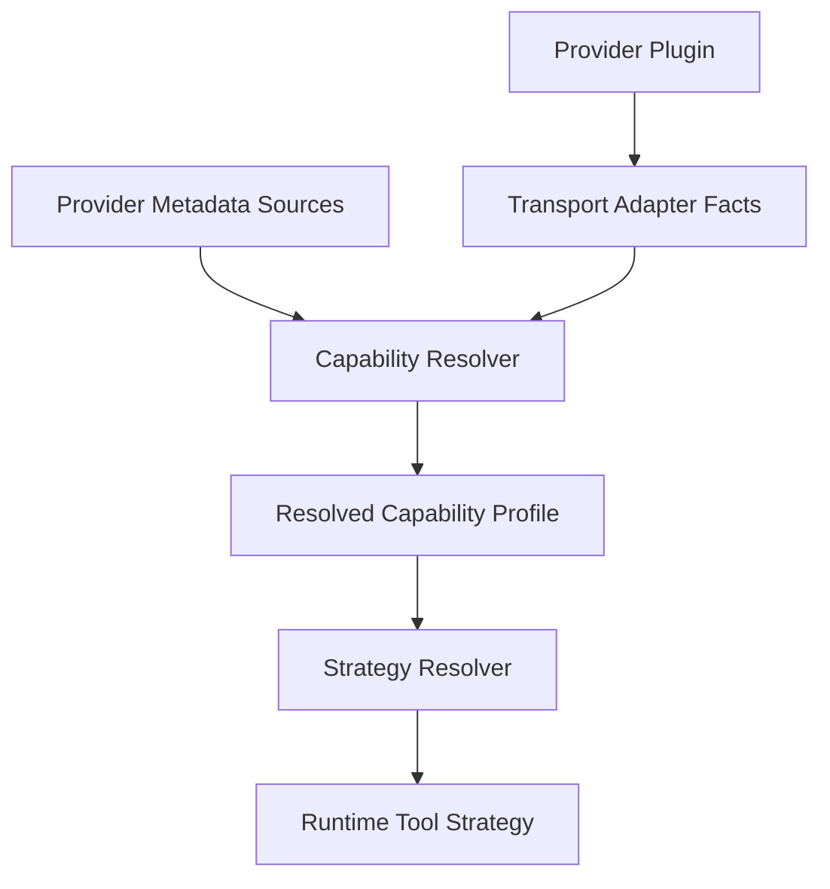

# Provider Capability Implementation Plan

Cette page fixe les decisions intermediaires validees pour la refonte providers/tooling.

Elle est ephemere et doit disparaitre une fois la convergence terminee et documentee dans `../current/`.

## Decisions validees

### 1. Source de verite des capacites

La direction validee est:

- `metadata provider/model -> couche de normalisation -> strategie runtime`

Cela signifie:

- ne pas maintenir une grande liste maison de modeles et de capacites
- utiliser en priorite les metadonnees exposees dynamiquement par les providers ou routers
- produire ensuite un profil unifie interne consomme par le runtime

Les tests et observations reelles servent a detecter des regressions ou des bugs d'integration.

Ils ne sont pas la source canonique des capacites d'un modele.

### 2. SSOT Yagr pour les capacites

Le SSOT Yagr n'est pas une base statique de modeles.

Le SSOT est le profil normalise final, resolu a l'execution, par exemple:

- capacites exposees par le provider
- capacites reelles du transport/adaptateur Yagr
- fallback conservateur quand les metadonnees sont absentes ou ambiguës

Le runtime ne doit lire que ce profil normalise.

### 3. Strategie runtime par niveau

Le runtime doit fonctionner avec quatre niveaux explicites:

- `native`
- `compatible`
- `weak`
- `none`

Ces niveaux ne doivent pas etre decides par des hacks provider-specific disperses.

Ils doivent etre resolus depuis le profil de capacite normalise.

### 4. Google

Le provider `google` via API officielle Gemini est la voie propre.

Le provider `google-proxy` ne doit pas etre presente comme une exposition fiable de Gemini tool-capable si l'adaptateur ne fournit pas proprement le tool calling.

Decision de travail:

- si un `google-proxy` propre n'est pas faisable sans bricolage structurel, il devra etre supprime
- on ne conserve pas un provider ambigu qui degrade artificiellement l'image de Gemini

### 5. OpenRouter

OpenRouter est un cas prioritaire pour la resolution dynamique des capacites car il expose:

- metadonnees modeles
- endpoints par modele
- `supported_parameters`
- modalities
- informations de cache et contexte

Il doit devenir le cas de reference pour la couche `metadata -> normalisation`.

## Architecture cible pour cette zone

## Objets cibles

### 1. Provider metadata adapter

Responsable de recuperer des metadonnees dynamiques quand le provider les expose.

Exemples:

- OpenRouter `/models`
- OpenRouter `/models/{id}/endpoints`
- Vercel AI Gateway `/v1/models`
- autres sources officielles si elles exposent des capacites comparables

### 2. Transport adapter facts

Responsable de decrire les limites reelles de l'adaptateur Yagr.

Exemples:

- l'adaptateur sait-il remonter des tool calls structures
- sait-il forcer un tool choice
- sait-il streamer les tool calls
- sait-il preservers les blocs provider-specific necessaires

### 3. Capability resolver

Responsable de fusionner:

- metadata provider/model
- contraintes du transport
- fallback conservateur

Pour produire un `ResolvedModelCapabilityProfile`.

### 4. Runtime strategy resolver

Responsable de transformer le profil normalise en strategie runtime:

- exposition des tools
- tool choice
- parallelisme
- structured outputs
- streaming des tool calls
- mode fallback pour `none`

## Plan d'implementation

### Etape 1. Capability resolver dynamique

- introduire un module dedie `CapabilityResolver`
- deplacer la logique actuelle de `model-capabilities.ts` vers une resolution par couches
- garder un fallback minimal conservateur uniquement quand aucune metadata fiable n'existe

Outcome:

- le runtime consomme un profil resolu propre
- la logique n'est plus fondee sur des heuristiques eparpillees

### Etape 2. OpenRouter metadata-first

- ajouter un fetch dynamique des modeles OpenRouter
- ajouter un fetch des endpoints par modele si necessaire
- normaliser `supported_parameters`, modalities, cache, contexte
- mettre en cache local avec TTL

Outcome:

- plus de pseudo-classement manuel des modeles OpenRouter

### Etape 3. Runtime strategy resolver

- creer une vraie couche runtime `native / compatible / weak / none`
- retirer les decisions encodees directement dans les providers ou dans `run-engine.ts`

Outcome:

- une seule logique de tooling adapte selon les capacites

### Etape 4. Google proxy decision

- requalifier techniquement `google-proxy`
- si pas de voie propre vers un vrai tool calling structure, le retirer
- garder `google` API officielle comme chemin propre

Outcome:

- pas de provider ambigu

### Etape 5. Amincir les adapters providers

- `openai-proxy`, `copilot-proxy`, `anthropic-proxy`, `google-proxy` restant
- limiter chaque adapter a:
  - auth/session
  - transport
  - conversion protocolaire minimale

Outcome:

- plus de logique runtime cachee dans chaque provider

## Critere de done pour ce chantier

Le chantier sera considere termine quand:

- les capacites runtime seront resolues depuis une couche normalisee unique
- OpenRouter utilisera des metadonnees dynamiques comme source primaire
- les providers ne contiendront plus de politique tooling de haut niveau
- `google-proxy` sera soit refait proprement, soit retire
- `architecture/current/` decrira alors l'etat reel obtenu
