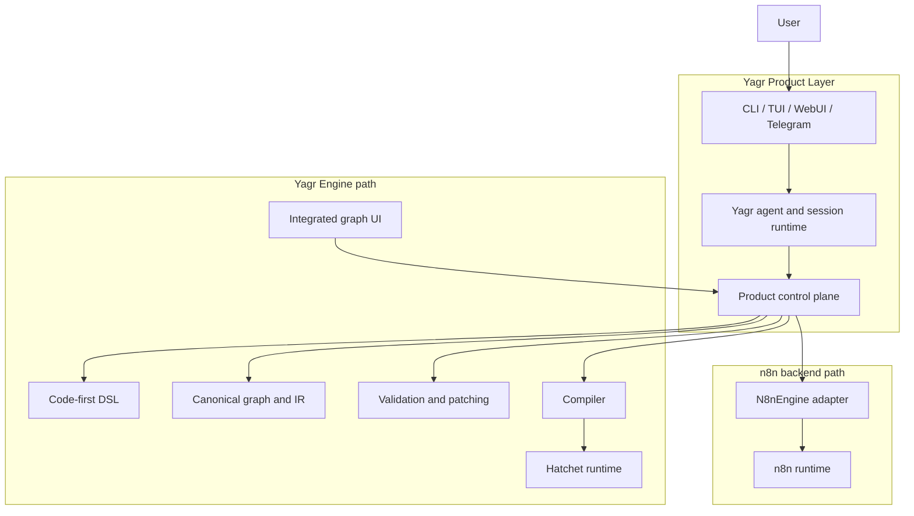
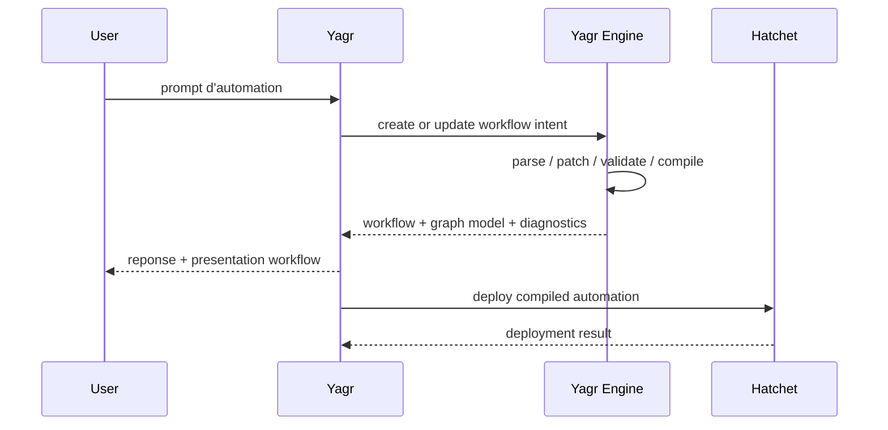
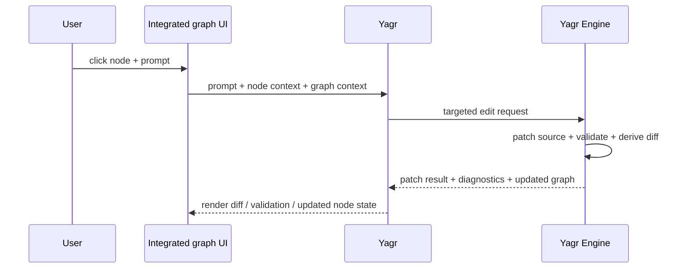
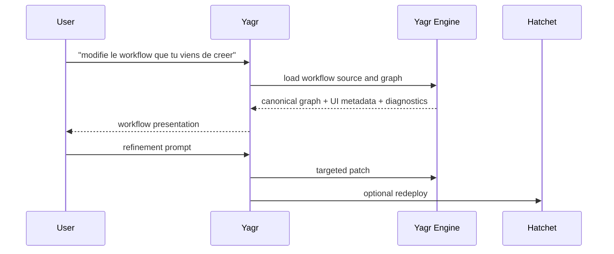
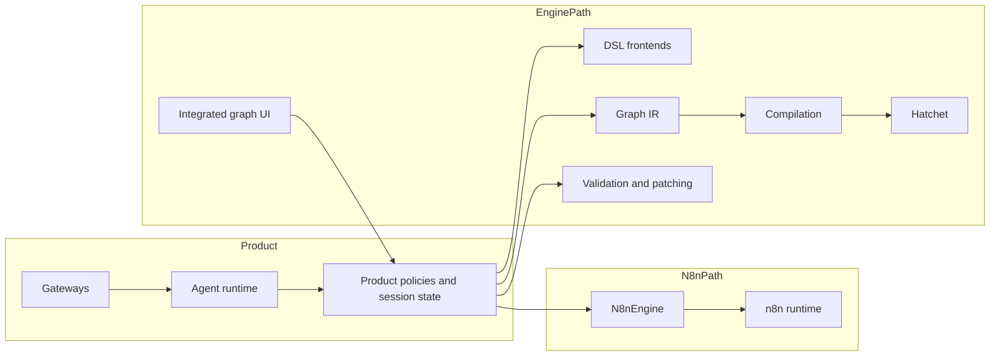

# Target Architecture - Yagr Engine

Cette page capture la direction cible issue de la vision produit, du `BLUEPRINT.md` du repo, de l'architecture actuelle documentee sous `architecture/current/`, et du blueprint `holon`.

Elle ne decrit pas encore le code reel du repo. Elle decrit la convergence voulue.

## 1. Intention cible

Le produit cible n'est ni un clone de `n8n`, ni un simple agent chat qui genere des scripts ad hoc.

La direction cible est:

- `Yagr` reste le point d'entree principal pour l'utilisateur
- le point d'entree principal reste le prompting
- `Yagr Engine` devient la brique de modelisation, validation, patching et compilation des automatisations
- l'UI de `Yagr Engine` est integree dans le produit `Yagr` comme surface de controle fine
- `Hatchet` devient le runtime d'execution fiable
- le choix du backend se fait en amont: soit `n8n`, soit `Yagr Engine + Hatchet`

En formule courte:

```text
prompt-first
+ graph-assisted
+ durable-runtime-backed
```

## 2. Positionnement des briques



Lecture voulue:

- `Yagr` porte l'experience utilisateur, l'autonomie agentique et la politique produit
- `n8n` et `Yagr Engine + Hatchet` sont deux chemins backend distincts
- `Yagr Engine` porte le modele d'automation et l'edition AI-native uniquement sur son propre chemin
- `Hatchet` porte l'execution, pas le modele produit
- `n8n` reste un backend alternatif supporte, pas une target de compilation de `Yagr Engine`

## 3. Decisions structurantes

### 3.1 Prompt-first, graph-assisted

L'utilisateur entre d'abord par le prompt.

Le graphe n'est pas la porte d'entree primaire du produit. Il sert a:

- inspecter ce que l'agent a produit
- guider des edits fins
- contextualiser un prompt sur un node, un edge, un trigger ou un workflow
- accelerer les corrections et raffinements sans basculer dans une UX formulaire classique

Le principe cible est:

- le chat cree l'automatisation
- le graphe la rend pilotable

### 3.2 `Yagr Engine` absorbe la vocation de `holon`

Le projet `holon` devient conceptuellement `Yagr Engine`.

On ne garde pas deux produits concurrents:

- `Yagr` au-dessus
- `Yagr Engine` en dessous

`Yagr Engine` reprend les principes forts de `holon`:

- code is truth
- visual is interface
- AI is the worker
- patching chirurgical
- metadata UI separee de la topologie
- edition contextualisee par node et par graphe

### 3.3 `Hatchet` est un runtime, pas le modele produit

`Hatchet` fournit:

- retries
- scheduling
- execution durable
- concurrency and rate controls
- run state and operational reliability

`Hatchet` ne doit pas devenir:

- la source de verite de la topologie
- le DSL auteur
- le modele conceptuel du produit

La verite produit reste dans `Yagr Engine`.

### 3.4 Le backend d'automation devient swappable par compilation

La cible n'est pas un branchement direct de `Yagr` sur `Hatchet`, ni un pipeline unique qui compilerait aussi bien vers `n8n` que vers `Hatchet`.

La cible est une selection amont entre deux chemins:

```text
Path A: Yagr -> N8nEngine -> n8n
Path B: Yagr -> Yagr Engine -> Hatchet
```

Les implications:

- le produit `Yagr` garde une facade commune
- le contrat `Engine` reste le point de selection
- `Yagr Engine` ne doit pas porter `n8n` comme target de compilation normale
- `n8n` et `Yagr Engine` sont des implementations concurrentes du backend d'automation

## 4. Responsabilites cibles

### 4.1 `Yagr`

`Yagr` garde les responsabilites suivantes:

- point d'entree utilisateur principal
- autonomie agentique
- gestion de session et d'historique
- required actions, approvals, interruptions
- presentation produit des workflows et des runs
- orchestration conversationnelle
- politique produit autour du prompting et du niveau d'autonomie
- coordination entre UI conversationnelle, UI graphe et backends

`Yagr` ne doit pas devenir:

- le parser du DSL
- le patcher structurel des workflows
- le moteur de validation du graphe
- le runtime d'execution des automatisations

### 4.2 `Yagr Engine`

`Yagr Engine` devient la brique d'autorite pour:

- le DSL de workflow
- le parsing et le graph extraction
- le modele canonique de node/edge/port
- la validation structurelle et semantique
- le patching lossless
- les annotations de graphe
- les operations d'edition ciblees par node/edge/workflow
- la compilation vers le runtime `Hatchet`
- l'inspection structurale necessaire aux prompts contextuels

`Yagr Engine` doit exposer des primitives du genre:

- `parseWorkflowSource`
- `validateGraph`
- `describeNode`
- `applyNodePatch`
- `applyWorkflowPatch`
- `compileAutomation()`
- `renderGraphViewModel`

### 4.3 `Yagr Engine UI`

L'UI issue de `holon` devient une surface integree dans `Yagr`, pas un produit separe.

Elle sert a:

- visualiser le workflow genere
- selectionner un node, un edge ou un sous-graphe
- lancer un prompt contextualise
- afficher annotations, badges, summary, ports et dependances
- previsualiser un patch propose
- confirmer ou annuler un changement
- afficher des erreurs de validation structurelles au niveau du graphe

Cette UI n'est pas la source de verite. Elle est une projection interactive du modele `Yagr Engine`.

### 4.4 `Hatchet`

`Hatchet` doit rester responsable de:

- l'execution fiable
- la reprise
- les retries
- la planification
- la gestion des runs
- l'etat d'execution
- l'operational runtime

`Hatchet` n'est pas responsable de:

- l'edition des workflows
- la topologie auteur
- les prompts contextuels
- la politique produit de creation d'automation

### 4.5 `n8n` comme backend alternatif

`n8n` reste un backend supporte sur son propre chemin:

- backend autonome pour les workspaces qui choisissent `n8n`
- implementation separee du contrat backend/engine
- support de l'existant et du mode V1

La regle cible est:

- si un workspace choisit `n8n`, il reste sur le chemin `n8n`
- si un workspace choisit `Yagr Engine`, il passe sur le chemin `Yagr Engine + Hatchet`
- on ne melange pas les deux au coeur du meme pipeline authoring/runtime

## 5. Source de verite et artefacts

### 5.1 Regle centrale

La verite doit exister a un seul endroit par niveau:

- sur le chemin `Yagr Engine`, verite auteur: le fichier source en DSL `Yagr Engine`
- sur le chemin `Yagr Engine`, verite structurelle: le graphe/IR derive par `Yagr Engine`
- verite UI: metadata de presentation uniquement
- verite runtime: runs et etat d'execution dans le backend cible

### 5.2 Invariants

- le JSON de l'UI ne decrit jamais la topologie
- un patch ne doit pas reecrire plus que la zone ciblee
- les ids de nodes et specs doivent rester stables
- les operations UI et les operations chat modifient la meme source d'autorite
- un workflow `Yagr Engine` compile vers `Hatchet`
- un workflow `n8n` reste un workflow `n8n`
- le contrat produit commun ne doit pas forcer une fusion artificielle des modeles auteur

### 5.3 Position sur le DSL host

Court terme:

- le DSL Python existant peut rester un frontend valide, surtout s'il est deja aligne conceptuellement avec `n8n-as-code`

Moyen terme:

- `Yagr Engine` doit disposer d'un IR canonique independant du langage host

Long terme:

- plusieurs frontends auteur peuvent converger vers le meme IR:
  - Python DSL
  - TypeScript DSL
  - edition AI contextualisee

La cible n'est pas de faire de Python le centre de gravite produit. La cible est d'avoir un modele canonique stable capable de survivre a plusieurs syntaxes hotes.

## 6. Flux cibles principaux

### 6.1 Creation d'une automation



Invariants:

- ce flux decrit uniquement le chemin `Yagr Engine + Hatchet`
- le workflow est d'abord un artefact `Yagr Engine`
- la presentation workflow est une sortie produit de premier plan

### 6.2 Edition fine depuis le graphe



Invariants:

- l'UI n'edite pas directement la topologie dans un store local autonome
- tout edit repasse par `Yagr Engine`
- le prompt contextuel porte le contexte exact du node/edge/workflow

### 6.3 Exploitation d'un workflow existant



## 7. Impact sur l'architecture actuelle du repo

La base actuelle a conserver:

- `YagrSessionAgent` et `YagrRunEngine` comme coeur du point d'entree agentique
- les facades minces (`gateway/*`)
- la logique provider/plugin et la strategie runtime LLM
- le principe d'un `Engine` abstrait

Les deplacements conceptuels a faire:

- sortir progressivement la logique trop `n8n`-specifique du system prompt et des tools coeur
- faire de `Yagr Engine` le vrai backend authoring/modeling
- garder `n8nac` dans le chemin `n8n`, sans en faire un target adapter du chemin `Yagr Engine`
- faire de la presentation graphe/UI un composant produit central
- rendre le choix `n8n` vs `Yagr Engine + Hatchet` explicite au niveau du workspace/backend selection

## 8. Frontieres cibles



Regles cibles:

- les facades restent minces
- le runtime agentique ne devient pas editeur de graphe
- `Yagr Engine` garde la maitrise de la structure
- `n8n` et `Yagr Engine + Hatchet` restent deux chemins backend explicites
- les runtimes ne remontent pas pour imposer leur modele au produit

## 9. Non-goals

Ce document ne cible pas:

- un clone pixel-perfect de `n8n`
- une UI canvas-first ou formulaire-first
- un runtime maison complet a la place de `Hatchet` a court terme
- une duplication concurrente entre `holon` et `Yagr Engine`
- une topologie de workflow stockee dans du JSON UI
- une target `n8n` compilee a partir de `Yagr Engine` dans le flux nominal

## 10. Convergence attendue

La convergence reussie ressemblera a ceci:

- l'utilisateur parle a `Yagr`
- `Yagr` cree une automation dans `Yagr Engine`
- le workflow est presente dans une UI graphe integree
- l'utilisateur peut prompter un node ou un sous-graphe pour affiner
- `Yagr Engine` applique un patch structurel cible
- l'automation `Yagr Engine` est compilee vers `Hatchet`
- `Hatchet` l'execute de facon fiable

Autrement dit:

```text
Yagr = entrypoint and autonomy
n8n path = Yagr + N8nEngine + n8n
engine path = Yagr + Yagr Engine + Hatchet
```
