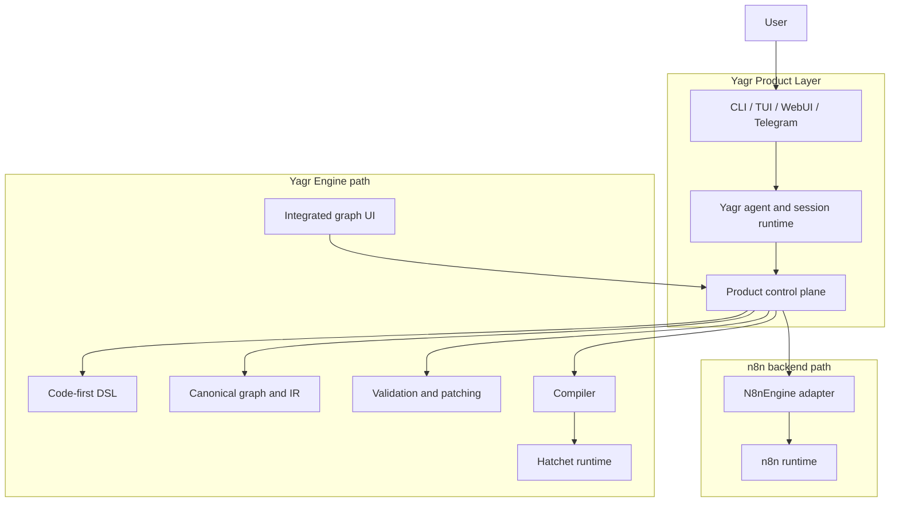
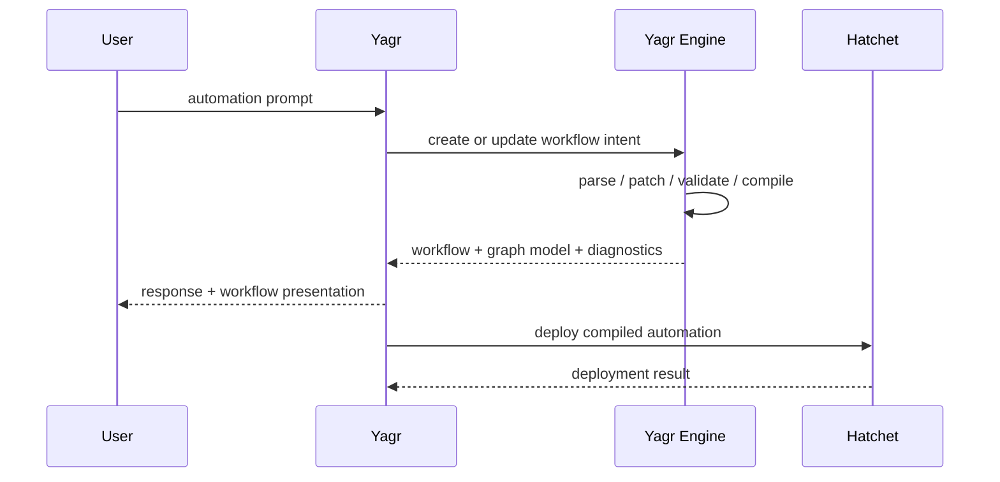
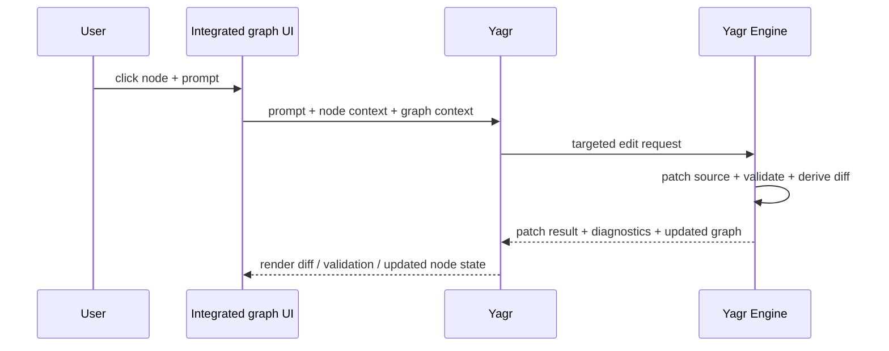
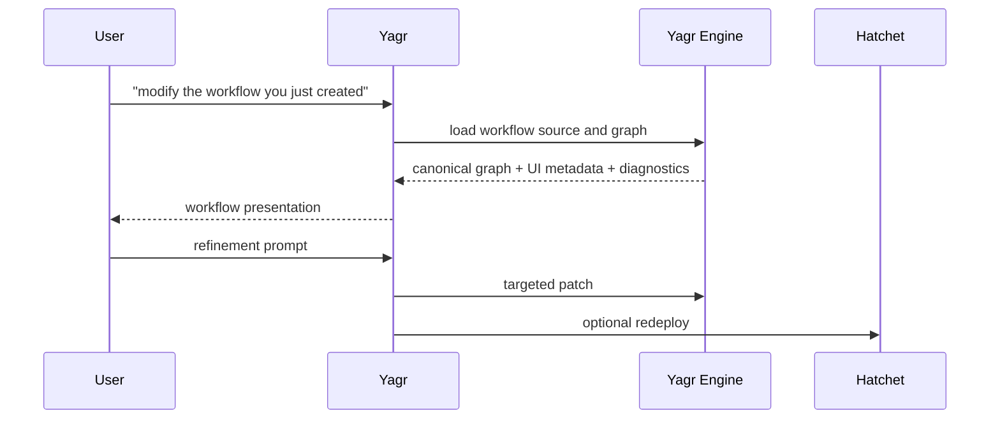
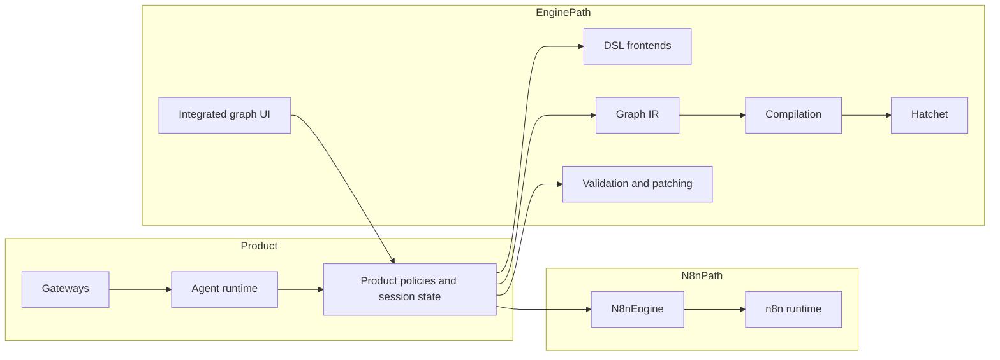

# Target Architecture - Yagr Engine

This page captures the target direction from the product vision, the repo's `BLUEPRINT.md`, the current architecture documented under `architecture/current/`, and the `holon` blueprint.

It does not yet describe the actual repo code. It describes the desired convergence.

## 1. Target Intent

The target product is neither a clone of `n8n`, nor a simple chat agent that generates ad hoc scripts.

The target direction is:

- `Yagr` remains the main user entry point
- the main entry point remains prompting
- `Yagr Engine` becomes the modeling, validation, patching, and compilation brick for automations
- the `Yagr Engine` UI is integrated into the `Yagr` product as a fine-grained control surface
- `Hatchet` becomes the reliable execution runtime
- the backend choice is made upstream: either `n8n`, or `Yagr Engine + Hatchet`

In short:

```text
prompt-first
+ graph-assisted
+ durable-runtime-backed
```

## 2. Positioning of Bricks


```mermaid
flowchart TD
    User[User]

    subgraph Product[Yagr Product Layer]
      Gateways[CLI / TUI / WebUI / Telegram]
      Agent[Yagr agent and session runtime]
      Control[Product control plane]
    end

    subgraph N8nPath[n8n backend path]
      N8nEngine[N8nEngine adapter]
      N8N[n8n runtime]
    end

    subgraph Engine[Yagr Engine path]
      DSL[Code-first DSL]
      IR[Canonical graph and IR]
      Validate[Validation and patching]
      EngineUI[Integrated graph UI]
      Compile[Compiler]
      Hatchet[Hatchet runtime]
    end

    User --> Gateways
    Gateways --> Agent
    Agent --> Control
    Control --> N8nEngine
    N8nEngine --> N8N
    Control --> DSL
    Control --> IR
    Control --> Validate
    Control --> Compile
    EngineUI --> Control
    Compile --> Hatchet
```

Intended reading:

- `Yagr` carries the user experience, agentic autonomy, and product policy
- `n8n` and `Yagr Engine + Hatchet` are two distinct backend paths
- `Yagr Engine` carries the automation model and AI-native editing only on its own path
- `Hatchet` carries execution, not the product model
- `n8n` remains a supported alternative backend, not a compilation target of `Yagr Engine`

## 3. Structuring Decisions

### 3.1 Prompt-first, graph-assisted

The user enters first through the prompt.

The graph is not the primary product entry point. It serves to:

- inspect what the agent produced
- guide fine-grained edits
- contextualize a prompt on a node, edge, trigger, or workflow
- accelerate corrections and refinements without switching to a classic form UX

The target principle is:

- the chat creates the automation
- the graph makes it controllable

### 3.2 `Yagr Engine` absorbs holon's purpose

The `holon` project conceptually becomes `Yagr Engine`.

We do not keep two competing products:

- `Yagr` above
- `Yagr Engine` below

`Yagr Engine` takes on holon's strong principles:

- code is truth
- visual is interface
- AI is the worker
- surgical patching
- metadata UI separated from topology
- contextual editing by node and by graph

### 3.3 `Hatchet` is a runtime, not the product model

`Hatchet` provides:

- retries
- scheduling
- durable execution
- concurrency and rate controls
- run state and operational reliability

`Hatchet` must not become:

- the source of truth for topology
- the DSL author
- the conceptual product model

The product truth remains in `Yagr Engine`.

### 3.4 The automation backend becomes swappable via compilation

The target is not a direct branching of `Yagr` on `Hatchet`, nor a single pipeline that would compile equally to `n8n` and to `Hatchet`.

The target is an upstream selection between two paths:

```text
Path A: Yagr -> N8nEngine -> n8n
Path B: Yagr -> Yagr Engine -> Hatchet
```

The implications:

- the `Yagr` product keeps a common facade
- the `Engine` contract remains the selection point
- `Yagr Engine` must not carry `n8n` as a normal compilation target
- `n8n` and `Yagr Engine` are concurrent implementations of the automation backend

## 4. Target Responsibilities

### 4.1 `Yagr`

`Yagr` keeps the following responsibilities:

- main user entry point
- agentic autonomy
- session and history management
- required actions, approvals, interruptions
- product presentation of workflows and runs
- conversational orchestration
- product policy around prompting and autonomy level
- coordination between conversational UI, graph UI, and backends

`Yagr` must not become:

- the DSL parser
- the structural workflow patcher
- the graph validation engine
- the execution runtime for automations

### 4.2 `Yagr Engine`

`Yagr Engine` becomes the authority brick for:

- the workflow DSL
- parsing and graph extraction
- the canonical node/edge/port model
- structural and semantic validation
- lossless patching
- graph annotations
- targeted edit operations by node/edge/workflow
- compilation to the `Hatchet` runtime
- structural inspection necessary for contextual prompts

`Yagr Engine` must expose primitives like:

- `parseWorkflowSource`
- `validateGraph`
- `describeNode`
- `applyNodePatch`
- `applyWorkflowPatch`
- `compileAutomation()`
- `renderGraphViewModel`

### 4.3 `Yagr Engine UI`

The UI from `holon` becomes a surface integrated into `Yagr`, not a separate product.

It serves to:

- visualize the generated workflow
- select a node, edge, or sub-graph
- launch a contextual prompt
- display annotations, badges, summary, ports, and dependencies
- preview a proposed patch
- confirm or cancel a change
- display structural validation errors at the graph level

This UI is not the source of truth. It is an interactive projection of the `Yagr Engine` model.

### 4.4 `Hatchet`

`Hatchet` must remain responsible for:

- reliable execution
- recovery
- retries
- scheduling
- run management
- execution state
- operational runtime

`Hatchet` is not responsible for:

- workflow editing
- author topology
- contextual prompts
- the product policy for automation creation

### 4.5 `n8n` as alternative backend

`n8n` remains a supported backend on its own path:

- autonomous backend for workspaces that choose `n8n`
- separate implementation of the backend/engine contract
- support for existing and V1 mode

The target rule is:

- if a workspace chooses `n8n`, it stays on the `n8n` path
- if a workspace chooses `Yagr Engine`, it moves to the `Yagr Engine + Hatchet` path
- we do not mix the two at the core of the same authoring/runtime pipeline

## 5. Source of Truth and Artifacts

### 5.1 Central Rule

Truth must exist in only one place per level:

- on the `Yagr Engine` path, author truth: the source file in `Yagr Engine` DSL
- on the `Yagr Engine` path, structural truth: the graph/IR derived by `Yagr Engine`
- UI truth: presentation metadata only
- runtime truth: runs and execution state in the target backend

### 5.2 Invariants

- the UI JSON never describes topology
- a patch must not rewrite more than the targeted area
- node IDs and specs must remain stable
- UI operations and chat operations modify the same authority source
- a `Yagr Engine` workflow compiles to `Hatchet`
- an `n8n` workflow remains an `n8n` workflow
- the common product contract must not force an artificial fusion of author models

### 5.3 Position on DSL host

Short term:

- the existing Python DSL can remain a valid frontend, especially if it is already conceptually aligned with `n8n-as-code`

Medium term:

- `Yagr Engine` must have a language-independent canonical IR

Long term:

- multiple authoring frontends can converge to the same IR:
  - Python DSL
  - TypeScript DSL
  - AI contextual editing

The target is not to make Python the product center of gravity. The target is to have a stable canonical model capable of surviving multiple host syntaxes.

## 6. Main Target Flows

### 6.1 Creating an Automation


```mermaid
sequenceDiagram
    participant U as User
    participant Y as Yagr
    participant E as Yagr Engine
    participant H as Hatchet

    U->>Y: automation prompt
    Y->>E: create or update workflow intent
    E->>E: parse / patch / validate / compile
    E-->>Y: workflow + graph model + diagnostics
    Y-->>U: response + workflow presentation
    Y->>H: deploy compiled automation
    H-->>Y: deployment result
```

Invariants:

- this flow describes only the `Yagr Engine + Hatchet` path
- the workflow is first a `Yagr Engine` artifact
- workflow presentation is a first-class product output

### 6.2 Fine-grained Editing from the Graph


```mermaid
sequenceDiagram
    participant U as User
    participant UI as Integrated graph UI
    participant Y as Yagr
    participant E as Yagr Engine

    U->>UI: click node + prompt
    UI->>Y: prompt + node context + graph context
    Y->>E: targeted edit request
    E->>E: patch source + validate + derive diff
    E-->>Y: patch result + diagnostics + updated graph
    Y-->>UI: render diff / validation / updated node state
```

Invariants:

- the UI does not directly edit topology in an autonomous local store
- every edit goes back through `Yagr Engine`
- the contextual prompt carries the exact node/edge/workflow context

### 6.3 Working with an Existing Workflow


```mermaid
sequenceDiagram
    participant U as User
    participant Y as Yagr
    participant E as Yagr Engine
    participant H as Hatchet

    U->>Y: "modify the workflow you just created"
    Y->>E: load workflow source and graph
    E-->>Y: canonical graph + UI metadata + diagnostics
    Y-->>U: workflow presentation
    U->>Y: refinement prompt
    Y->>E: targeted patch
    Y->>H: optional redeploy
```

## 7. Impact on Current Repo Architecture

The current base to preserve:

- `YagrSessionAgent` and `YagrRunEngine` as the core of the agentic entry point
- thin facades (`gateway/*`)
- provider/plugin logic and LLM runtime strategy
- the principle of an abstract `Engine`

Conceptual moves to make:

- progressively remove `n8n`-specific logic from the system prompt and core tools
- make `Yagr Engine` the true authoring/modeling backend
- keep `n8nac` in the `n8n` path, without making it a target adapter of the `Yagr Engine` path
- make graph/UI presentation a central product component
- make the `n8n` vs `Yagr Engine + Hatchet` choice explicit at the workspace/backend selection level

## 8. Target Boundaries


```mermaid
flowchart LR
    subgraph Product
      G[Gateways]
      A[Agent runtime]
      P[Product policies and session state]
    end

    subgraph N8nPath
      NE[N8nEngine]
      NR[n8n runtime]
    end

    subgraph EnginePath
      D[DSL frontends]
      I[Graph IR]
      V[Validation and patching]
      U[Integrated graph UI]
      C[Compilation]
      H[Hatchet]
    end

    G --> A
    A --> P
    P --> NE
    NE --> NR
    P --> D
    P --> I
    P --> V
    U --> P
    I --> C
    C --> H
```

Target rules:

- facades remain thin
- the agentic runtime does not become a graph editor
- `Yagr Engine` keeps control of structure
- `n8n` and `Yagr Engine + Hatchet` remain two explicit backend paths
- runtimes do not come back up to impose their model on the product

## 9. Non-goals

This document does not target:

- a pixel-perfect clone of `n8n`
- a canvas-first or form-first UI
- a complete custom runtime to replace `Hatchet` in the short term
- concurrent duplication between `holon` and `Yagr Engine`
- a workflow topology stored in UI JSON
- an `n8n` target compiled from `Yagr Engine` in the nominal flow

## 10. Expected Convergence

Successful convergence will look like this:

- the user talks to `Yagr`
- `Yagr` creates an automation in `Yagr Engine`
- the workflow is presented in an integrated graph UI
- the user can prompt a node or sub-graph to refine
- `Yagr Engine` applies a targeted structural patch
- the `Yagr Engine` automation is compiled to `Hatchet`
- `Hatchet` executes it reliably

In other words:

```text
Yagr = entrypoint and autonomy
n8n path = Yagr + N8nEngine + n8n
engine path = Yagr + Yagr Engine + Hatchet
```
